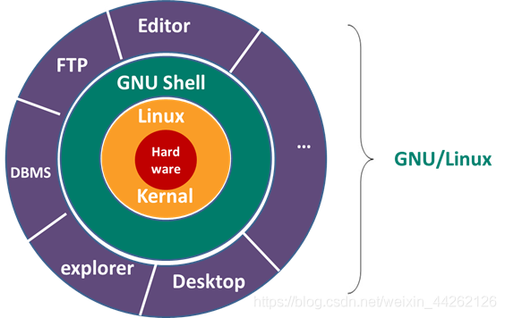
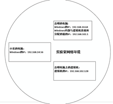
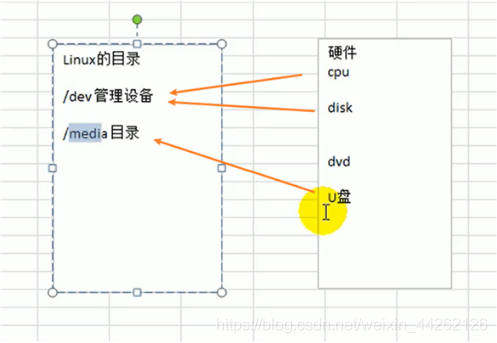
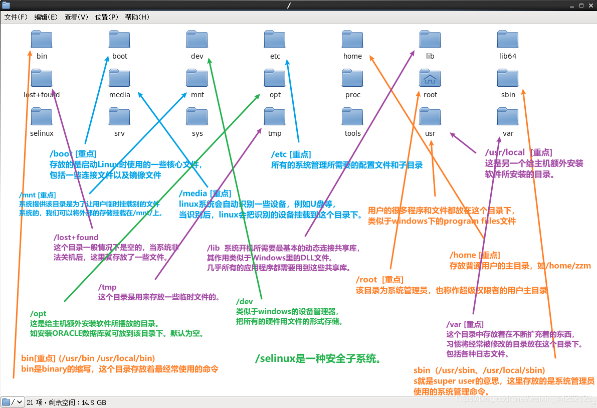

# 1 Linux入门

## 1.1 为什么是Linux

Linux是一个开源、免费的操作系统，其稳定性、安全性和处理多并发等已经受到业界的认可，同时，由于是Linux是开源的，所以，用户可以根据自己的需求修改代码，在商业使用上还不会像Windows一样有很多局限性。

Linux是在伟大的GNU计划上产生的，它建立在Unix的基础上。GNU计划表示操作系统上的任何软件都应该是开源的，而且是可以任意删除与修改的。

上述图像表示：应用程序→shell命令解释器→Linux内核→硬件。
 

## 1.2 为什么是CentOS，而不是其他Linux发行版

Linux发行版有很多，包括CentOS、Ubantu、红帽等。我们之所以用CentOS，是因为大数据的开发一般都在CentOS上运行的，Python一般都是在Ubantu上运行。

 

## 1.3 什么是虚拟机

虚拟机就像是一个虚拟的计算机，当配置好这个计算机的内存、网络等一系列硬件后，就可以在上面安装系统。

常用的虚拟机软件是Vmware，我们可以在该软件上安装CentOS或者Ubantu操作系统。

# 2 VMware、CentOS的安装

## 2.1 手动安装：

自己动手一步步安装CentOS，而不是用VMware软件的傻瓜式安装。安装文档和安装包在如下链接，
链接：https://pan.baidu.com/s/14yTMA6B6t48xqfnI4mrwRw
提取码：ming
                        ————参考尚硅谷

 

## 2.2 自动安装：

用安装好的VMware的自动安装来安装CentOS，真的太香了。

 

## 2.3 走过的弯路：

1） 如果不用VMware的自动安装，而是按照教程安装，要时刻做好系统崩溃的准备。
2） 虚拟机中系统的关机千万不能用直接关闭虚拟机来解决，而是在该系统中老老实实的点关机，不然该系统很容易奔溃。这一点很容易理解，就像我们自己电脑的windows一样。
3） 如果自己安装VMware tools的话，我之前也写了一个教程，但是这只是不是再VMware的自动安装下才有的，如果是VMware的自动安装，它会自动安装。
4） 推荐先按照这份教程手动的安装，先了解一下Linux的很多细节，后期再通过VMware自动安装。
5） 在配置虚拟机时，网络连接存在三种方式，包括桥接模式、网络地址转化模式（NAT-Network Address Transaction）、主机模式，我们一般选择NAT模式。三者的区别如下：

如上图所示，

-   **NAT模式**的意思就是我的电脑上单独产生一个字段与虚拟机连接。
    好处与坏处：

1.  虚拟机不占用其他的ip,所以不会ip冲突
1.  内网的其他人不能和虚拟机通讯

-   **桥接模式**则是，我的电脑上不单独产生一个字段与虚拟机连接，该实验室网络环境下，包括虚拟机、我的电脑、同事小乐的电脑都用的是192.168.14.x字段。
    好处与坏处：

1.  内网的其他人可以和虚拟机通讯。
1.  一个网址的最后一位，0是保留地址，255是广播地址，1是网关地址，所以，桥接模式中，最多只能有253台服务器。

-   **主机模式**则是把虚拟机单独看成一台新的主机来对待。（不常用）

# 3 Linux的目录结构

## 3.1 介绍

与Windows不同的是，在Linux中，万物都可以当成文件来对待。即使是一个硬件设备，在Linux中，也是使用文本来标记。如下图，硬件对应的是不同目录下的文件：

Linux的目录结构：linux 的文件系统是采用级层式的树状目录结构，在此结构中的最上层是根目录“/”，然后在此目录下再创建其他的目录。

 

## 3.2 Linux的文件目录树（我也太强了，尽然直接把它总结了出来）

另外还有五个目录，分别是：

-   /boot分区：用于Linux系统的启动
-   /swap分区：虚拟内存。作用是当我的物理内存不够用的时候，可以临时作为虚拟内存
-   /proc:这个目录是一个虚拟的目录，它是系
    统内存的映射，访问这个目录来获取系统信息
-   /srv:service缩写，该目录存放一些服务启动之后需要提取的数据。
-   /sys:这是linux2.6内核的一个很大的变化。该目录下安装了2.6内核中新出现的一个文件系统 sysfs

**学习Linux，一定要在脑海中形成一个目录树，一看到什么目录，就知道这个目录的作用是什么。**