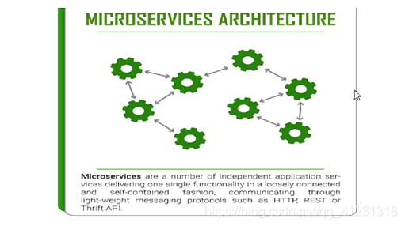
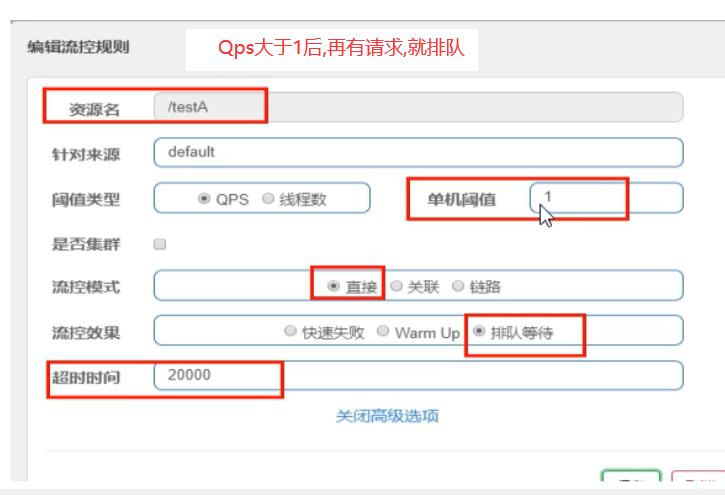

[TOC]


# SpringCloud

## 0. SpringCloud升级,部分组件停用:

1. Eureka停用,可以使用zk作为服务注册中心

2. 服务调用,Ribbon准备停更,代替为LoadBalance

3. Feign改为OpenFeign

4. Hystrix停更,改为resilence4j

		或者阿里巴巴的sentienl

5.Zuul改为gateway

6. 服务配置Config改为  Nacos
7. 服务总线Bus改为Nacos

# 环境搭建:
## 1. 创建父工程,pom依赖
file -> new -> maven -> create from zrchetype -> maven-archetype-site

pom文件见以下链接
[https://blog.csdn.net/u014520586/article/details/108423499](https://blog.csdn.net/u014520586/article/details/108423499)


## 2. 创建子模块,pay模块

### 1. cloud-provider-payment8001

### 2. pom依赖
[https://blog.csdn.net/u014520586/article/details/108423499](https://blog.csdn.net/u014520586/article/details/108423499)
### 3. 创建application.yml

```yml
server:
	port: 8001   
spring:
	application:
		name: cloud-payment-service
	datasource:
    # 当前数据源操作类型
    type: com.alibaba.druid.pool.DruidDataSource
    # mysql驱动类
    driver-class-name: com.mysql.cj.jdbc.Driver
      url: jdbc:mysql://localhost:3306/db2019?useUnicode=true&characterEncoding=
            UTF-8&useSSL=false&serverTimezone=GMT%2B8								
    username: root
    password: 
mybatis:			
    mapper-locations: classpath*:mapper/*.xml
   	type-aliases-package: com.eiletxie.springcloud.entities
#它一般对应我们的实体类所在的包，这个时候会自动取对应包中不包括包名的简单类名作为包括包名的别名。多个package之间可以用逗号或者分号等来进行分隔（value的值一定要是包的全）
```

### 4. 主启动类    
```java
package com.atguigu.springcloud;

import org.springframework.boot.SpringApplication;
import org.springframework.boot.autoconfigure.SpringBootApplication;

@SpringBootApplication
public class PaymentMain8001 {

    public static void main(String[] args) {
        SpringApplication.run(PaymentMain8001.class, args);
    }

}

```

### 5. 业务类

#### 1. sql

```sql
CREATE TABLE payment(
    id BIGINT(20) NOT NULL AUTO_INCREMENT COMMENT 'id',
    `SERIAL` VARCHAR(200) DEFAULT '',
    PRIMARY KEY(id)
) ENGINE = INNODB AUTO_INCREMENT=1 DEFAULT CHARSET = utf8
```
#### 	2. 实体类

#### 3. .entity类

Payment
```java
package com.atguigu.springcloud.entities;

import lombok.AllArgsConstructor;
import lombok.Data;
import lombok.NoArgsConstructor;

import java.io.Serializable;

@Data
@AllArgsConstructor
@NoArgsConstructor
public class Payment implements Serializable {

    private Long id;
    private String serial;
}
```
CommonResult
```java
import lombok.NoArgsConstructor;
package com.atguigu.springcloud.entities;

import lombok.AllArgsConstructor;
import lombok.Data;
import lombok.NoArgsConstructor;

@Data
@AllArgsConstructor
@NoArgsConstructor
public class CommonResult<T> {
    private Integer code;
    private String message;
    private T data;

    public CommonResult(Integer code, String message) {
        this(code, message, null);
    }
}
```
#### 4. dao层:
```java
package com.atguigu.springcloud.dao;

import com.atguigu.springcloud.entities.Payment;
import org.apache.ibatis.annotations.Mapper;
import org.apache.ibatis.annotations.Param;

@Mapper
public interface PaymentDao {
    public int create(Payment payment);

    public Payment getPaymentById(@Param("id")Long id);
}
```

#### 5. mapper配置文件类
**在resource下,创建mapper/PaymentMapper.xml**
```xml
<?xml version="1.0" encoding="UTF-8"?>
<!DOCTYPE mapper PUBLIC "-//mybatis.org//DTD Mapper 3.0//EN"
        "http://mybatis.org/dtd/mybatis-3-mapper.dtd">
<mapper namespace="com.atguigu.springcloud.dao.PaymentDao">
     <insert id="create" parameterType="Payment" useGeneratedKeys="true" keyProperty="id">
         insert into payment(serial) values(#{serial})
     </insert>

    <resultMap id="BaseResultMap" type="com.atguigu.springcloud.entities.Payment">
        <id column="id" property="id" jdbcType="BIGINT"></id>
        <id column="serial" property="serial" jdbcType="VARCHAR"></id>
    </resultMap>

    <select id="getPaymentById" parameterType="Long" resultMap="BaseResultMap">
        select *
        from payment where id = #{id};
    </select>
    
</mapper>
```


#### 6. 写service和serviceImpl
PaymentService
```java
package com.atguigu.springcloud.service;

import com.atguigu.springcloud.entities.Payment;
import org.apache.ibatis.annotations.Param;

public interface PaymentService {
    public int create(Payment payment);

    public Payment getPaymentById(@Param("id")Long id);
}
```
PaymentServiceImpl
```java
package com.atguigu.springcloud.service.impl;

import com.atguigu.springcloud.dao.PaymentDao;
import com.atguigu.springcloud.entities.Payment;
import com.atguigu.springcloud.service.PaymentService;
import org.springframework.stereotype.Service;

import javax.annotation.Resource;

@Service
public class PaymentServiceImpl implements PaymentService {
    @Resource
    private PaymentDao paymentDao;

    @Override
    public int create(Payment payment) {
        return paymentDao.create(payment);
    }

    @Override
    public Payment getPaymentById(Long id) {
        return paymentDao.getPaymentById(id);
    }
}

```


#### 7. controller
```java
package com.atguigu.springcloud.controller;

import com.atguigu.springcloud.entities.CommonResult;
import com.atguigu.springcloud.entities.Payment;
import com.atguigu.springcloud.service.PaymentService;
import lombok.extern.slf4j.Slf4j;
import org.springframework.web.bind.annotation.*;

import javax.annotation.Resource;

@RestController
@Slf4j
public class PaymentController {
    @Resource
    private PaymentService paymentService;

    @PostMapping(value = "/payment/create")
    public CommonResult create(@RequestBody Payment payment) {
        int result = paymentService.create(payment);
        log.info("***插入结果: "+ result);
        if (result > 0) {
            return new CommonResult(200.  "插入数据库成功", result);

        } else {
            return new CommonResult(444.  "插入数据库失", null);
        }
    }

    @GetMapping("/payment/get/{id}")
    public CommonResult getPaymentById(@PathVariable("id") Long id) {
        Payment payment = paymentService.getPaymentById(id);
        log.info("***查询结果: " + payment);
        if (payment != null) {
            return new CommonResult(200.  "查询成功: ", payment);
        } else {
            return new CommonResult(444.  "没有对应记录, 查询ID: " + id);
        }

    }
}


```
## 使用postman测试


## 3. 热部署:
父工程pom文件添加devtools
```xml
<dependency>
    <groupId>org.springframework.boot</groupId>
    <artifactId>spring-boot-devtools</artifactId>
   <scope>runtime</scope>
    <optional>true</optional>
</dependency>
```
 子工程pom文件添加plugin
 ```xml
 <build>
  <plugins>
    <plugin>
      <groupId>org.springframework.boot</groupId>
      <artifactId>spring-boot-maven-plugin</artifactId>
      <configuration>
        <fork>true</fork>
        <addResources>true</addResources>
      </configuration>
    </plugin>
  </plugins>
</build>
 ```
IDEA开启autobuild设置
IDEA按住ctrl+shift+alt+/
选中compiler.automake.allow.when.app.running

重启IDEA


## 4. cloud-consumer-order80

### **1. pom**		

### **2. yml配置文件**

```yaml
server:
    port: 80
```

### **3. 主启动类**
```java
package com.atguigu.springcloud;

import org.springframework.boot.SpringApplication;
import org.springframework.boot.autoconfigure.SpringBootApplication;

@SpringBootApplication
public class OrderMain80 {
    
    public static void main(String[] args) {
        SpringApplication.run(OrderMain80.class, args);
    }

}
```

### **4.复制pay模块的实体类,entity包**


### **5. 写controller类**

		因为这里是消费者类,主要是消费,那么就没有service和dao,需要调用pay模块的方法
	
		并且这里还没有微服务的远程调用,那么如果要调用另外一个模块,则需要使用基本的api调用
RestTemplate是什么
```
RestTemplate提供了多种便捷访问远程HTTP服务的方法
是一种简单便捷的访问restful服务模板类, 是Spring提供的用于访问Rest服务的客户端模板工具集
(完成80到8001的远程调用)
```
官方文档
[https://docs.spring.io/spring-framework/docs/5.2.2.RELEASE/javadoc-api/org/springframework/web/client/RestTemplate.html](https://docs.spring.io/spring-framework/docs/5.2.2.RELEASE/javadoc-api/org/springframework/web/client/RestTemplate.html)

使用RestTemplate调用pay模块, 

将restTemplate注入到容器
```java
package com.atguigu.springcloud.config;

import org.springframework.context.annotation.Bean;
import org.springframework.context.annotation.Configuration;
import org.springframework.web.client.RestTemplate;

@Configuration
public class ApplicationContextConfig {
    
    @Bean
    public RestTemplate getRestTemplate() {
        return new RestTemplate();
    }
    //相当于在applicationContext.xml中配置<bean id class>
}

```

编写controller:
```java
package com.atguigu.springcloud.controller;

import com.atguigu.springcloud.entities.CommonResult;
import com.atguigu.springcloud.entities.Payment;
import lombok.extern.slf4j.Slf4j;
import org.springframework.web.bind.annotation.GetMapping;
import org.springframework.web.bind.annotation.PathVariable;
import org.springframework.web.bind.annotation.RestController;
import org.springframework.web.client.RestTemplate;

import javax.annotation.Resource;

@RestController
@Slf4j
public class OrderController {
    
    public static final String PAYMENT_URL = "http://localhost:8001";
    
    @Resource
    RestTemplate restTemplate;
    
    @GetMapping("/consumer/payment/create")
    public CommonResult<Payment> create(Payment payment) {
    
        return restTemplate.postForObject(PAYMENT_URL + "/payment/create", payment, CommonResult.class);
    }
    
    @GetMapping("/consumer/payment/get/{id}")
    public CommonResult<Payment> getPayment(@PathVariable("id") Long id) {
        return restTemplate.getForObject(PAYMENT_URL + "/payment/get/" + id, CommonResult.class);
    }
}
```


## 5. 重构,

新建一个模块,将重复代码抽取到一个公共模块中

### 1. 创建cloud-api-commons模块

### 2. 抽取公共pom


### 3. entity和实体类放入commons中
删除pay模块和order模块的entities包

### 4. 使用maven,将commone模块打包(install),

### 5. 其他模块引入commons
之前两个模块, pom文件的dependencies标签中加入以下依赖
```xml
        <dependency>
            <groupId>com.atguigu.springcloud</groupId>
            <artifactId>cloud-api-commons</artifactId>
            <version>${project.version}</version>
        </dependency>
```
即可使用其中的entities类以及该api模块中引入的其他依赖

# 2. 服务注册与发现
## 6. Eureka:

前面我们没有服务注册中心,也可以服务间调用,为什么还要服务注册?

当服务很多时,单靠代码手动管理是很麻烦的,需要一个公共组件,统一管理多服务,包括服务是否正常运行,等

Eureka用于提供 **==服务注册==** ,目前官网 **已经停止更新**

Eureka包含两个组件: Eureka Server和Eureka Client
Eureka Server提供服务注册服务
各个微服务节点通过配置启动后, 会在EurekaServer中进行注册, 这样EurekaServer中的服务注册表中将会存储所有可用服务节点的信息, 服务节点的信息可以在节点中直观看到
Eureka Client通过注册中心进行访问
是一个Java客户端, 用于简化Eureka Server的交互, 客户端同时也具备一个内置的, 使用轮训(round-robin)负载算法的负载均衡器. 在应用启动后, 将会向Eureka发送心跳(默认周期为30秒). 如果Eureka Server在多个心跳周期内没有接受到某个节点的心跳, Eureka Server将会从服务注册表中把这个服务节点移除(默认90秒)


### 单机版eureka

#### 1. 创建项目cloud-eureka-server-7001

#### **2. 引入pom依赖**

eurka最新的依赖变了
#### 3. 配置文件:
application.yml
```yaml
server:
    port: 7001
eureka:
    instance:
        hostname: localhost # eureka服务端的实例名称
    client:
        # false标识不向注册中心注册自己
        register-with-eureka: false
        # false标识自己端就是注册中心, 我的职责就是维护服务实例, 并不需要去检索服务
        fetch-registry: false
        service-url:
#            设置与Eureka Server交互的地址查询服务和注册服务都需要依赖这个地址
            defaultZone: http://${eureka.instance.hostname}:${server.port}/eureka/

```
#### 4. 主启动类	
加上@EnableEurekaServer注解
```java
package com.atguigu.springcloud;

import org.springframework.boot.SpringApplication;
import org.springframework.boot.autoconfigure.SpringBootApplication;
import org.springframework.cloud.netflix.eureka.server.EnableEurekaServer;

@SpringBootApplication
@EnableEurekaServer
public class EurekaMain7001 {
    
    public static void main(String[] args) {
        SpringApplication.run(EurekaMain7001.class, args);
    }
}

```
#### 5. 此时就可以启动当前项目了
访问`http://localhost:7001/`, 出现下图页面, 表示项目启动成功


#### 6. 其他服务注册到eureka

比如此时pay模块加入eureka

##### 1. 修改pom,引入依赖
```xml
        <!--eureka client-->
        <dependency>
            <groupId>org.springframework.cloud</groupId>
            <artifactId>spring-cloud-starter-netflix-eureka-client</artifactId>
        </dependency>
```
##### 2. 主启动类上加注解, 表示当前是eureka客户端
@EnableEurekaClient
```java
package com.atguigu.springcloud;

import org.springframework.boot.SpringApplication;
import org.springframework.boot.autoconfigure.SpringBootApplication;
import org.springframework.cloud.netflix.eureka.EnableEurekaClient;

@SpringBootApplication
@EnableEurekaClient
public class PaymentMain8001 {

    public static void main(String[] args) {
        SpringApplication.run(PaymentMain8001.class, args);
    }

}
```
##### 3. 修改配置文件
在pay模块的application.yml文件中添加以下内容
```yaml
eureka:
    client:
#        标识是否将自己注册进Eureka Server 默认为true
        register-with-eureka: true
#        是否从Eureka Server抓取已有的注册信息, 默认为true, 单节点无所谓, 集群必须设置为true才能配合ribbon使用负载均衡
        fetch-registry: true
        service-url:
            defaultZone: http://localhost:7001/eureka/
```
##### 4. pay模块重启,就可以注册到eureka中了


先启动eureka模块, 再启动pay模块, 顺序不要反

如果启动失败或者没有红框中的服务, 检查yml文件中的配置, 注意`defaultZone`中`Z`要大写

pay模块中
```yaml
server:
    port: 8001
spring:
    application:
        name: cloud-payment-service
```
name属性即为Eureka中application的名称, 两者保持一致
```yaml
eureka:
    client:
        #        标识是否将自己注册进Eureka Server 默认为true
        register-with-eureka: true
```
`register-with-eureka`属性表示是否将该模块注册进`eureka`中, `true`表示表示册, `false`表示不注册
**==order模块的注册是一样的==**

### 集群版eureka:

#### 集群原理:

 ```
1. 就是pay模块启动时,注册自己,并且自身信息也放入eureka
2.order模块,首先也注册自己,放入信息,当要调用pay时,先从eureka拿到pay的调用地址
3.通过HttpClient调用
 	并且还会缓存一份到本地,每30秒更新一次
 ```
问题：微服务RPC远程服务调用最核心的是什么
高可用，试想你的注册中心只有一个only one，它出故障了那就呵呵（v）了，会导致整个为服务环境不可用，所以
解决办法：搭建Eureka注册中心集群，实现负载均衡+故障容错

#### 集群构建原理
互相注册


#### **构建新erueka项目**

名字:cloud-eureka-server-7002

##### 1. pom文件:
粘贴7001的即可

##### 2. 配置文件:

在写配置文件前,修改一下主机的hosts文件
文件路径: `C:\Windows\System32\drivers\etc\host`
host文件加上
```
127.0.0.1 eureka7001.com
127.0.0.1 eureka7002.com
```

首先修改之前的7001的eureka项目,因为多个eureka需要互相注册
7001的yml文件
```yaml
server:
    port: 7001
eureka:
    instance:
        hostname: eureka7001.com # eureka服务端的实例名称
    client:
        # false标识不向注册中心注册自己
        register-with-eureka: false
        # false标识自己端就是注册中心, 我的职责就是维护服务实例, 并不需要去检索服务
        fetch-registry: false
        service-url:
#            设置与Eureka Server交互的地址查询服务和注册服务都需要依赖这个地址
            defaultZone: http://eureka7002.com:7002/eureka/
```

**7002也是一样的,只不过端口和地址改一下**

然后修改7002
7002的yml文件
```yaml
server:
    port: 7002
eureka:
    instance:
        hostname: localhost # eureka服务端的实例名称
    client:
        # false标识不向注册中心注册自己
        register-with-eureka: false
        # false标识自己端就是注册中心, 我的职责就是维护服务实例, 并不需要去检索服务
        fetch-registry: false
        service-url:
#            设置与Eureka Server交互的地址查询服务和注册服务都需要依赖这个地址
            defaultZone: http://eureka7001.com:7001/eureka/
```


##### 3. 主启动类:
7002复制7001的即可
#### 从IDEA中直接复制module
直接从IDEA中复制7001, 重命名为7002,
选中module7001, Ctrl+C, Ctrl+V, 文件夹重命名, shift+F6, module重命名, 
修改7002module的pom文件中
```
    <artifactId>cloud-eureka-server-7002</artifactId>
```
maven中添加7002的pom文件,
修改主类名, 主类的类文件名为xxx7002


#### 找不到或无法加载主类错误解决

File -> Project Structure -> modules -> 找到父模块cloud2020, 将右面红色框处的目录删除


##### 4. 然后启动7001. 7002即可
浏览器访问localhost:7002, DS Replicas中出现7001服务


#### 将pay,order模块注册到eureka集群中:

##### 1. 只需要修改配置文件即可
80模块yml文件
```yaml
server:
    port: 80

eureka:
    client:
        #        标识是否将自己注册进Eureka Server 默认为true
        register-with-eureka: true
        #        是否从Eureka Server抓取已有的注册信息, 默认为true, 单节点无所谓, 集群必须设置为true才能配合ribbon使用负载均衡
        fetch-registry: true
        service-url:
            #            defaultZone: http://localhost:7001/eureka/ # 单机版
            defaultZone: http://localhost:7001/eureka/,/http://localhost:7002/eureka/ # 集群版

```
##### 2. 两个模块都修改
修改模块中yml文件的eureka部分和上面一样即可
然后先启动7001. 7002. 然后是pay模块8001. 然后是order(80)
### 3. 将pay模块也配置为集群模式
#### 0. 创建新模块,8002

	名称: cloud_pay_8002

#### 1. pom文件,复制8001的

#### 2. pom文件复制8001的

#### 3. 配置文件复制8001的

		端口修改一下,改为8002
	
		服务名称不用改,用一样的

#### 4.主启动类,复制8001的

#### 5. mapper,service,controller都复制一份
#### 也可以直接在IDEA中复制粘贴
修改pom的artifactId, 父pom`<module>`标签添加子模块, 修改主类名, 主类的文件名, yml文件中的port为8002, 
File -> Project Structure -> modules -> 找到父模块cloud2020, 将右面红色框处的目录删除
参见`从IDEA中直接复制module`一小节

然后就启动服务即可

此时访问order模块,发现并没有负载均衡到两个pay,模块中,而是只访问8001

虽然我们是使用RestTemplate访问的微服务,但是也可以负载均衡的

#### 修改80模块的Controller类, 返回信息中添加端口号
添加字段
```java
    @Value(("${server.port}"))
    private String serverPort;
```
会从yml文件中取port属性的值, 赋值给serverPort字段
```yaml
server:
    port: 8001
```
返回的CommonResult对象中添加port信息

OrderController类
```java
package com.atguigu.springcloud.controller;

import com.atguigu.springcloud.entities.CommonResult;
import com.atguigu.springcloud.entities.Payment;
import com.atguigu.springcloud.service.PaymentService;
import lombok.extern.slf4j.Slf4j;
import org.springframework.beans.factory.annotation.Value;
import org.springframework.web.bind.annotation.*;

import javax.annotation.Resource;

@RestController
@Slf4j
public class PaymentController {
    @Resource
    private PaymentService paymentService;
    
    @Value(("${server.port}"))
    private String serverPort;

    @PostMapping(value = "/payment/create")
    public CommonResult create(@RequestBody Payment payment) {
        int result = paymentService.create(payment);
        log.info("***插入结果: "+ result);
        if (result > 0) {
            return new CommonResult(200, "插入数据库成功, serverPort: " + serverPort, result);

        } else {
            return new CommonResult(444, "插入数据库失败", null);
        }
    }

    @GetMapping("/payment/get/{id}")
    public CommonResult getPaymentById(@PathVariable("id") Long id) {
        Payment payment = paymentService.getPaymentById(id);
        log.info("***查询结果: " + payment);
        if (payment != null) {
            return new CommonResult(200, "查询数据成功, serverPort: " + serverPort, payment);
        } else {
            return new CommonResult(444, "没有对应记录, 查询ID: " + id);
        }

    }
}

```
浏览器访问consumer80模块中的方法, 发现始终只访问8001端口
浏览器访问`http://localhost/consumer/payment/get/1`, 


**注意这样还不可以,需要让RestTemplate开启负载均衡注解,还可以指定负载均衡算法,默认轮询**
#### @LoadBalanced注解
修改80模块下的config/ApplicationContextConfig, 加上`@LoadBalanced`注解
```java
package com.atguigu.springcloud.config;

import org.springframework.cloud.client.loadbalancer.LoadBalanced;
import org.springframework.context.annotation.Bean;
import org.springframework.context.annotation.Configuration;
import org.springframework.web.client.RestTemplate;

@Configuration
public class ApplicationContextConfig {
    
    @Bean
    @LoadBalanced
    public RestTemplate getRestTemplate() {
        return new RestTemplate();
    }
    //相当于在applicationContext.xml中配置<bean id class>
}

```

#### 修改PAYMENT_URL
修改80模块Controller类中的`PAYMENT_URL`
```java
    public static final String PAYMENT_URL = "http://CLOUD-PAYMENT-SERVICE";
```
其中`CLOUD-PAYMENT-SERVICE`从eureka中复制得到

OrderController类
```java
package com.atguigu.springcloud.controller;

import com.atguigu.springcloud.entities.CommonResult;
import com.atguigu.springcloud.entities.Payment;
import lombok.extern.slf4j.Slf4j;
import org.springframework.web.bind.annotation.GetMapping;
import org.springframework.web.bind.annotation.PathVariable;
import org.springframework.web.bind.annotation.RestController;
import org.springframework.web.client.RestTemplate;

import javax.annotation.Resource;

@RestController
@Slf4j
public class OrderController {

//    public static final String PAYMENT_URL = "http://localhost:8001";
    public static final String PAYMENT_URL = "http://CLOUD-PAYMENT-SERVICE";
    
    @Resource
    RestTemplate restTemplate;
    
    @GetMapping("/consumer/payment/create")
    public CommonResult<Payment> create(Payment payment) {
    
        return restTemplate.postForObject(PAYMENT_URL + "/payment/create", payment, CommonResult.class);
    }
    
    @GetMapping("/consumer/payment/get/{id}")
    public CommonResult<Payment> getPayment(@PathVariable("id") Long id) {
        return restTemplate.getForObject(PAYMENT_URL + "/payment/get/" + id, CommonResult.class);
    }
}

```

浏览器访问`http://localhost/consumer/payment/get/1`, 8001和8002两个端口交替出现
### 4. 修改服务主机名和ip在eureka的web上显示

比如修改pay模块

#### 1. 修改配置文件

```yaml
eureka:
    client:
#        标识是否将自己注册进Eureka Server 默认为true
        register-with-eureka: true
#        是否从Eureka Server抓取已有的注册信息, 默认为true, 单节点无所谓, 集群必须设置为true才能配合ribbon使用负载均衡
        fetch-registry: true
        service-url:
#            defaultZone: http://localhost:7001/eureka/ # 单机版
            defaultZone: http://localhost:7001/eureka/,/http://localhost:7002/eureka/,http://localhost:7003/eureka, # 集群版
    instance:
        instance-id: payment-8001 # 配置显示名称
        prefer-ip-address: true # 配置访问路径可以显示ip地址
```

status项显示配置的名称, 
鼠标悬停在名称上方, 左下角显示ip地址


### 5. eureka服务发现:

以pay模块为例

#### 1. 首先添加一个注解,在controller中

```java
   @Resource
    private DiscoveryClient discoveryClient;
```
添加方法
```java
    @GetMapping("/payment/discovery")
    public Object discovery() {
        List<String > services = discoveryClient.getServices();
        for (String element: services
             ) {
            log.info("****** element: " + element);
        }
        List<ServiceInstance> instances = discoveryClient.getInstances("CLOUD-PAYMENT-SERVICE");
        for (ServiceInstance instance: instances
             ) {
            log.info(instance.getServiceId() + "\t" + instance.getHost() + "\t" + instance.getPort() + "\t" + instance.getUri());
        }
        return this.discoveryClient;
    }
```
添加后的PaymentController
```java
package com.atguigu.springcloud.controller;

import com.atguigu.springcloud.entities.CommonResult;
import com.atguigu.springcloud.entities.Payment;
import com.atguigu.springcloud.service.PaymentService;
import lombok.extern.slf4j.Slf4j;
import org.springframework.beans.factory.annotation.Value;
import org.springframework.cloud.client.ServiceInstance;
import org.springframework.cloud.client.discovery.DiscoveryClient;
import org.springframework.web.bind.annotation.*;

import javax.annotation.Resource;
import java.util.List;

@RestController
@Slf4j
public class PaymentController {
    @Resource
    private PaymentService paymentService;
    
    @Value(("${server.port}"))
    private String serverPort;
    
    @Resource
    private DiscoveryClient discoveryClient;

    @PostMapping(value = "/payment/create")
    public CommonResult create(@RequestBody Payment payment) {
        int result = paymentService.create(payment);
        log.info("***插入结果: "+ result);
        if (result > 0) {
            return new CommonResult(200, "插入数据库成功, serverPort: " + serverPort, result);

        } else {
            return new CommonResult(444, "插入数据库失败", null);
        }
    }

    @GetMapping("/payment/get/{id}")
    public CommonResult getPaymentById(@PathVariable("id") Long id) {
        Payment payment = paymentService.getPaymentById(id);
        log.info("***查询结果: " + payment);
        if (payment != null) {
            return new CommonResult(200, "查询数据成功, serverPort: " + serverPort, payment);
        } else {
            return new CommonResult(444, "没有对应记录, 查询ID: " + id);
        }

    }
    
    @GetMapping("/payment/discovery")
    public Object discovery() {
        List<String > services = discoveryClient.getServices();
        for (String element: services
             ) {
            log.info("****** element: " + element);
        }
        List<ServiceInstance> instances = discoveryClient.getInstances("CLOUD-PAYMENT-SERVICE");
        for (ServiceInstance instance: instances
             ) {
            log.info(instance.getServiceId() + "\t" + instance.getHost() + "\t" + instance.getPort() + "\t" + instance.getUri());
        }
        return this.discoveryClient;
    }
}
```

#### 2. 在主启动类上添加一个注解
@EnableDiscoveryClient

PaymentMain8001
```java
package com.atguigu.springcloud;

import org.springframework.boot.SpringApplication;
import org.springframework.boot.autoconfigure.SpringBootApplication;
import org.springframework.cloud.client.discovery.EnableDiscoveryClient;
import org.springframework.cloud.netflix.eureka.EnableEurekaClient;

@SpringBootApplication
@EnableEurekaClient
@EnableDiscoveryClient
public class PaymentMain8001 {

    public static void main(String[] args) {
        SpringApplication.run(PaymentMain8001.class, args);
    }

}
```

然后重启8001.浏览器访问`http://localhost:8001/payment/discovery`

控制台输出:

### 6. Eureka自我保护
**概述**
保护模式主要用于一组客户端和Eureka Server之间存在网络分区场景下的保护。一旦进入保护模式，Eureka Server将会尝试保护其服务注册表中的信息，不再删除服务注册中的数据，也就是不会注销任何微服务。

某时刻某一个微服务不可用了，Eureka不会立刻清理，依旧会对该微服务的信息进行保存属于CAP里面的AP分支

**什么是自我保护模式？**
EurekaClient可以正常运行，但是与EurekaServer网络不通情况下，EurekaServer不会立刻将EurekaClient服务剔除

**为什么会产生Eureka自我保护机制？**
默认情况下，如果EurekaServer在一定时间内没有接收到某个微服务实例的心跳，EurekaServer将会注销该实例（默认90秒）。但是当网络分区故障发生（延时、卡顿、拥挤）时，微服务与EurekaServer之间无法正常通信，以上行为可能变得非常危险了——因为微服务本身其实是健康的，此时本不应该注销这个微服务。Eureka通过“自我保护模式"来解决这个问题——当EurekaServer节点在短时间内丢失过多客户端时（可能发生了网络分区故障），那么这个节点就会进入自我保护模式。

出厂默认，自我保护机制是开启的
使用eureka.server.enable-self-preservation =false 可以禁用自我保护模式

#### 关闭Eureka自我保护
**eureka服务端配置:**
**设置接受心跳时间间隔**
```yaml
eureka:
    server:
#        关闭自我保护机制, 保证不可用服务被及时剔除
        enable-self-preservation: false
#        设置检测间隔时间
        eviction-interval-timer-in-ms: 2000
```
**客户端(比如pay模块):**

```yaml
eureka:
    instance:
        instance-id: payment-8001 # 配置显示名称
        prefer-ip-address: true # 配置访问路径可以显示ip地址
        #心跳检测与续约时间
        #开发时设置小些，保证服务光闭后注册中心能即使别除服务
        #Eureka客户端向服务端发送心跳的时间间隔，单位为秒（默认是30秒）
        lease-renewal-interval-in-seconds: 1
        #Eureka服务端在收到最后一次心跳后等待时间上限，单位为秒（默认是90秒），超时将剔除服务
        lease-expiration-duration-in-seconds: 2
```
此时启动erueka和pay.此时如果直接关闭了pay,那么erueka会直接删除其注册信息


## 7. Zookeeper服务注册与发现

### 1. 启动zk, 到linux上

### 2. 创建新的pay模块,

单独用于注册到zk中  

名字 : cloud_pay_8003

#### 1. pom依赖

#### 2. 配置文件


#### 3. 主启动类


#### 4. controller


#### 5. 然后就可以启动

**此时启动,会报错,因为jar包与我们的zk版本不匹配**

解决:
		修改pom文件,改为与我们zk版本匹配的jar包


**此时8003就注册到zk中了**

```java
我们在zk上注册的node是临时节点,当我们的服务一定时间内没有发送心跳
  	那么zk就会将这个服务的node删除了
```
**这里测试,就不写service与dao什么的了**

### 3. 创建order消费模块注册到zk

#### 1. 创建项目

名字: cloud_order_zk_80

#### 2. pom

#### 3. 配置文件


#### 4主启动类:


#### 5. RestTemplate


#### 6. controller


**然后启动即可注册到zk**

#### 8. 集群版zk注册:

只需要修改配置文件:


这个connect-string指定多个zk地址即可

connect-string: 1.2.3.4. 2.3.4.5

#### 


## 8. Consul:
Consul 是一套开源的分布式服务发现和配置管理系统，由 HashiCorp公司用Go 语言开发。
提供了微服务系统中的服务治理、配置中心、控制总线等功能。这些功能中的每一个都可以根据需要单独使用，也可以一起使用以构建全方位的服务网格，总之Consul提供了一种完整的服务网格解决方案。
它具有很多优点。包括：基于raft协议，比较简洁；支持健康检查，同时支持HTTP和DNS协议支持跨数据中心的WAN集群提供图形界面跨平台，支持Linux、Mac、Windows

功能

**服务发现:** 提供HTTP和DNS两种发现方式。
**健康监测:** 支持多种方式，HTTP、TCP、Docker、Shell脚本定制
**KV存储:** Key、Value的存储方式
**多数据中心:** Consul支持多数据中心
**可视化Web界面**


### 1. 安装consul

需要下载一个安装包

[http://consul.io](http://consul.io)

consul简介
[https://www.springcloud.cc/spring-cloud-consul.html](https://www.springcloud.cc/spring-cloud-consul.html)

consul百度网盘下载与安装介绍
[https://blog.csdn.net/weixin_43564627/article/details/105511912](https://blog.csdn.net/weixin_43564627/article/details/105511912)

启动是一个命令行界面,需要输入`consul agent -dev`启动


### 2. 创建新的pay模块
### cloud-provider-consul-pay8006

#### 1. 项目名字

cloud_consule_pay_8006

#### 2. pom依赖

#### 3. 配置文件
application.yml
```yaml
#consul服务端口号
server:
    port: 8006

spring:
    application:
        name: cloud-provider-payment

#consul注册中心地址
    cloud:
      consul:
          host: localhost
          port: 8500
          discovery:
#              hostname: 127.0.0.1
              service-name: ${spring.application.name}
```

#### 4. 主启动类
```java

package com.atguigu.springcloud;

import org.springframework.boot.SpringApplication;
import org.springframework.boot.autoconfigure.SpringBootApplication;
import org.springframework.cloud.client.discovery.EnableDiscoveryClient;

@SpringBootApplication
@EnableDiscoveryClient
public class PaymentMain8006 {
    
    public static void main(String[] args) {
        SpringApplication.run(PaymentMain8006.class, args);
    }
}

```
#### 5. controller
```java
package com.atguigu.springcloud.controller;

import lombok.extern.slf4j.Slf4j;
import org.springframework.beans.factory.annotation.Value;
import org.springframework.web.bind.annotation.RequestMapping;
import org.springframework.web.bind.annotation.RestController;

import java.util.UUID;

@RestController
@Slf4j
public class PaymentConsulController {
    
    @Value("${server.port}")
    private String serverPort;
    
    @RequestMapping(value = "/payment/consul")
    public String paymentConsul() {
        return "springcloud with consul: " + serverPort + "\t" + UUID.randomUUID().toString();
    }
}


```

#### 6. 启动服务
浏览器访问`http://localhost:8500/ui/dc1/services`


浏览器访问`http://localhost:8006/payment/consul`


#### 


### 3. 创建新order模块
### cloud-consumer-consul-order80


#### 1. pom文件

#### 2. 配置文件
```yaml
#consul服务端口号
server:
    port: 80

spring:
    application:
        name: cloud-consumer-order

    #consul注册中心地址
    cloud:
        consul:
            host: localhost
            port: 8500
            discovery:
                #              hostname: 127.0.0.1
                service-name: ${spring.application.name}

```

#### 3. 主启动类
```java
package com.atguigu.springcloud;

import org.springframework.boot.SpringApplication;
import org.springframework.boot.autoconfigure.SpringBootApplication;
import org.springframework.cloud.client.discovery.EnableDiscoveryClient;

@SpringBootApplication
@EnableDiscoveryClient
public class OrderConsulMain80 {
    public static void main(String[] args) {
        SpringApplication.run(OrderConsulMain80.class, args);
    }
}

```

#### 4. RestTemplate注册
```java
package com.atguigu.springcloud.config;

import org.springframework.cloud.client.loadbalancer.LoadBalanced;
import org.springframework.context.annotation.Bean;
import org.springframework.context.annotation.Configuration;
import org.springframework.web.client.RestTemplate;

@Configuration
public class ApplicationContextConfig {
    
    @Bean
    @LoadBalanced
    public RestTemplate getRestTemplate() {
        return new RestTemplate();
    }
    //相当于在applicationContext.xml中配置<bean id class>
}

```

#### 5. controller
```java
package com.atguigu.springcloud.controller;


import com.atguigu.springcloud.entities.Payment;
import lombok.extern.slf4j.Slf4j;
import org.springframework.web.bind.annotation.GetMapping;
import org.springframework.web.bind.annotation.RestController;
import org.springframework.web.client.RestTemplate;

import javax.annotation.Resource;

@RestController
@Slf4j
public class OrderConsulController {
    
    public static final String INVOKE_URL = "http://cloud-provider-payment";
    
    @Resource
    RestTemplate restTemplate;
    
    @GetMapping("/consumer/payment/consul")
    public String PaymentInfo(Payment payment) {
        
        String result = restTemplate.getForObject(INVOKE_URL + "/payment/consul", String.class);
        return result;
    }
    

}

```

#### 6. 启动服务,测试
浏览器访问`http://localhost:8500/ui/dc1/services`


浏览器访问`http://localhost/consumer/payment/consul`

## 9. 三个注册中心的异同
| 组件名    | 语言 | CAP  | 服务健康检查 | 对外暴露接口 | Spring cloud集成 |
| --------- | ---- | ---- | ------------ | ------------ | ---------------- |
| Eureka    | Java | AP   | 可配支持     | HTTP         | 已集成           |
| Consul    | Go   | CP   | 支持         | HTTP/DNS     | 已集成           |
| Zookeeper | Java | CP   | 支持         | 客户端       | 已集成           |


# 3. 服务调用

## 10. Ribbon负载均衡:
**Spring Cloud Ribbon**是基于Netflix Ribbon实现的一套客户端负载均衡的工具。
简单的说，Ribbon是Netflix发布的开源项目，主要功能是提供客户端的软件负载均衡算法和服务调用。Ribbon客户端组件提供一系列完善的配置项如连接超时，重试等。简单的说，就是在配置文件中列出Load Balancer（简称LB）后面所有的机器，Ribbon会自动的帮助你基于某种规则（如简单轮询，随机连接等）去连接这些机器。我们很容易使用Ribbon实现自定义的负载均衡算法。
**Ribbon目前也进入维护,基本上不准备更新了**

**区别**
LB（负载均衡）
	

	集中式LB
	进程内LB

**集中式LB(服务端负载均衡)**
集中式LB即在服务的消费方和提供方之间使用独立的LB设施（可以是硬件，如F5，也可以是软件，如nginx），由该设施负责把访问请求通过某种策略转发至服务的提供方；

**进程内LB(本地负载均衡)**

进程内LB将LB逻辑集成到消费方，消费方从服务注册中心获知有哪些地址可用，然后自己再从这些地址中选择出一个合适的服务器。
本地jvm进程进行负载均衡
Ribbon就属于进程内LB，它只是一个类库，集成于消费方进程，消费方通过它来获取到服务提供方的地址。

前面讲解了80通过轮询负载访问8001/8002

**Ribbon就是负载均衡+RestTemplate**

总结：Ribbon其实就是一个软负载均衡的客户端组件，他可以和其他所需请求的客户端结合使用，和eureka结合只是其中的一个实例。

Ribbon在工作时分成两步
第一步先选择 EurekaServer，它优先选择在同一个区域内负载较少的server.
第二步再根据用户指定的策略，在从server取到的服务注册列表中选择一个地址。
其中Ribbon提供了多种策略：比如轮询、随机和根据响应时间加权。

### 使用Ribbon:

#### 1. 默认我们使用eureka的新版本时,它默认集成了ribbon:

```xml
<dependency>
	<groupId>org.springframework.cloud</groupId>
	<artifactId>spring-cloud-starter-netflix-eureka-client</artifactId>
</dependency>
```
**==这个starter中集成了ribbon了==**
可以不用再引入ribbon坐标, 直接使用

#### 2. 我们也可以手动引入ribbon
**放到order模块中,因为只有order访问pay时需要负载均衡**
```xml
<dependency>
	<groupld>org.springframework.cloud</groupld>
	<artifactld>spring-cloud-starter-netflix-ribbon</artifactld>
</dependency>
```
#### 3. RestTemplate类:
RestTemplate的:xxxForObject()和xxxForEntity()
```java
RestTemplate的:
	xxxForObject()方法,返回的是响应体中的数据
    xxxForEntity()方法.返回的是entity对象,这个对象不仅仅包含响应体数据,还包含响应体信息(状态码等)
```
Controller实例
```java
    @GetMapping("/consumer/payment/get/{id}")
    public CommonResult<Payment> getPayment(@PathVariable("id") Long id) {
    //getForObject方法
        return restTemplate.getForObject(PAYMENT_URL + "/payment/get/" + id, CommonResult.class);
    }
    
    @GetMapping("/consumer/payment/getForEntity/{id}")
    public CommonResult<Payment> getPayment2(@PathVariable("id") Long id) {
    //getForEntity方法
        ResponseEntity<CommonResult> entity = restTemplate.getForEntity(PAYMENT_URL + "/payment/get/" + id,
                CommonResult.class);
        if (entity.getStatusCode().is2xxSuccessful()) {
            //可以得到更详细的信息, 例如状态码, 头信息等
            log.info(entity.getStatusCode() + "\t" + entity.getHeaders());
            return entity.getBody();
        } else {
            return new CommonResult<>(444, "操作失败");
        }
    }
```
#### Ribbon常用负载均衡算法:

**IRule接口,Riboon使用该接口,根据特定算法从所有服务中,选择一个服务,**

**Rule接口有7个实现类,每个实现类代表一个负载均衡算法**

| 名称                                    | 规则                                                         |
| --------------------------------------- | ------------------------------------------------------------ |
| com.netflix.loadbalancer.RoundRobinRule | 轮询                                                         |
| com.netflix.loadbalancer.RandomRule     | 随机轮询                                                     |
| com.netflix.loadbalancer.RetryRule      | 先按照RoundRobinRule的策略获取服务，如果获取服务失败则在指定时间内会进行重试，获取可用的服务轮询的扩展 |
| WeightedResponseTimeRule                | 对RoundRobinRule的扩展，应速度越快的实例选择权重越大，越容易被选择 |
| BestAvailableRule                       | 会先过滤掉由于多次访问故障而处于断路器跳闸状态的服务，然后选择一个并发量最小的服务 |
| AvailabilityFilteringRule               | 先过滤掉故障实例，再选择并发较小的实例ZoneAvoidanceRule      |

#### 使用Ribbon

**==这里使用eureka的那一套服务==**
官方文档明确给出了警告：

这个自定义配置类不能放在@ComponentScan所扫描的当前包下以及子包下，否则我们自定义的这个配置类就会被所有的Ribbon客户端所共享，达不到特殊化定制的目的了。

**==也就是不能放在主启动类所在的包及子包下==**

##### 1. 修改order模块

##### 2. 额外创建一个包
myrule与springcloud在同一级目录下, 不能放在sprigncloud目录下(与主启动类OrderMain80类同级)


##### 3. 创建配置类,指定负载均衡算法
MyselfRule
```java
package com.atguigu.myrule;

import com.netflix.loadbalancer.IRule;
import com.netflix.loadbalancer.RandomRule;
import org.springframework.context.annotation.Bean;
import org.springframework.context.annotation.Configuration;

@Configuration
public class MyselfRule {
    
    @Bean
    public IRule MyRule() {
        //定义为随机
        return new RandomRule();
    }
}
```

##### 4. 在主启动类上加一个注解
`@RibbonClient(name = "CLOUD-PAYMENT-SERVICE", configuration = MyselfRule.class)`

```java
ackage com.atguigu.springcloud;

import com.atguigu.myrule.MyselfRule;
import org.springframework.boot.SpringApplication;
import org.springframework.boot.autoconfigure.SpringBootApplication;
import org.springframework.cloud.netflix.eureka.EnableEurekaClient;
import org.springframework.cloud.netflix.ribbon.RibbonClient;

@SpringBootApplication
@EnableEurekaClient
//改变默认的ribbon设置, 轮询改为随机
@RibbonClient(name = "CLOUD-PAYMENT-SERVICE", configuration = MyselfRule.class)
public class OrderMain80 {
    
    public static void main(String[] args) {
        SpringApplication.run(OrderMain80.class, args);
    }

}

```
**表示,访问CLOUD_PAYMENT_SERVICE的服务时,使用我们自定义的负载均衡算法**

浏览器访问`http://localhost/consumer/payment/get/1`, 8001和8002端口随机出现


#### 自定义负载均衡算法

##### 1. ribbon的轮询算法原理


##### 2. 自定义负载均衡算法:

1. 给pay模块(8001. 8002)的controller方法添加一个方法,返回当前节点端口
```java
    @GetMapping("/payment/lb")
    public String getPaymentLB() {
        return serverPort;
    }
```
**2. 修改order80模块**

去掉ApplicationContextConfig上的@LoadBalanced
```java
package com.atguigu.springcloud.config;

import org.springframework.cloud.client.loadbalancer.LoadBalanced;
import org.springframework.context.annotation.Bean;
import org.springframework.context.annotation.Configuration;
import org.springframework.web.client.RestTemplate;

@Configuration
public class ApplicationContextConfig {
    
    @Bean
//    @LoadBalanced
    public RestTemplate getRestTemplate() {
        return new RestTemplate();
    }
    //相当于在applicationContext.xml中配置<bean id class>
}

```
##### 3. 自定义接口

```java
package com.atguigu.springcloud.lb;

import org.springframework.cloud.client.ServiceInstance;

import java.util.List;

public interface LoadBalancer {
    ServiceInstance instances(List<ServiceInstance> serviceInstances);
}
```
==具体的算法在实现类中实现==

##### 4. 接口实现类
```java
package com.atguigu.springcloud.lb;

import org.springframework.cloud.client.ServiceInstance;
import org.springframework.stereotype.Component;

import java.util.List;
import java.util.concurrent.atomic.AtomicInteger;

@Component
public class MyLB implements LoadBalancer{
    
    private AtomicInteger atomicInteger = new AtomicInteger(0);
    
    public final int getAndIcrement() {
        int current;
        int next;
        do {
            current = this.atomicInteger.get();
            next = current >= 214783647 ? 0 : current + 1;
        
        } while (!this.atomicInteger.compareAndSet(current, next));
        System.out.println("**** next: " + next);
        return next;

    }
    
    @Override
    public ServiceInstance instances(List<ServiceInstance> serviceInstances) {
        int index = getAndIcrement() % serviceInstances.size();
        return serviceInstances.get(index);
    }
}

```
##### 5. 修改controller:
加入以下两个属性, 和GetMapping方法
```java
    @Resource
    private LoadBalancer loadBalancer;
    
    @Resource
    private DiscoveryClient discoveryClient;
    @GetMapping("/consumer/payment/lb")
    public String getPaymentLB() {
        List<ServiceInstance> instances = discoveryClient.getInstances("CLOUD-PAYMENT-SERVICE");
        if (instances == null || instances.size()<0) {
            return null;
        }
        ServiceInstance serviceInstance = loadBalancer.instances(instances);
        URI uri = serviceInstance.getUri();
        return restTemplate.getForObject(uri + "/payment/lb", String.class);
    }

```
##### 6. 启动服务,测试即可


## 11. OpenFeign
Feign是一个声明式WebService客户端。使用Feign能让编写Web Service客户端更加简单。

它的使用方法是定义一个服务接口然后在上面添加注解。Feign也支持可拔插式的编码器和解码器。

Spring Cloud对Feign进行了封装,使其支持了Spring MVC标准注解和HttpMessageConverters。

Feign可以与Eureka和Ribbon组合使用以支持负载均衡

**是一个声明式的web客户端,只需要创建一个接口,添加注解即可完成微服务之间的调用**

Feign能干什么

Feign旨在使编写Java Http客户端变得更容易。就是远程调用其他服务前面在使用Ribbon+RestTemplate时，利用RestTemplate对http请求的封装处理，形成了一套模版化的调用方法。但是在实际开发中，由于对服务依赖的调用可能不止一处，往往一个接口会被多处调用，所以通常都会针对每个微服务自行封装一些客户端类来包装这些依赖服务的调用。

所以，Feign在此基础上做了进一步封装，由他来帮助我们定义和实现依赖服务接口的定义。

在Feign的实现下我们只需创建一个接口并使用注解的方式来配置它（以前是Dao接口上面标注Mapper注解，现在是一个微服务接口上面标注一个Feign注解即可）,即可完成对服务提供方的接口绑定，**简化了使用Spring cloud Ribbon时，自动封装服务调用客户端的开发量。**

Feign集成了Ribbon

利用Ribbon维护了Payment的服务列表信息，并且通过轮询实现了客户端的负载均衡。而与Ribbon不同的是，通过feign只需要定义服务绑定接口且以声明式的方法，优雅而简单的实现了服务调用

==就是A要调用B,Feign就是在A中创建一个一模一样的B对外提供服务的的接口,我们调用这个接口,就可以服务到B==

### **Feign与OpenFeign区别**

| Feign                                                        | OpenFeign                                                    |
| ------------------------------------------------------------ | ------------------------------------------------------------ |
| Feign是Spring Cloud组件中的一个轻量级RESTful的HTTP服务客户端, Feign内置了Ribbon,用来做客户端负载均衡,去调用服务注册中心的服务. Feign的使用方式是:使用Feign的注解定义接口,调用这个接口就可以调用服务注册中心的服务 | OpenFeign是Spring Cloud在Feign的基础上支持了SpringMVC的注解, 如@RequesMapping等等.OpenFeign的@FeignClient可以解析SpringMVC的@RequestMapping注解下的接口,并通过动态代理的方式产生实现类,实现类中做负载均衡并调用其他服务. |
```xml
<dependency>
	<groupId>org.springframework.cloud</groupId>
	<artifactId>spring-cloud-starter-feign</artifactId>
</dependency>
```
```xml
<dependency>
	<groupId>org.springframework.cloud</groupId>
	<artifactId>spring-cloud-starter-openfeign</artifactId>
</dependency>
```

### 使用OpenFeign
```java
之前的服务间调用,我们使用的是ribbon+RestTemplate
现在改为使用Feign
```
#### 1. 新建一个order项目,用于feign测试
### cloud-consumer-openfeign-order80

#### 2. pom文件

#### 3. 配置文件
```yaml
server:
    port: 80

eureka:
    client:
        register-with-eureka: false
        service-url:
            defaultZone: http://localhost:7001/eureka/,http://localhost:7002/eureka/
```
#### 4. 主启动类
```java
package com.atguigu.springcloud;

import org.springframework.boot.SpringApplication;
import org.springframework.boot.autoconfigure.SpringBootApplication;
import org.springframework.cloud.openfeign.EnableFeignClients;

@SpringBootApplication
@EnableFeignClients
public class OrderFeignMain80 {
    
    public static void main(String[] args) {
        SpringApplication.run(OrderFeignMain80.class, args);
    }
}
```
#### 5. fegin需要调用的其他的服务的接口
service接口
```java
package com.atguigu.springcloud.service;

import com.atguigu.springcloud.entities.CommonResult;
import com.atguigu.springcloud.entities.Payment;
import feign.RequestLine;
import org.springframework.cloud.openfeign.FeignClient;
import org.springframework.stereotype.Component;
import org.springframework.web.bind.annotation.GetMapping;
import org.springframework.web.bind.annotation.PathVariable;

@Component
@FeignClient(value = "CLOUD-PAYMENT-SERVICE")
public interface PaymentFeignService {
//    @RequestLine("GET /payment/get/{id}")
    @GetMapping(value = "/payment/get/{id}")
    public CommonResult<Payment> getPaymentById(@PathVariable("id")Long id);
}

```


#### 6. controller
```java
package com.atguigu.springcloud.controller;

import com.atguigu.springcloud.entities.CommonResult;
import com.atguigu.springcloud.entities.Payment;
import com.atguigu.springcloud.service.PaymentFeignService;
import lombok.extern.slf4j.Slf4j;
import org.springframework.web.bind.annotation.GetMapping;
import org.springframework.web.bind.annotation.PathVariable;
import org.springframework.web.bind.annotation.ResponseBody;
import org.springframework.web.bind.annotation.RestController;

import javax.annotation.Resource;

@RestController
@Slf4j
public class OrderFeignController {
    @Resource
    private PaymentFeignService paymentFeignService;
    
    @GetMapping("/consumer/payment/get/{id}")
    public CommonResult<Payment> getPaymentById(@PathVariable("id") Long id) {
        return paymentFeignService.getPaymentById(id);
    }
    
}
```
#### 7测试:

启动两个erueka(7001. 7002)

启动两个pay(8001. 8002)

启动当前的order模块

浏览器访问`http://localhost/consumer/payment/get/1`


#### SocketTimeoutException: Read timed out解决
使用Feign时，超时问题SocketTimeoutException: Read timed out
[https://blog.csdn.net/qq_44209563/article/details/104385529](https://blog.csdn.net/qq_44209563/article/details/104385529)

**Feign默认使用ribbon实现负载均衡**

### OpenFeign超时机制:
==OpenFeign默认等待时间是1秒,超过1秒,直接报错==
#### 1. 设置超时时间,修改配置文件:

**因为OpenFeign的底层是ribbon进行负载均衡,所以它的超时时间是由ribbon控制**

```yaml
#设置feign客户端超时时间（OpenFeign.默认支ribbon）
ribbon：
#指的是建立连接所用的时间，适用于网络状况正常的情况下，两瑞连接所用的时间
	ReadTimeout：5000
#指的是建立连接后从服务器读取到可用资源所用的时间ConnectTimeout：5ed
```
### OpenFeign日志

Feign 提供了日志打印功能，我们可以通过配置来调整日志级别，从而了解 Feign中Http请求的细节。
说白了就是对Feign接口调用情况进行监控和输出

**OpenFeign的日志级别有:**

| 名称    | 级别                                                      |
| ------- | --------------------------------------------------------- |
| NONE    | 默认的，不显示任何日志；                                  |
| BASIC   | 仅记录请求方法、URL、响应状态码及执行时间；               |
| HEADERS | 除了BASIC中定义的信息之外，还有请求和响应的头信息；       |
| FULL    | 除了HEADERS中定义的信息之外，还请求和响应的正文及元数据。 |

#### 	1. 使用OpenFeign的日志:
**实现在配置类中添加OpenFeign的日志类**

```java
package com.atguigu.springcloud.config;


import feign.Contract;
import feign.Logger;
import org.springframework.context.annotation.Bean;
import org.springframework.context.annotation.Configuration;

@Configuration
public class FeignConfiguration {
    
    @Bean
    Logger.Level feignLoggerlevel() {
        return Logger.Level.FULL;
    }
    
}
```


#### 2. 为指定类设置日志级别
(为 com.atguigu.springcloud.service.PaymentFeignService添加debug级别的FULL日志)
**配置文件中**
```yaml
logging:
    level:
#        feign日志以什么级别监控哪个接口
        com.atguigu.springcloud.service.PaymentFeignService: debug
```
#### 	3. 启动服务即可


# 4. 服务降级
服务雪崩

多个微服务之间调用的时候，假设微服务A调用微服务B和微服务C, 微服务B和微服务C又调用其它的微服务，这就是所谓的“扇出"。如果扇出的链路上某个微服务的调用响应时间过长或者不可用，对微服务A的调用就会占用越来越多的系统资源，进而引起系统崩，所谓的“雪崩效应”

对于高流量的应用来说，单一的后端依赖可能会导致所有服务器上的所有资源都在几秒钟内饱和。比失败更糟糕的是，这些应用程序还可能导致服务之间的延迟增加，备份队列，线程和其他系统资源紧张，导致整个系统发生更多的级联故障。这些都表示需要对故障和延迟进行隔离和管理，以便单个依赖关系的失败，不能取消整个应用程序或系统。

所以，通常当你发现一个模块下的某个实例失败后，这时候这个模块依然还会接收流量，然后这个有问题的模块还调用了其他的模块，这样就会发生级联故障，或者叫雪崩。

## 12. Hystrix服务降级
Hystrix是一个用于处理分布式系统的延迟和容错的开源库，在分布式系统里，许多依赖不可避免的会调用失败，比如超时、异常等，Hystrix能够保证在一个依赖出问题的情况下，不会导致整体服务失败，避免级联故障，以提高分布式系统的弹性。

“断路器”本身是一种开关装置，当某个服务单元发生故障之后，通过断路器的故障监控（类似熔断保险丝），向调用方返回一个符合预期的、可处理的备选应（FallBack），而不是长时间的等待或者抛出调用方无法处理的异常，这样就保证了服务调用方的线程不会被长时间、不必要地占用，从而避免了故障在分布式系统中的蔓延，乃至雪崩。

服务降级
服务熔断
接近实时的监控

==**Hystrix官宣, 停止更新**==

### hystrix中的重要概念:

#### 1. 服务降级
**比如当某个服务繁忙,不能让客户端的请求一直等待,应该立刻返回给客户端一个备选方案**
哪些情况会触发服务降级:
程序运行异常
超时
服务熔断触发服务降级
线程池/信号量打满
#### 2. 服务熔断
**当某个服务出现问题,卡死了,不能让用户一直等待,需要关闭所有对此服务的访问, 然后调用服务降级**

类比保险丝, 服务器达到最大服务访问后, 直接拒绝访问, 然后调用服务降级的方法并返回友好提示
这样就保证了服务调用方的线程不会被长时间, 不必要的占用, 从而避免了故障在分布式系统中的蔓延, 乃至雪崩
服务降级 -> 熔断 -> 恢复调用链路

#### 3. 服务限流
限流,比如秒杀场景,不能访问用户瞬间都访问服务器,限制一次只可以有多少请求

### 使用hystrix,服务降级:
#### 1. 创建带降级机制的pay模块 :
#### cloud-provider-hystrix-payment8001
##### 2. pom文件
##### 3. 配置文件
```yaml
server:
    port: 8001
spring:
    application:
        name: cloud-provider-hystrix-payment
eureka:
    client:
        register-with-eureka: true
        fetch-registry: true
        service-url:
            defaultZone: http://localhost:7001/eureka,/http://localhost:7002/eureka
```
##### 4. 主启动类
```java
package com.atguigu.springcloud;

import org.springframework.boot.SpringApplication;
import org.springframework.boot.autoconfigure.SpringBootApplication;
import org.springframework.cloud.netflix.eureka.EnableEurekaClient;

@SpringBootApplication
@EnableEurekaClient
public class PaymenthystrixMain8001 {
    
    public static void main(String[] args) {
        SpringApplication.run(PaymenthystrixMain8001.class, args);
    }
}

```
##### 5. service
```java
package com.atguigu.springcloud.service;

import org.springframework.stereotype.Service;

import java.util.concurrent.TimeUnit;

@Service
public class PaymentService {
    public String paymentInfo_OK(Integer id) {
        return "线程池: " + Thread.currentThread().getName() + "   paymentInfo_OK" + id + "hhhO(∩_∩)O哈哈哈~";
        
    }
    
    public String paymentInfo_TimeOut(Integer id) {
        try {
            TimeUnit.SECONDS.sleep(3);
        } catch (InterruptedException e) {
            e.printStackTrace();
        }
        Integer timeNumber = 3;
        return "线程池: " + Thread.currentThread().getName() + "   paymentInfo_TimeOut" + id + "hhhO(∩_∩)O哈哈哈~" + "耗时" + timeNumber +"秒钟";
        
    }
}

```
##### 6. controller
```java
package com.atguigu.springcloud.controller;

import com.atguigu.springcloud.service.PaymentService;
import lombok.extern.slf4j.Slf4j;
import org.springframework.beans.factory.annotation.Value;
import org.springframework.web.bind.annotation.GetMapping;
import org.springframework.web.bind.annotation.PathVariable;
import org.springframework.web.bind.annotation.RestController;

import javax.annotation.Resource;
import java.security.spec.PSSParameterSpec;

@RestController
@Slf4j
public class PaymentController {
    @Resource
    private PaymentService paymentService;
    
    @Value("${server.port")
    private String serverPort;
    
    @GetMapping("/payment/hystrix/ok/{id}")
    public String paymentInfo_OK(@PathVariable("id") Integer id) {
        String result = paymentService.paymentInfo_OK(id);
        log.info("****result: " + result);
        return result;
    }
    
    @GetMapping("/payment/hystrix/timeout/{id}")
    public String paymentInfo_TimeOut(@PathVariable("id") Integer id) {
        String result = paymentService.paymentInfo_TimeOut(id);
        log.info("****result: " + result);
        return result;
    }
}

```


##### 7. 先测试:
浏览器访问
`http://localhost:8001//payment/hystrix/ok/1`
`http://localhost:8001//payment/hystrix/timeout/2`

使用jmeter进行压测
jmeter下载, 安装与启动
[https://www.cnblogs.com/monjeo/p/9330464.html](https://www.cnblogs.com/monjeo/p/9330464.html)


浏览器访问
`http://localhost:8001//payment/hystrix/ok/1`

```java
此时使用压测工具,并发20000个请求,请求会延迟的那个方法,
压测中,发现,另外一个方法并没有被压测,但是我们访问它时,却需要等待
这就是因为被压测的方法它占用了服务器大部分资源,导致其他请求也变慢了
```
##### 8. 先不加入hystrix,
#### 2. 创建带降级的order模块:
##### 1. 名字:  cloud-consumer-feign-hystrix-order80

##### 2. pom

##### 3. 配置文件
```yaml
server:
    port: 80
eureka:
    client:
        register-with-eureka: false
        service-url:
            defaultZone: http://eureka7001.com:7001/eureka/
```
##### 4. 主启动类
```java
package com.atguigu.springcloud;

import org.springframework.boot.SpringApplication;
import org.springframework.boot.autoconfigure.SpringBootApplication;
import org.springframework.cloud.openfeign.EnableFeignClients;


@SpringBootApplication
@EnableFeignClients
public class OrderHystrixMain80 {
    public static void main(String[] args) {
        SpringApplication.run(OrderHystrixMain80.class, args);
    }
    
}

```

##### 5. 远程调用pay模块的接口:
```java
package com.atguigu.springcloud.service;

import org.springframework.cloud.openfeign.FeignClient;
import org.springframework.stereotype.Component;
import org.springframework.web.bind.annotation.GetMapping;
import org.springframework.web.bind.annotation.PathVariable;

import java.util.concurrent.TimeUnit;

@Component
@FeignClient("CLOUD-PROVIDER-HYSTRIX-PAYMENT")
public interface PaymentHystixService {
    
    @GetMapping("/payment/hystrix/ok/{id}")
    public String paymentInfo_OK(@PathVariable("id") Integer id);
    
    @GetMapping("/payment/hystrix/timeout/{id}")
    public String paymentInfo_TimeOut(@PathVariable("id") Integer id);
}

```
##### 6. controller:
```java
package com.atguigu.springcloud.controller;

import com.atguigu.springcloud.service.PaymentHystixService;
import lombok.extern.slf4j.Slf4j;
import org.springframework.web.bind.annotation.GetMapping;
import org.springframework.web.bind.annotation.PathVariable;
import org.springframework.web.bind.annotation.RestController;

import javax.annotation.Resource;

@RestController
@Slf4j
public class OrderHystrixController {
    @Resource
    private PaymentHystixService paymentHystixService;
    
    @GetMapping("/consumer/payment/hystrix/ok/{id}")
    public String paymentInfo_OK(@PathVariable("id") Integer id) {
        return paymentHystixService.paymentInfo_OK(id);
    }
    
    @GetMapping("/consumer/payment/hystrix/timeout/{id}")
    public String paymentInfo_TimeOut(@PathVariable("id") Integer id) {
        return paymentHystixService.paymentInfo_TimeOut(id);
    }
}

```

##### 7. 测试
启动order模块,访问pay
`http://localhost//consumer/payment/hystrix/ok/1`
再次压测2万并发,发现order访问也变慢了
8001同一层次的其他接口服务被困死, 因为tomcat线程池里面的工作线程已经被挤占完毕
80此时调用8001, 客户端响应缓慢, 转圈

**解决:**
#### 3. 配置服务降级


##### 1. 修改pay模块

###### 1. 为service的指定方法(会延迟的方法)添加@HystrixCommand注解
```java
package com.atguigu.springcloud.service;

import com.netflix.hystrix.contrib.javanica.annotation.HystrixCommand;
import com.netflix.hystrix.contrib.javanica.annotation.HystrixProperty;
import org.springframework.stereotype.Service;

import java.util.concurrent.TimeUnit;

@Service
public class PaymentService {
    public String paymentInfo_OK(Integer id) {
        return "线程池: " + Thread.currentThread().getName() + "   paymentInfo_OK" + id + "hhhO(∩_∩)O哈哈哈~";
        
    }
    @HystrixCommand(fallbackMethod = "paymentInfo_TimeOutHandler", commandProperties = {@HystrixProperty(name = "execution.isolation.thread.timeoutInMilliseconds", value = "3000")})
    public String paymentInfo_TimeOut(Integer id) {
        Integer timeNumber = 5;
        try {
            TimeUnit.SECONDS.sleep(timeNumber);
        } catch (InterruptedException e) {
            e.printStackTrace();
        }
        return "线程池: " + Thread.currentThread().getName() + "   paymentInfo_TimeOut" + id + "hhhO(∩_∩)O哈哈哈~" + "耗时" + timeNumber +"秒钟";
        
    }
    
    public String paymentInfo_TimeOutHandler(Integer id) {
        return "线程池: " + Thread.currentThread().getName() + "   paymentInfo_TimeOutHandler" + id + "~~~~(>_<)~~~~ 呜呜呜" + "耗时";
    }
}
```


###### 2. 主启动类上,添加激活hystrix的注解

@EnableCircuitBreaker
```java
package com.atguigu.springcloud;

import org.springframework.boot.SpringApplication;
import org.springframework.boot.autoconfigure.SpringBootApplication;
import org.springframework.cloud.client.circuitbreaker.EnableCircuitBreaker;
import org.springframework.cloud.netflix.eureka.EnableEurekaClient;

@SpringBootApplication
@EnableEurekaClient
@EnableCircuitBreaker
public class PaymentHystrixMain8001 {
    
    public static void main(String[] args) {
        SpringApplication.run(PaymentHystrixMain8001.class, args);
    }
}

```


###### 3. 触发异常


**可以看到,也触发了降级**

##### 2. 修改order模块,进行服务降级

==**一般服务降级,都是放在客户端(order模块)**==

修改上面的service模块, 将超时时间改为5000ms, 休眠时间改为3秒, 则访问order模块不会出发降级
```java
    @HystrixCommand(fallbackMethod = "paymentInfo_TimeOutHandler", commandProperties = {@HystrixProperty(name = "execution.isolation.thread.timeoutInMilliseconds", value = "5000")})
    public String paymentInfo_TimeOut(Integer id) {
        Integer timeNumber = 3;
        try {
            TimeUnit.SECONDS.sleep(timeNumber);
        } catch (InterruptedException e) {
            e.printStackTrace();
        }
        return "线程池: " + Thread.currentThread().getName() + "   paymentInfo_TimeOut" + id + "hhhO(∩_∩)O哈哈哈~" + "耗时" + timeNumber +"秒钟";
    }
```
###### 1. 修改配置文件:
```yaml
server:
    port: 80
eureka:
    client:
        register-with-eureka: false
        service-url:
            defaultZone: http://eureka7001.com:7001/eureka/
feign:
    hystrix:
        enabled: true

```

###### **2. 主启动类添加注解,启用hystrix:**
@EnableHystrix
```java
@SpringBootApplication
@EnableFeignClients
@EnableHystrix
public class OrderHystrixMain80 {
    public static void main(String[] args) {
        SpringApplication.run(OrderHystrixMain80.class, args);
    }
    
}
```

###### 3. 修改controller,添加降级方法什么的
```java
package com.atguigu.springcloud.controller;

import com.atguigu.springcloud.service.PaymentHystixService;
import com.netflix.hystrix.contrib.javanica.annotation.HystrixCommand;
import com.netflix.hystrix.contrib.javanica.annotation.HystrixProperty;
import lombok.extern.slf4j.Slf4j;
import org.springframework.web.bind.annotation.GetMapping;
import org.springframework.web.bind.annotation.PathVariable;
import org.springframework.web.bind.annotation.RestController;

import javax.annotation.Resource;

@RestController
@Slf4j
public class OrderHystrixController {
    @Resource
    private PaymentHystixService paymentHystixService;
    
    @GetMapping("/consumer/payment/hystrix/ok/{id}")
    public String paymentInfo_OK(@PathVariable("id") Integer id) {
        return paymentHystixService.paymentInfo_OK(id);
    }
    
    @HystrixCommand(fallbackMethod = "paymentTimeOutFallbackMethod", commandProperties = {@HystrixProperty(name = "execution.isolation.thread.timeoutInMilliseconds", value = "15000")})
    @GetMapping("/consumer/payment/hystrix/timeout/{id}")
    public String paymentInfo_TimeOut(@PathVariable("id") Integer id) {
        return paymentHystixService.paymentInfo_TimeOut(id);
    }
    
    public String paymentTimeOutFallbackMethod(Integer id) {
        return "我是消费者80, 对方支付系统繁忙, 请10秒钟后再试试或者自己运行出错, 请检自己,~~~~(>_<)~~~~";
    }
    
}

```


###### 4. 测试

启动pay模块,order模块,

**注意:,这里pay模块和order模块都开启了服务降级**

但是order这里,设置了1.5秒就降级,所以访问时,一定会降级

 ##### 4. 重构:

**上面出现的问题:**
		1. 降级方法与业务方法写在了一块,耦合度高

		2.每个业务方法都写了一个降级方法,重复代码多

##### **解决重复代码的问题**:

**配置一个全局的降级方法,所有方法都可以走这个降级方法,至于某些特殊创建,再单独创建方法**

###### 1. 创建一个全局方法
controller中加入如下方法
```java
    public String payment_Global_FallbackMethod() {
        return "Global异常处理信息, 请稍后再试 /(ToT)/";
    }
```

###### 2. 使用注解指定其为全局降级方法(默认降级方法)
@DefaultProperties(defaultFallback = "payment_Global_FallbackMethod")


###### 3. 业务方法使用默认降级方法:


```java

@RestController
@Slf4j
@DefaultProperties(defaultFallback = "payment_Global_FallbackMethod")
public class OrderHystrixController {
    @Resource
    private PaymentHystixService paymentHystixService;
    
    @GetMapping("/consumer/payment/hystrix/ok/{id}")
    public String paymentInfo_OK(@PathVariable("id") Integer id) {
        return paymentHystixService.paymentInfo_OK(id);
    }
    
//    @HystrixCommand(fallbackMethod = "paymentTimeOutFallbackMethod", commandProperties = {@HystrixProperty(name = "execution.isolation.thread.timeoutInMilliseconds", value = "15000")})
    @HystrixCommand
    @GetMapping("/consumer/payment/hystrix/timeout/{id}")
    public String paymentInfo_TimeOut(@PathVariable("id") Integer id) {
        return paymentHystixService.paymentInfo_TimeOut(id);
    }
    
    public String paymentTimeOutFallbackMethod(Integer id) {
        return "我是消费者80, 对方支付系统繁忙, 请10秒钟后再试试或者自己运行出错, 请检自己,~~~~(>_<)~~~~";
    }
    
    public String payment_Global_FallbackMethod() {
        return "Global异常处理信息, 请稍后再试 /(ToT)/";
    }
    
}

```


###### 4. 测试

##### 解决代码耦合度的问题:
修改order模块,这里开始,pay模块就不服务降级了,服务降级写在order模块即可

###### 1. Payservice接口是远程调用pay模块的,我们这里创建一个类实现service接口,在实现类中统一处理异常
```java
package com.atguigu.springcloud.service;

import org.springframework.stereotype.Component;

@Component
public class PaymentFallbackService implements PaymentHystixService {
    @Override
    public String paymentInfo_OK(Integer id) {
        return "----PaymentFallbackService fall back-paymentInfo_OK, o(Π——Π)o";
    }
    
    @Override
    public String paymentInfo_TimeOut(Integer id) {
        return "----PaymentFallbackService fall back-paymentInfo_TimeOut, o(Π——Π)o";
    }
}

```


###### 2. 修改配置文件:添加:
```yaml
feign:
    hystrix:
        enabled: true
```

###### 	3. 让PayService的实现类生效
```java
@Component
@FeignClient(value = "CLOUD-PROVIDER-HYSTRIX-PAYMENT", fallback = PaymentFallbackService.class)
public interface PaymentHystixService {
    
    @GetMapping("/payment/hystrix/ok/{id}")
    public String paymentInfo_OK(@PathVariable("id") Integer id);
    
    @GetMapping("/payment/hystrix/timeout/{id}")
    public String paymentInfo_TimeOut(@PathVariable("id") Integer id);
}
```

```java
它的运行逻辑是:
		当请求过来,首先还是通过Feign远程调用pay模块对应的方法
    但是如果pay模块报错,调用失败,那么就会调用PayMentFalbackService类的
    当前同名的方法,作为降级方法
```

###### 4. 启动测试

启动order和pay正常访问--ok

==此时将pay服务关闭,order再次访问==

可以看到,并没有报500错误,而是降级访问==实现类==的同名方法

这样,即使服务器挂了,用户要不要一直等待,或者报错

问题:

```java
	这样虽然解决了代码耦合度问题,但是又出现了过多重复代码的问题,每个方法都有一个降级方法
```

### 使用服务熔断:


类比保险丝达到最大服务访问后，直接拒绝访问, 拉闸限电，然后调用服务降级的方法返回友好提示

就是保险丝服务的降级->进而熔断->恢复调用链路

**比如并发达到1000. 我们就拒绝其他用户访问,在有用户访问,就访问降级方法**


熔断机制概述
熔断机制是应对雪崩效应的一种微服务链路保护机制。当扇出链路的某个微服务出错不可用或者响应时间太长时，会进行服务的降级，进而熔断该节点微服务的调用，快速返回错误的响应信息。
当检测到该节点微服务调用响应正常后，恢复调用链路。
在Spring Cloud框架里，熔断机制通过Hystrix实现。Hystrix会监控微服务间调用的状况，当失败的调用到一定阈值，缺省是5秒内20次调用失败，就会启动熔断机制。熔断机制的注解是@HystrixCommand。


#### 1. 修改前面的pay模块

##### 1. 修改8001的PaymentService类,添加服务熔断相关的方法**

```java
    @HystrixCommand(fallbackMethod = "paymentCircuitBreaker_fallback", threadPoolKey = "HystrixFooServiceGaGa", commandProperties = {
            @HystrixProperty(name = "circuitBreaker.enabled", value = "true"),//是否开启断路器
            @HystrixProperty(name = "circuitBreaker.requestVolumeThreshold", value = "10"),//请求次数并发超过这个次数,开启断路器
            @HystrixProperty(name="circuitBreaker.sleepWindowInMilliseconds",value="10000"),//时间窗口期
            @HystrixProperty(name ="circuitBreaker.errorThresholdPercentage",value="60")//失败率达到多少后跳闸  60%, 比如,10次造求6次失败则跳闻
            
    
    }
    )
    public String paymentCircuitBreaker(@PathVariable("id") Integer id) {
        if (id < 0) {
            throw new RemoteTimeoutException("****id不能为负数");
        }
        String serialNumber = IdUtil.simpleUUID();
        return Thread.currentThread().getName() + "/t" + "调用成功, 流水号" + serialNumber;
        
    }
    
    
    public String paymentCircuitBreaker_fallback(@PathVariable("id") Integer id) {
        return "id 不能为负数, 请稍后再试 /(ToT)/~~" + id;
    
    }

```

IdUtil是Hutool包下的类,这个Hutool就是整合了所有的常用方法,比如UUID,反射,IO流等工具方法什么的都整合了

这里属性整体意思是:
			10秒之内(窗口,会移动),如果并发==超过==10个,或者10个并发中,失败了6个,就开启熔断器

```
The precise way that the circuit opening and closing occurs is as follows:
1. Assuming the volume across a circuit meets a certain threshold
(HystrixcommandProperties. circuitBreakerRequestVolume Threshold())...

2. And assuming that the error percentage exceeds the threshold error percentage
(HystrixcommandProperties. circuitBreakerErrorThresholdPercentage())...

3. Then the circuit-breaker transitions from CLOSED to OPEN.

4. While it is open, it short-circuits all requests made against that circuit-breaker.

5. After some amount of time
(HystrixcommandProperties. circuitBreakersleepwindowInMilliseconds()), the next single request is let through(this is the HALF-OPEN state). If the request fails, the circuit-breaker returns to the oPEN state for the duration of the sleep window. If the request succeeds, the circuit-breaker transitions to CLOSED and the logic in 1. takes over again.
```


```java
断路器的打开和关闭,是按以下5步决定的
  	1. 并发此时是否达到我们指定的阈值
  	2. 错误百分比,比如我们配置了60%,那么如果并发请求中,10次有6次是失败的,就开启断路器
    3. 上面的条件符合,断路器改变状态为open(开启)
    4. 这个服务的断路器开启,所有请求无法访问
  	5. 在我们的时间窗口期,期间,尝试让一些请求通过(半开状态),如果请求还是失败,证明断路器还是开启状态,服务没有恢复
  		如果请求成功了,证明服务已经恢复,断路器状态变为close关闭状态
```

##### 2. 修改controller

添加一个测试方法

```
@GetMapping("/payment/circut/{id}")
public String paymentCircutBreaker(@PathVariable("id") Integer id) {
    String result = paymentService.paymentCircuitBreaker(id);
    log.info("***result: " + result);
    return result;
}
```


##### 3. 测试:

启动pay,order模块

==多次访问,并且错误率超过60%:==


此时服务熔断,此时即使访问正确的也会报错:


**但是,当过了几秒后,又恢复了**

因为在10秒窗口期内,它自己会尝试接收部分请求,发现服务可以正常调用,慢慢的当错误率低于60%,取消熔断


### Hystrix所有可配置的属性:

**全部在这个方法中记录,以成员变量的形式记录,**

		以后需要什么属性,查看这个类即可


搜索找到HystrixCommandProperties类

其中构造方法中的this.xxx属性

```
protected HystrixCommandProperties(HystrixCommandKey key, HystrixCommandProperties.Setter builder, String propertyPrefix) {
    this.key = key;
    this.circuitBreakerEnabled = getProperty(propertyPrefix, key, "circuitBreaker.enabled", builder.getCircuitBreakerEnabled(), default_circuitBreakerEnabled);
    this.circuitBreakerRequestVolumeThreshold = getProperty(propertyPrefix, key, "circuitBreaker.requestVolumeThreshold", builder.getCircuitBreakerRequestVolumeThreshold(), default_circuitBreakerRequestVolumeThreshold);
    this.circuitBreakerSleepWindowInMilliseconds = getProperty(propertyPrefix, key, "circuitBreaker.sleepWindowInMilliseconds", builder.getCircuitBreakerSleepWindowInMilliseconds(), default_circuitBreakerSleepWindowInMilliseconds);
    ...
```


### 总结

熔断类型

| 熔断打开 | 请求不再进行调用当前服务，内部设置时钟一般为MTTR（平均故障处理时间），当打开时长达到所设时钟则进入半熔断状态 |
| :------: | ------------------------------------------------------------ |
| 熔断关闭 | 熔断关闭不会对服务进行熔断                                   |
| 熔断半开 | 部分请求根据规则调用当前服务，如果请求成功且符合规则则认为当前服务恢复正常，关闭熔断 |


**==当断路器开启后:==**

1.  再有请求调用的时候，将不会调用主逻辑，而是直接调用降级**==fallback==**.通过断路器，实现了自动地发现错误并将主逻辑切换为降级逻辑，减少响应延迟的效果。

2.  原来的主逻辑要如何恢复呢？
    对于这一问题，hystrix也为我们实现了自动恢复功能。

    当断路器打开，对主逻辑进行熔断之后，hystrix会启动一个休眠时间窗，

    在这个时间窗内，降级逻辑是临时的成为主逻辑，

    当休眠时间窗到期，断路器将进入半开状态，释放一次请求到原来的主逻辑上，

    如果此次请求正常返回，那么断路器将继续闭合，断路器关闭主逻辑恢复，

    如果这次请求依然有问题，断路器继续进入打开状态，休眠时间窗重新计时


**==其他参数:==**


**熔断整体流程:**

```
1. 请求进来,首先查询缓存,如果缓存有,直接返回
  	如果缓存没有,--->2
2. 查看断路器是否开启,如果开启的,Hystrix直接将请求转发到降级返回,然后返回
  	如果断路器是关闭的,
				判断线程池等资源是否已经满了,如果已经满了
  					也会走降级方法
  			如果资源没有满,判断我们使用的什么类型的Hystrix,决定调用构造方法还是run方法
        然后处理请求
        然后Hystrix将本次请求的结果信息汇报给断路器,因为断路器此时可能是开启的
          			(因为断路器开启也是可以接收请求的)
        		断路器收到信息,判断是否符合开启或关闭断路器的条件,
				如果本次请求处理失败,又会进入降级方法
        如果处理成功,判断处理是否超时,如果超时了,也进入降级方法
        最后,没有超时,则本次请求处理成功,将结果返回给controller
```


### Hystrix服务监控:

#### HystrixDashboard

​        除了隔离依赖服务的调用以外，Hystrix还提供了==**准实时的调用监控（Hystrix Dashboard）**==，Hystrix会持续地记录所有通过Hystrix发起的请求的执行信息，并以统计报表和图形的形式展示给用户，包括每秒执行多少请求多少成功，多少失败等。Netflix通过hystrix-metrics-event-stream项目实现了对以上指标的监控。Spring Cloud也提供了Hystrix Dashboard的整合，对监控内容转化成可视化界面。

#### 2. 使用HystrixDashboard:

##### 1. 创建项目 cloud-consumer-hystrix-dashboard9001

##### 2. pom文件

##### 3. 配置文件

```
server:
    port: 9001
```

##### 4. 主启动类

```java
package com.atguigu.springcloud;

import org.springframework.boot.SpringApplication;
import org.springframework.boot.autoconfigure.SpringBootApplication;
import org.springframework.cloud.netflix.hystrix.dashboard.EnableHystrixDashboard;

@SpringBootApplication
@EnableHystrixDashboard
public class HystrixDashboardMain9001 {
    public static void main(String[] args) {
        SpringApplication.run(HystrixDashboardMain9001.class, args);
    }
}
```


##### 5. 修改所有pay模块(8001. 8002. 8003...)

**他们都添加一个pom依赖:**

```
<!--监控-->
<dependency>
    <groupId>org.springframework.boot</groupId>
    <artifactId>spring-boot-starter-actuator</artifactId>
</dependency>
```

之前的pom文件中都添加过了,==这个是springboot的监控组件==

##### 6. 启动9001即可

访问: **localhost:9001/hystrix**


##### 7. 注意,此时仅仅是可以访问HystrixDashboard,并不代表已经监控了8001. 8002

如果要监控,还需要配置:(8001为例)


==PaymentHystrixMain8001 的主启动类添加配置==

```java
@SpringBootApplication
@EnableEurekaClient
@EnableCircuitBreaker
public class PaymentHystrixMain8001 {
    
    public static void main(String[] args) {
        SpringApplication.run(PaymentHystrixMain8001.class, args);
    }
    
    /**
    * 此配置是为了服务监控而配置，与服务容错本身无关，springcloud升级后的坑
    * servLetRegistrationBean因为springboot的默认路径不是"/hystrix.stream"，
    * 只要在自己的项目里配置上下面的servlet就可以了
    **/
    @Bean
    public ServletRegistrationBean getservlet() {
        HystrixMetricsStreamServlet streamservlet = new HystrixMetricsStreamServlet();
        ServletRegistrationBean registrationBean = new ServletRegistrationBean(streamservlet);
        registrationBean.setLoadOnStartup(1);
        registrationBean.addUrlMappings("/hystrix.stream");
        registrationBean.setName("HystrixMetricsStreamServlet");
        return registrationBean;
    }
}
```


**其他8002. 8003都是一样的**

##### 8. 到此,可以启动服务

启动7001. 8001. 9001

**然后在web界面,指定9001要监控8001:**

输入http://localhost:8001/hystrix.stream


浏览器访问

http://localhost:8001/payment/circut/31

http://localhost:8001/payment/circut/-31


9001地址出现访问数据


如何看?

```7色年
1圈
1线
整图说明
整图说明2
```

7色:

7种颜色, 代表不同的状态


1圈

1线

实心圆：共有两种含义。它通过颜色的变化代表了实例的健康程度，它的健康度从绿色<黄色<橙色<红色递减。
该实心圆除了颜色的变化之外，它的大小也会根据实例的请求流量发生变化，流量越大该实心圆就越。所以通过该实心圆的展示，就可以在大量的实例中快速的发现故障实例和高压力实例。
曲线：用来记录2分钟内流量的相对变化，可以通过它来观察到流量的上升和下降趋势。


整图说明

整图说明2


# 5. 服务网关:

## zuul停更了


## 13. GateWay


Gateway是在Spring生态系统之上构建的API网关服务，基于Spring 5，Spring Boot 2和Project Reactor等技术。
Gateway旨在提供一种简单而有效的方式来对API进行路由，以及提供一些强大的过滤器功能，例如：熔断、限流、重试等

SpringCloud Gateway 是Spring Cloud的一个全新项目，基于Spring 5.0+Spring Boot 2.0和Project Reactor 等技术开发的网关，它旨在为微服务架构提供一种简单有效的统一的API路由管理方式。
SpringCloud Gateway 作为Spring Cloud 生态系统中的网关，目标是替代Zuul，在Spring Cloud2.0以上版本中，没有对新版本的Zuul2.0以上最新高性能版本进行集成，仍然还是使用的Zuul 1.x非Reactor模式的老版本。而为了提升网关的性能，SpringCloud Gateway是基于**WebFlux**框架实现的，而WebFlux框架底层则使用了高性能的**Reactor**模式通信框架**Netty**。
Spring Cloud Gateway的目标提供统一的路由方式且基于Filter链的方式提供了网关基本的功能，例如：安全，监控/指标，和限流。

**gateway之所以性能好,因为底层使用WebFlux,而webFlux底层使用netty通信(NIO)**


### GateWay的特性

Spring Cloud Gateway 具有如下特性：
基于Spring Framework 5，Project Reactor和Spring Boot 2.0进行构建；

动态路由：能够匹配任何请求属性；

可以对路由指定 Predicate（断言）和Filter（过滤器）；

集成Hystrix的断路器功能；

集成Spring Cloud 服务发现功能；

易于编写的Predicate（断言）和Filter（过滤器）；

请求限流功能；支持路径重写。


### GateWay与zuul的区别:

在SpringCloud Finchley 正式版之前，Spring Cloud推荐的网关是Netflix提供的Zuul：
1、Zuul 1.x，是一个基于阻塞I/O的API Gateway
2、Zuul 1.x基于Servlet 2.5使用==阻塞架构==, 它不支持任何长连接(如 WebSocket). Zuul的设计模式和Nginx较像，每次I/O操作都是从工作线程中选择一个执行，请求线程被阻塞到工作线程完成，但是差别是Nginx用C++实现，Zuul用Java实现，而JVM本身会有第一次加载较慢的情况，使得Zuul的性能相对较差。
3、Zuul2.x理念更先进，想基于Netty非阻塞和支持长连接，但SpringCloud目前还没有整合。Zuul2.x的性能较Zuul1.x有较大提升。在性能方面，根据官方提供的基准测试，Spring Cloud Gateway的QPS（每秒请求数）是Zuul的1.6倍。
4、Spring Cloud Gateway 建立在Spring Framework5、Project Reactor 和Spring Boot2之上，使用非阻塞APl。
5、Spring Cloud Gateway 还支持WebSocket，并且与Spring紧密集成拥有更好的开发体验

### zuul1.x的模型

Springcloud中所集成的Zuul版本，采用的是Tomcat容器，使用的是传统的Servlet IO处理模型。
Servlet的生命周期？servlet由servlet container进行生命周期管理。
container启动时构造servlet对象并调用servlet init()进行初始化；container运行时接受请求，并为每个请求分配一个线程（一般从线程池中获取空闲线程）然后调用service()。
container关闭时调用servlet destory()销毁servlet；


上述模式的缺点：
servlet是一个简单的网络I0模型，当请求进入servlet container时，servlet container就会为其绑定一个线程.

在并发不高的场景下这种模型是适用的。

但是一旦高并发（比如抽风用jemeter），线程数量就会上涨，而线程资源代价是昂贵的（上线文切换，内存消耗太）严重影响请求的处理时间。
在一些简单业务场景下，不希望为每个request分配一个线程，只需要1个或几个线程就能应对极大并发的请求，这种业务场景下servlet模型没有优势

所以Zuul 1.X是基于servlet之上的一个阻塞式处理模型，即spring实现了处理所有request请求的一个servlet（DispatcherServlet）并由该servle阻塞式处理处理。

所以Springcloud Zuul无法摆脱servlet模型的弊端


### 什么是webflux:

**是一个非阻塞的web框架,类似springmvc这样的**

传统的Web框架，比如说：struts2，springmvc等都是基于Servlet API与Servlet容器基础之上运行的。
但是

==在Servlet3.1之后有了导步非阻塞的支持==。

而WebFlux是一个典型非阻塞异步的框架，它的核心是基于Reactor的相关API实现的。相对传统的web框架来说，它可以运行在诸如Netty，Undertow及支持Servlet3.1的容器上。非阻塞式+函数式编程（Spring5必须让你使用java8）
Spring WebFlux是Spring 5.0引入的新的响应式框架，区别于Spring MVC，它不需要依赖ServletAPl，它是完全异步非阻塞的，并且基于Reactor来实现响应式流规范。


### GateWay的一些概念

#### 1. 路由

路由是构建网关的基本模块，它由ID，目标URI，一系列的断言和过滤器组成，如果断言为true则匹配该路由


就是根据某些规则,将请求发送到指定服务上

 

#### 2. 断言

参考的是Java8的java.util.function.Predicate

开发人员可以匹配HTTP请求中的所有内容（例如请求头或请求参数），如果请求与断言相匹配则进行路由

就是判断,如果符合条件就是xxxx,反之yyyy


#### 3. 过滤

指的是Spring框架中GatewayFilter的实例，使用过滤器，可以在请求被路由前或者之后对请求进行修改。

**路由前后,过滤请求**


### GateWay的工作原理


客户端向Spring Cloud Gateway 发出请求。然后在Gateway Handler Mapping中找到与请求相匹配的路由，将其发送到Gateway Web Handler。
Handler 再通过指定的过滤器链来将请求发送到我们实际的服务执行业务逻辑，然后返回。
过滤器之间用虚线分开是因为过滤器可能会在发送代理请求之前（“pre”）或之后（"post"）执行业务逻辑。
Filter在“pre”类型的过滤器可以做参数校验、权限校验、流量监控、日志输出、协议转换等，在“post”类型的过滤器中可以做响应内容、响应头的修改，日志的输出，流量监控等有着非常重要的作用。

### 使用GateWay

#### 新建一个GateWay的项目 cloud-gateway-gateway9527

#### 1. pom

#### 2. 配置文件

```yaml
server:
    port: 9527

spring:
    application:
        name: cloud-gateway

eureka:
    instance:
        hostname: cloud-gateway-service
    client:
        service-url:
            register-with-ureka: true
            fetch-registry: true
            defaultZone: http://eureka7001.com:7001/eureka
```


#### 3. 主启动类

```java
package com.atguigu.springcloud;

import org.springframework.boot.SpringApplication;
import org.springframework.boot.autoconfigure.SpringBootApplication;
import org.springframework.cloud.netflix.eureka.EnableEurekaClient;

@SpringBootApplication
@EnableEurekaClient
public class GateWayMain9527 {
    public static void main(String[] args) {
        SpringApplication.run(GateWayMain9527.class, args);
    }
}
```


#### 4. 针对pay模块,设置路由

(cloud-provider-eureka-payment8001)


**==修改GateWay模块(9527)的配置文件==:**

```yaml
server:
    port: 9527
spring:
    application:
        name: cloud-gateway
    cloud:
        gateway:
            routes:
              - id: payment_routh #payment_routh #路由的ID，没有固定规则，但要求唯一，建议配合服务名
                uri: http://localhost:8001  #匹配后提供服务的路由地址 没有进行负载均衡
#                uri: lb://cloud-payment-service #匹配后提供服务的路由地址
                # 就是ureka上服务地址 CLOUD-PAYMENT-SERVICE
                predicates:
                  - Path=/payment/get/** #断言，路径相匹配的进行路由

              - id: payment_routh2 #payment_routh #路由的ID，没有固定规则，但要求唯一，建议配合服务名
                uri: http://localhost:8001  #匹配后提供服务的路由地址
#                uri: lb://cloud-payment-service #匹配后提供服务的路由地址
                predicates:
                  - Path=/payment/lb/** #断言，路径相匹配的进行路由

eureka:
    instance:
        hostname: cloud-gateway-service
    client: # 服务提供者provider注册金eureka服务列表内
        service-url:
            register-with-eureka: true
            fetch-registry: true
            defaultZone: http://eureka7001.com:7001/eureka
```

这里注意缩进


id, uri, predicates在同一缩进位置, id前加 `- `(横杠+空格)

这里表示,
当访问``localhost:9527/payment/get/1`时, 路由到`localhost:8001/payment/get/1`


#### 5. 开始测试

**启动7001. 8001. 9527**

cloud-eureka-server7001

cloud-provider-eureka-payment8001

cloud-gateway-gateway9527

如果启动GateWay报错
可能是GateWay模块pom文件dependency引入了web和监控的starter依赖,需要移除


访问:

`localhost:9527/payment/get/1`


#### 6. GateWay的网关配置,

**GateWay的网关配置,除了支持配置文件,还支持硬编码方式**


#### 7. 使用硬编码配置GateWay

##### 创建配置类

```
package com.atguigu.springcloud.config;

import org.springframework.cloud.gateway.route.RouteLocator;
import org.springframework.cloud.gateway.route.builder.RouteLocatorBuilder;
import org.springframework.context.annotation.Bean;
import org.springframework.context.annotation.Configuration;

@Configuration
public class GateWayConfig {
    @Bean
    public RouteLocator costumRouteLocator(RouteLocatorBuilder routeLocatorBuilder) {
        //配置了一个id为rout_name的路由规则
        //当访问地址http://localhost:9527//guonei时会自动转发到地址:http://news.baidu.com/guonei
        RouteLocatorBuilder.Builder routes = routeLocatorBuilder.routes();
    
        routes.route("path_rout_atguigu",
                r -> r.path("/guonei")
                        .uri("http://news.baidu.com/guonei"));
        
        return routes.build();
    }
}
```

#### 8. 然后重启服务即可

 

### 重构

上面的配置虽然实现了网关,但是是在配置文件中写死了要路由的地址

现在需要修改,不指定地址,而是根据微服务名字进行路由,我们可以在注册中心获取某组微服务的地址

默认情况下Gateway会根据注册中心注册的服务列表, 以注册中心上微服务名为路径创建动态路由进行转发, 从而实现动态路由的功能

需要:

```java
1个eureka,2个pay模块
    启动:
    cloud-eureka7001
    cloud-provider-eureka-payment8001
    cloud-provider-eureka-payment8002
```

#### 修改GateWay模块的配置文件

```yaml
server:
    port: 9527
spring:
    application:
        name: cloud-gateway
    cloud:
        gateway:
            discovery:
                locator:
                    enabled: true # 开启从注册中心动态创建路由的功能, 利用微服务名进行路由
            routes:
                  - id: payment_routh #payment_routh #路由的ID，没有固定规则，但要求唯一，建议配合服务名
#                    uri: http://localhost:8001  #匹配后提供服务的路由地址 没有进行负载均衡
                    uri: lb://cloud-payment-service #匹配后提供服务的路由地址
                    # 就是ureka上服务地址 CLOUD-PAYMENT-SERVICE
                    predicates:
                      - Path=/payment/get/** #断言，路径相匹配的进行路由

                  - id: payment_routh2 #payment_routh #路由的ID，没有固定规则，但要求唯一，建议配合服务名
#                    uri: http://localhost:8001  #匹配后提供服务的路由地址
                    uri: lb://cloud-payment-service #匹配后提供服务的路由地址
                    predicates:
                      - Path=/payment/lb/** #断言，路径相匹配的进行路由

eureka:
    instance:
        hostname: cloud-gateway-service
    client: # 服务提供者provider注册金eureka服务列表内
        service-url:
            register-with-eureka: true
            fetch-registry: true
            defaultZone: http://eureka7001.com:7001/eureka
```


#### 启动微服务, 测试

启动9527模块

浏览器访问`localhost:9527//payment/lb`

轮流出现

8001, 8002


### Pridicate断言

参考文章:

[https://blog.csdn.net/rain_web/article/details/102469745]:https://blog.csdn.net/rain_web/article/details/102469745

Spring Cloud Gateway将路由匹配作为Spring WebFlux HandlerMapping基础架构的一部分。
Spring Cloud Gateway包括许多内置的Route Predicate工厂。所有这些Predicate都与HTTP请求的不同属性匹配。多个Route Predicate工厂可以进行组合
Spring Cloud Gateway 创建 Route 对象时，使用RoutePredicateFactory创建 Predicate 对象，Predicate对象可以赋值给Route。Spring Cloud Gateway 包含许多内置的Route Predicate Factories。
所有这些谓词都匹配HTTP请求的不同属性。多种谓词工厂可以组合，并通过逻辑and。

**我们之前在配置文件中配置了断言:**

```yaml
predicates:
  -    Path=/payment/get/** #断言，路径相匹配的进行路由
```

**这个断言表示,如果外部访问路径是指定路径,就路由到指定微服务上**

可以看到,这里有一个Path,这个是断言的一种,==断言的类型==:


```java
After:
		可以指定,只有在指定时间后,才可以路由到指定微服务
```


```yaml
  - id: payment_routh2 # payment route#路由的D,设有固定规则但要求唯
    # uri:http://localhost:8001 # 配后提供原务的路由地址
    uri:1b:// cloud- payment- service # 匹配后提供务的路由地址
    predicates:
  - Path=/payment/1b/
#断言,路径相匹配的进行路由
  - After=2020-02-21T15:51:37,485+08:00[Asia/shanghai]
```

这里表示,只有在==2020年的2月21的15点51分37秒==之后,访问==才可以路由==

在此之前的访问,都会报404


如何获取当前时区?**

```java
public static void main(String[] args) {
	ZonedDateTime zbj= ZonedDateTime.now(); //默认时区
	System. out. println(zbj); // 获取时区
}
```


```java
before:
		与after类似,他说在指定时间之前的才可以访问
between:
		需要指定两个时间,在他们之间的时间才可以访问
```


```java
cookie:
		只有包含某些指定cookie(key,value),的请求才可以路由
```

Cookie Route Predicate需要两个参数,一个是 Cookie name, 一个是正则表达式
路由规则会通过获取对应的 Cookie name值和正则表达式去匹配, 如果匹配上就会执行路由,如果没有匹配上则不执行

```yaml
              - id: payment_routh2 #payment_routh #路由的ID，没有固定规则，但要求唯一，建议配合服务名
#                uri: http://localhost:8001  #匹配后提供服务的路由地址
                uri: lb://cloud-payment-service #匹配后提供服务的路由地址
                predicates:
                  - Path=/payment/lb/** #断言，路径相匹配的进行路由
                  - Cookie=username,zzyy #表示只有 cookie包含 username并且vaue是z2y的才可以路由
```

#### 使用curl测试

打开cmd, 输入

```
curl http://localhost:9527/payment/lb --cookie "username=zzyy"
```

回车, 控制台输出 8002/ 8001


```java
Header:
		只有包含指定请求头的请求,才可以路由
```

```yaml
              - id: payment_routh2 #payment_routh #路由的ID，没有固定规则，但要求唯一，建议配合服务名
#                uri: http://localhost:8001  #匹配后提供服务的路由地址
                uri: lb://cloud-payment-service #匹配后提供服务的路由地址
                predicates:
                  - Path=/payment/lb/** #断言，路径相匹配的进行路由
#                  - Cookie=username,zzyy #表示只有 cookie包含 username并且vaue是z2y的才可以路由
                  - Header=X-Request -Id, \d+ #表示请求头包含X-Request-Id属性并且value是数字才可以路由
```

测试:

```
curl http://localhost:9527/payment/lb -H "X-Request-Id:123"
```


```java
host:
		只有指定主机的才可以访问,
		比如我们当前的网站的域名是www.aa.com
    那么这里就可以设置,只有用户是www.aa.com的请求,才进行路由
```

Host Route Predicate 接收一组参数，一组匹配的域名列表，这个模板是一个 ant 分隔的模板，用`.`号作为分隔符。它通过参数中的主机地址作为匹配规则。

```
spring:
    cloud:
        gateway:
            routes:
              - id: host_route
                uri: http://ityouknow.com
                predicates:
                  - Host=**.ityouknow.com
```

使用 curl 测试，命令行输入:

```
curl http://localhost:8080  -H "Host: www.ityouknow.com" 
curl http://localhost:8080  -H "Host: md.ityouknow.com" 
```

经测试以上两种 host 均可匹配到 host_route 路由，去掉 host 参数则会报 404 错误。


可以看到,如果带了域名访问,就可以,但是直接访问ip地址.就报错了

```java
method:
		只有指定请求才可以路由,比如get请求...
```


```java
path:
		只有访问指定路径,才进行路由
     比如访问,/abc才路由
```


```java
Query:
		必须带有请求参数才可以访问
```


Predicates就是为了实现一组匹配规则, 让请求找到对应的Route进行处理


### Filter过滤器:

路由过滤器可用于修改进入的HTTP请求和返回的HTP响应,路由过滤器只能指定路由进行使用。
Spring Cloud Gateway内置了多种路由过滤器,他们都由 Gateway Filter的工厂类来产生

#### 生命周期:

**在请求进入路由之前,和处理请求完成,再次到达路由之前**


#### 种类

```
Gateway Filter
Global Filter
```

GateWayFilter,单一的过滤器

**与断言类似,比如闲置,请求头,只有特定的请求头才放行,反之就过滤**:


GlobalFilter,全局过滤器:

#### **自定义过滤器:**

实现两个接口

```java
package com.atguigu.springcloud.filter;

import lombok.extern.slf4j.Slf4j;
import org.springframework.cloud.gateway.filter.GatewayFilterChain;
import org.springframework.cloud.gateway.filter.GlobalFilter;
import org.springframework.core.Ordered;
import org.springframework.http.HttpStatus;
import org.springframework.stereotype.Component;
import org.springframework.web.server.ServerWebExchange;
import reactor.core.publisher.Mono;

import java.util.Date;

@Component
@Slf4j
public class MyLogGateWayFilter implements GlobalFilter, Ordered {
    /**
     * Process the Web request and (optionally) delegate to the next {@code WebFilter}
     * through the given {@link GatewayFilterChain}.
     *
     * @param exchange the current server exchange
     * @param chain    provides a way to delegate to the next filter
     * @return {@code Mono<Void>} to indicate when request processing is complete
     */
    @Override
    public Mono<Void> filter(ServerWebExchange exchange, GatewayFilterChain chain) {
        log.info("*****come in MyLogGateWayFilter: " + new Date());
        String uname = exchange.getRequest().getQueryParams().getFirst("uname");
//        获取到请求参数 uname
        if (uname == null) {
//            如果 uname为空就直接过源掉不走路由
            log.info(("******用户名为null, 非法用户"));
            exchange.getResponse().setStatusCode(HttpStatus.NOT_ACCEPTABLE);
            return exchange.getResponse().setComplete();
        }
//        反之调用下一个过滤器也就是放行
        return chain.filter(exchange);
    }
    
    /**
     * Get the order value of this object.
     * <p>Higher values are interpreted as lower priority. As a consequence,
     * the object with the lowest value has the highest priority (somewhat
     * analogous to Servlet {@code load-on-startup} values).
     * <p>Same order values will result in arbitrary sort positions for the
     * affected objects.
     *
     * @return the order value
     * @see #HIGHEST_PRECEDENCE
     * @see #LOWEST_PRECEDENCE
     */
    @Override
    public int getOrder() {
        return 0;
    }
}

```


**然后启动服务,即可,因为过滤器通过@COmponet已经加入到容器了**

访问`localhost:9527/payment/lb?uname=z3`可以访问到

只要有uname参数就可以访问到

没有uname参数则不能访问


# 6. 服务配置:

## Spring Config分布式配置中心:

==微服务面临的问题==

```java
每个微服务都需要一个配置文件,并且,如果有几个微服务都需要连接数据库
那么就需要配4次数据库相关配置,并且当数据库发生改动,那么需要同时修改4个微服务的配置文件才可以
```

所以有了springconfig配置中心

Spring Cloud Config为微服务架构中的微服务提供集中化的外部配置支持,配置服务器为眢个不同微服务应用的所有环境提供了一个中心化的外部配置


Spring Cloud Config分为==服务端和客户端==两部分。

服务端也称为==分布式配置中心==,它是一个独立的微服务应用,用来连接配置服务器并为客户端提供获取配置信息,加密/解密信息等访问接口

客户端则是通过指定的配置中心来管理应用资源,以及与业务相关的配置内容,并在启动的时候从配置中心获取和加载配置信息配置

服务器默认采用git来存储配置信息,这样就有助于对环境配置进行版本管理,并且可通过git客戶端工具来方便的管理和访问配置内容


```
集中管理配置文件
测试开发等环境
不同环境不同配置,动态化的配置更新,分环境部暑比如 dev/test/prod/beta/release
运行期间动态调整配置,不再需要在每个服务部罢的机器上编写配置文件,服务会向配置中心统一拉取配置自己的信息
当配置发生变动时,服务不需要重启即可感知到配置的变化并应用新的配置
将配置信息以REST接口的形式暴露 (Post、curl访问刷新均可)
```


### 1. 使用配置中心:

#### 0. 使用github作为配置中心的仓库:

参考文章:

初学者-git及GitHub学习与使用

[https://blog.csdn.net/u013340830/article/details/79801431](https://blog.csdn.net/u013340830/article/details/79801431)


**初始化git环境:**

```
用你自己的账号在Gitub上新建一个名为 springcloud-configl的新 Repository
由上一步获得刚新建的git地址
此时在本`地D盘符下D:\44\SpringCloud2020\springcloud-config
```

如果需要修改, 

```
git add .
git commit -m "init yml"
git push origin master
```

(可以自己建立仓库, 使用自己的github账号地址, 也可以直接使用老师的仓库地址)

文件如下


#### 1. 新建config模块 cloud-config-server3344


#### 2. pom

#### 3. 配置文件

```yaml
server:
    port: 3344

spring:
    application:
        name: cloud-config-center
    cloud:
        config:
            server:
                git:

                   # uri: git@github.com:zzyybs/springcloud-config.git
                    # 上面的这个地址会报错TransportException, 无法连接至git仓库
                    uri: https://github.com/zzyybs/springcloud-config.git # github中git仓库的地址
                    # 将github上的这个目录作为配置文件存放仓库
                    # 搜索目录
                    search-paths:
                      - springcloud-config
            # 读取分支
            label: master

# 服务注册到eureka地址
eureka:
    client:
        service-url:
            defaultZone: http://localhost:7001/eureka

```

`org.eclipse.jgit.api.errors.TransportException: git@github.com:zzyybs/springcloud-config.git: Auth fail`报错解决:

[https://blog.csdn.net/weixin_44021270/article/details/107928239](https://blog.csdn.net/weixin_44021270/article/details/107928239)

如果要使用``git@github.com:zzyybs/springcloud-config.git`地址(ssh), 参考如下文章:

Spring Cloud Config 配置 git 时遇到的坑:

[https://blog.csdn.net/sinat_38843093/article/details/79917102](https://blog.csdn.net/sinat_38843093/article/details/79917102)

#### 4. 主启动类

```java
package com.atguigu.springcloud;

import org.springframework.boot.SpringApplication;
import org.springframework.boot.autoconfigure.SpringBootApplication;
import org.springframework.cloud.config.server.EnableConfigServer;

@SpringBootApplication
@EnableConfigServer
public class ConfigCenterMain3344 {
    
    public static void main(String[] args) {
        SpringApplication.run(ConfigCenterMain3344.class, args);
    }
}
```

#### 5. 修改hosts

windows下修改 hosts文件,增加映射

```
127.0.0.1 config-3344.com
```


#### 6. 配置完成

测试,3344是否可以从github上获取配置

启动3344	(要先启动eureka)

浏览器访问`http://config-3344.com:3344/master/config-dev.yml`


它实际上就是,读取到配置文件中的GitHub的地址,然后拼接上/master/config-dev.yml

#### 7. 读取配置文件的规则

推荐第1种

==1.==

```
/{label}/{application}-{profile}.yml
```


==2.==


**这里默认会读取master分支,因为我们配置文件中配置了`label`**


==3.==


注意,这个方式读取到的配置是==json格式==的

**所有规则:**

```yaml
/{application}-{profile}[/{label}]
/{application}-{profile}.yml
/{label}/{application}-{profile}.yml
/{application}-{profile}.properties
/{label}/{application}-{profile}.properties
```


### 2. 创建配置中心客户端:

#### 1. 创建config客户端项目 cloud-config-client3355


#### 2. pom


#### 3. 配置文件

注意这个配置文件就不是application.yml

而是==bootstrap.yml==

这个配置文件的作用是,先到配置中心加载配置,然后加载到application.yml中

```java
applicaiton.ym1是用户级的资源配置项
bootstrap,ym1是系统级的,优先级更加高
Spring Cloud会创建一个 Bootstrap Context",作为 Spring应用的 Application Context的父上下文。
初始出的时候, Bootstrap Context负责从外部源加载配置属性并解析配置。
这两个上下文共享一个从外部获取的 Environment。

Bootstrap属性有高优先级:默认情况下,它们不会被本地配置覆盖。
Bootstrap Context和 Application Context有着不同的约定
所以新增了一个 bootstrap.ym文件,保证 Bootstrap Context和 Application Context配置的分离

要将 Client模块下的 lapplication.yml文件改为 bootstrap.yml, 这是很关键的,
因为 bootstrap.yml是比 application.yml先加载的。 bootstrap.yml优先级高于application.yml
```


```yaml
server:
    port: 3355
spring:
    application:
        name: config-client
    cloud:
        # Config客户端配置
        config:
            label: master # 分支名称
            name: config # 配置文件名称
            profile: dev # 读取后缀名称
            # 上述3个综合: master分支上config-dev.yml的配置文件被读取 http://config:3344/master/config-dev.yml
            uri: http://localhost:3344 # 配置中心地址
            # 这四个整合在一起的意思是:
            # 客户端会读取http://localhost3344/master/config-dev.yml
            # 上面的配置文件
            
# 服务注册到eureka地址
eureka:
    client:
        service-url:
            defaultZone: http://localhost:7001/eureka
```


#### 4. 主启动类

```java
package com.atguigu.springcloud;

import org.springframework.boot.SpringApplication;
import org.springframework.boot.autoconfigure.SpringBootApplication;
import org.springframework.cloud.netflix.eureka.EnableEurekaClient;

@SpringBootApplication
@EnableEurekaClient
public class ConfigClientMain3355 {
    
    public static void main(String[] args) {
        SpringApplication.run(ConfigClientMain3355.class, args);
    }
}
```


#### 5. controller类

就是上面提到的,以rest风格将配置对外暴露

```java
package com.atguigu.springcloud.controller;

import org.springframework.beans.factory.annotation.Value;
import org.springframework.cloud.context.config.annotation.RefreshScope;
import org.springframework.web.bind.annotation.GetMapping;
import org.springframework.web.bind.annotation.RestController;

@RestController
@RefreshScope
public class ConfigClientController {
    @Value("${config.info}")
    private String configInfo;
    
    
    @GetMapping("/configInfo")
    public String getConfigInfo() {
        return configInfo;
    }
}
```


**如果客户端运行正常,就会读取到github上配置文件的,config.info下的配置**

#### 6. 测试:

启动eureka7001, 3344, 3355

浏览器访问`localhost:3355/configInfo`


#### 7. 问题

上面3355确实获取到了配置文件,但是如果此时在github上把配置文件修改了,3355是获取不到的
3344可以实时获取到最新配置文件,但是3355却获取不到
除非重启3355服务

#### **8. 实现动态刷新:**

##### 1. 修改3355. 添加一个pom依赖:

```xml
        <!--监控-->
        <dependency>
            <groupId>org.springframework.boot</groupId>
            <artifactId>spring-boot-starter-actuator</artifactId>
        </dependency>
```


##### 2. 修改配置文件,添加一个配置

```yaml
# 暴露监控端点
management:
    endpoints:
        web:
            exposure:
                include: "*"
```


##### 3. 修改controller, 添加@RefreshScope注解

```java
@RestController
@RefreshScope
public class ConfigClientController {
    @Value("${config.info}")
    private String configInfo;
    
    
    @GetMapping("/configInfo")
    public String getConfigInfo() {
        return configInfo;
    }
}
```


##### 4. 此时重启服务

**此时3355还不可以动态获取**

因为此时,还需要==外部==发送post请求通知3355

打开cmd, 输入

```
curl -X POST "http://localhost:3355/actuator/refresh"
```

运行后即可获得github上yml文件的更新

**此时在刷新3355. 发现可以获取到最新的配置文件了,这就实现了动态获取配置文件,因为3355并没有重启**

具体流程就是:

	我们启动好服务后
	运维人员,修改了配置文件,然后发送一个post请求通知3355
	3355就可以获取最新配置文件


**问题:**

	如果有多个客户端怎么办(3355. 3356. 3357.....)
	
	虽然可以使用shell脚本,循环刷新
	
	但是,可不可以使用广播,一次通知??
	
	这些springconfig做不到,需要使用springcloud Bus消息总线


# 7. 消息总线:

## SpringCloud Bus

Spring Cloud Bus配合 Spring Cloud Config使用可以实现配置的动态刷新。


Spring Cloud Bus是用来将分布式系统的节点与轻量级消息系统链接起来的框架
它整合了Java的事件处理机制和消息中间件的功能
Spring Clud Bus目前支持 RabbitMQ和Kafka


Spring Cloud Bυs能管理和传播分布式系统间的消息,就像一个分布式执行器,可用于广播状态更改、事件推送等,也可以当作微服务间的通信通道


注意,这里两张图片,就代表两种广播方式
图1: **它是Bus直接通知给其中一个客户端,由这个客户端开始蔓延,传播给其他所有客户端**

图2: **它是通知给配置中心的服务端, 由服务端广播给所有客户端**


**为什么被称为总线?**

**什么是总线**
在微服务架构的系统中, 通常会使用轻量级的消息代理来构建一个公用的消息主题, 并让系统中所有微服务实例都连接上来。

由于该主题中产生的消息会被所有实例监听和消费, 所以称它为消息总线。

在总线上的各个实例, 都可以方便地广播一些需要让其他连接在该主题上的实例都知道的消息。

**基本原理**
ConfigClient实例都监听MQ中同个topic (默认是 spring Cloud Bus).

当一个服务刷新数据的时候, 它会把这个信息放入到 Topic中,这样甚它监听同一 Topic的服务就能得到通知, 然后去更新自身的配置

```java
就是通过消息队列达到广播的效果
我们要广播某个消息时,主要放到某个topic中,所有监听的节点都可以获取到
```


### 使用Bus

#### 1. 配置rabbitmq环境

参考文章:

windows10环境下的RabbitMQ安装步骤（图文）

[https://blog.csdn.net/ring300/article/details/82802017](https://blog.csdn.net/ring300/article/details/82802017)

[https://blog.csdn.net/qq_34996727/article/details/81016395](https://blog.csdn.net/qq_34996727/article/details/81016395)


注意RabbitMQ与erlang的版本配合, 否则会不能启动

RabbitMQ与erlang的版本要求:

[https://www.rabbitmq.com/which-erlang.html](https://www.rabbitmq.com/which-erlang.html)


#### 2. 创建一个 cloud-config-client3366

全部复制3355的即可

bootstrap.yml

```yaml
server:
    port: 3366
spring:
    application:
        name: config-client
    cloud:
        # Config客户端配置
        config:
            label: dev # 分支名称
            name: config # 配置文件名称
            profile: master # 读取后缀名称
            # 上述3个综合: master分支上config-dev.yml的配置文件被读取 http://config:3344/master/config-dev.yml
            uri: http://localhost:3344 # 配置中心地址
            # 这四个整合在一起的意思是:
            # 客户端会读取http://localhost3344/master/config-dev.yml
            # 上面的配置文件

# 服务注册到eureka地址
eureka:
    client:
        service-url:
            defaultZone: http://localhost:7001/eureka

# 暴露监控端点
management:
    endpoints:
        web:
            exposure:
                include: "*"

```

pom, yml, 主启动类, controller类, 与3344相同, 将port改为3366, 文件名字中的”3355”改为“3366”


#### 2. 使用Bus实现全局广播

**Bus广播有两种方式:**


==就是上面两个图片的两种方式==

```
1)利用消息总线触发一个客户端/bus/refresh, 而刷新所有客户端的配置
2)利用消息总线触发一个服务端ConfigServer的/bus/refresh端点,而刷新所有客户端的配置
```


**这两种方式,第二种跟合适,因为:**

==第一种的缺点:==

打破了微服务的职责单一性,因为微服务本身是业务模块,它本不应该承担配置刷新的职责

破坏了微服务各节点的对等性。因为第一种有一个客户端需要额外的承担刷新职责而其他的客户端却只有业务职责

有一定的局限性。例如,微服务在迁移时,它的网络地址常常会发生变化, 此时如果想要做到自动刷新, 那就会增加更多的修改


#### **配置第二种方式:**

##### 1. 配置3344(配置中心服务端)

###### 1. 添加pom

**springboot的监控组件,和消息总线**

        <!-- 添加消息总线RabbitMQ支持 -->
        <dependency>
            <groupId>org.springframework.cloud</groupId>
            <artifactId>spring-cloud-starter-bus-amqp</artifactId>
        </dependency>
        <!--监控-->
        <dependency>
            <groupId>org.springframework.boot</groupId>
            <artifactId>spring-boot-starter-actuator</artifactId>
        </dependency>


###### 2. 修改配置文件

注意缩进和位置

```yaml
# rabbitmq相关配置 添加到spring模块下
#spring:
    rabbitmq:
        host: localhost
        port: 5672
        username: guest
        password: guest
```


```yaml
# rabbitmq相关配置, 暴露bus刷新配置的端口
management:
    endpoints:
        web:
            exposure:
                include: 'bus-refresh'
```

整体yml文件如下:

```yaml
server:
    port: 3344

spring:
    application:
        name: cloud-config-center
    cloud:
        config:
            server:
                git:

                   # uri: git@github.com:zzyybs/springcloud-config.git
                    # 上面的这个地址会报错无法连接至git仓库
                    uri: https://github.com/zzyybs/springcloud-config.git # github中git仓库的地址
                    # 将github上的这个目录作为配置文件存放仓库
                    # 搜索目录
                    search-paths:
                      - springcloud-config
            # 读取分支
            label: master
# rabbitmq相关配置
    rabbitmq:
        host: localhost
        port: 5672
        username: guest
        password: guest

# 服务注册到eureka地址
eureka:
    client:
        service-url:
            defaultZone: http://localhost:7001/eureka

# rabbitmq相关配置, 暴露bus刷新配置的端口
management:
    endpoints:
        web:
            exposure:
                include: 'bus-refresh'

```


##### 2. 修改3355(配置中心的客户端)

###### 1. pom

```yaml
<!-- 添加消息总线RabbitMQ支持 -->
<dependency>
    <groupId>org.springframework.cloud</groupId>
    <artifactId>spring-cloud-starter-bus-amqp</artifactId>
</dependency>
<!--监控-->
<dependency>
    <groupId>org.springframework.boot</groupId>
    <artifactId>spring-boot-starter-actuator</artifactId>
</dependency>
```


###### 2. 配置文件:

==注意配置文件的名字,要改为bootstrap.yml==


```yaml
    rabbitmq:
        host: localhost
        port: 5672
        username: guest
        password: guest
```
整体yml配置文件:

```yaml
server:
    port: 3355
spring:
    application:
        name: config-client
    cloud:
        # Config客户端配置
        config:
            label: master # 分支名称
            name: config # 配置文件名称
            profile: dev # 读取后缀名称
            # 上述3个综合: master分支上config-dev.yml的配置文件被读取 http://config:3344/master/config-dev.yml
            uri: http://localhost:3344 # 配置中心地址
            # 这四个整合在一起的意思是:
            # 客户端会读取http://localhost3344/master/config-dev.yml
            # 上面的配置文件
    rabbitmq:
        host: localhost
        port: 5672
        username: guest
        password: guest
        
# 服务注册到eureka地址
eureka:
    client:
        service-url:
            defaultZone: http://localhost:7001/eureka

# 暴露监控端点
management:
    endpoints:
        web:
            exposure:
                include: "*"

```


##### 3. 修改3366(也是配置中心的客户端)

修改与3355是一模一样的


##### 4. 测试

启动7001. 3344. 3355. 3366

此时修改GitHub上的配置文件

==此时只需要刷新3344. 即可让3355. 3366动态获取最新的配置文件==

cmd输入命令:

```java
curl -X POST "http://localhost:3344/actuator/bus-refresh"
```


其原理就是:

Configclient实例都监听MQ中同一个 topic(默认是 springCloudBus。当一个服务刷新数据的时候,它会把这个信息放入到 Topic中,这样其它监听同一 Topic的服务就能得到通知,然后去更新自身的配置

**所有客户端都监听了一个rabbitMq的topic,我们将信息放入这个topic,所有客户端都可以送到,从而实时更新**

#### 配置定点通知

	就是只通知部分服务,比如只通知3355. 不通知3366


公式: http://localhost3344/actuator/bus-refresh/(destination)

bus/refresh请求不再发送到具体的服务实例上,而是发给 config server并通过 destination参数类指定需要更新配置的服务或实例

**只通知3355**

```java
curl -X POST "htTp://localhost:3344/actuator/bus-refresh/config-client:3355
```


**可以看到,实际上就是通过==微服务的名称+端口号==进行指定**


# 8. 消息驱动

## Spring Cloud Stream

参考文章:

[https://blog.csdn.net/qq_41231318/article/details/106663725](https://blog.csdn.net/qq_41231318/article/details/106663725)

```java
现在一个很项目可能分为三部分:
	前端--->后端---->大数据
    	而后端开发使用消息中间件,可能会使用RabbitMQ
		而大数据开发,一般都是使用Kafka,
那么一个项目中有多个消息中间件,对于程序员,因为人员都不友好
```

而Spring Cloud Stream就类似jpa,屏蔽底层消息中间件的差异,程序员主要操作Spring Cloud Stream即可

不需要管底层是kafka还是rabbitMQ

屏蔽底层消息中间件的差异降低切换成本,统一消息的编程模型


### ==什么是Spring Cloud Stream==

**什么是 Spring CloudStream**

官方定义 Spring Cloud Stream是一个构建消息驱动微服务的框架。

应用程序通过 inputs(生产者)或者 outputs(消费者)来与 Spring Cloud Stream中binder对象交互。

我们主要就是操作 binder对象与底层mq交换

通过我们配置来 binding绑定),而 Spring Cloud Stream的 binder对象负责与消息中间件交互

所以,我们只需要搞清楚如何与 Spring Cloud Stream交互就可以方便使用消息驱动的方式

通过使用 Spring Integration来连接消息代理中间件以实现消息事件驱动。

Spring Cloud Stream为些供应商的消息中间件产品提供了个性化的自动化配置实现,引用了发布-订阅、消费组、分区的三个核心概念
**目前仅支持 RabbitMO、 Kafka**

**为什么用 Cloud stream**
比方说我们用到了 RabbitMQ和 Kafka,由于这两个消息中间件的架构上的不同,

像 RabbitMQ有 exchange, kafka有 Topic和 partitions分区


这些中间件的差异性导致我们实际项目开发给我们造成了一定的困扰,

我们如果用了两个消息队列的其中一种,后面的业务需求,我想往另外种消息队列进行迁移,这时候无疑就是个灾难性的,一大堆东西都要重新推倒重新做,因为它跟我们的系统耦合了,

这时候 springcloud Stream给我们提供了一种解耦合的方式。


### ==**Spring Cloud Stream是怎么屏蔽底层差异的?**==

在没有绑定器这个概念的情况下,我们的Spring Boot应用要直接与消息中间件进行信息交互的时候,

由于各消息中间件构建的初衷不同, 它们的实现细节上会有较大的差异性

通过定义绑定器作为中间层, 完美地实现了应用程序与消息中间件细节之间的隔离。

通过向应用程序暴露统的 Channel通道, 使得应用程序不需要再考虑各种不同的消息中间件实现

**通过定义绑定器 Binder作为中间层,实现了应用程序与消息中间件细节之间的隔离。**


**绑定器:**

Binder

INPUT对应消费者

OUTPUT对应生产者

Binder
在没有绑定器这个概念的情况下,我们的 Spring Boot应用要直接与消息中间件进行信息交互的时候, 由于各消息中间件构建的初衷不同, 它们的实现细节上会有较大的差异性

通过定义绑定器作为中间层,完美地实现了应用程序与消息中间件细节之间的隔离。

Stream对消息中间件的进一步封装, 可以做到代码层面对中间件的无感知, 甚至于动态的切换中间件 (rabbitmq切换为 kafka),使得微服务开发的高度解耦,服务可以关注更多自己的业务流程


### **Spring Cloud Stream的通信模式**

```java
Stream中的消息通信方式遵循了发布-订阅模式
Topic主题进行广播
    在 RabbitMQ就是Exchange
    在Kaka中就是Topic
```


### Spring Cloud Stream的业务流程


```
Binder:
很方便的连接中间件, 屏蔽差异
Source和Sink:
简单的可理解为参照对象是Spring Cloud Stream自身,从 Stream发布消息就是输出,接受消息就是输入。
Channel:
通道,是队列Queue的一种抽象,在消息通讯系统中就是实现存储和转发的媒介, 通过Channel对队列进行配置
```


```java
类似flume中的channel,source,sink  估计是借鉴(抄袭)的
  	source用于获取数据(要发送到mq的数据)
  	channel类似SpringCloudStream中的中间件,用于存放source接收到的数据,或者是存放binder拉取的数据
```


### 常用注解和api

| 组成                                                         | 说明                             |
| ------------------------------------------------------------ | -------------------------------- |
| Middleware                                                   | 中间件,目前只支持 RabbitMQ和Kaka |
| Binder|是应用与消息中间件之间的封装, 目前实行了Kafka和RabbitMQ的Binder, 通过Binder可以很方便的连接中间件, 可以动态的改变消息类型(对应于Kaka的topic, RabbitMQ的 exchange), 这些都可以通过配置文件来实现|
|@Input| 注解标识输入通道, 通过该输入通道接收到的消息进入应用 |
|@Output | 注解标识输出通道, 发布的消息将通过该通道离开应用程序 |
|@StreamListener|监听队列, 用于消费者的队列的消息接收|
|@EnableBinding|指信道 channel和exchange绑定在一起 |


### 使用SpringCloudStream

需要创建三个项目,一个生产者,两个消费者

**cloud- stream- rabbitmq- provider8801**,作为生产者进行发消息模块
**cloud- stream-rabbitmq-consumer8802**,作为消息接收模块
**cloud- strean- rabbitmq- consumer8803**,作为消息接收模块


### 1. 创建生产者

#### 1. pom

#### 2. 配置文件

```yaml
server:
    port: 8801

spring:
    application:
        name: cloud-stream-provider
    cloud:
        stream:
            binders: # 在此处配置要绑定的rabbitmq的服务信息
                defaultRabbit: # 表示定义的名称, 用于与binding的整合
                    type: rabbit # 消息组件类型]
                    enviroment: # 设置rabbitmq的相关环境配置
                        spring:
                            rabbitmq:
                                host: localhost
                                port: 5671
                                username: guest
                                password: guest
            bindings: # 服务的真个处理
                output: # 这个名字是一个通道的名称
                    destination: studyExchange # 表示要使用的Exchange名称定义
                    content-type: application/json # 设置消息类型, 本次为json, 文本则设置"text/plain"
                    binder: defaultRabbit # 这只要绑定的消息服务的具体设置
eureka:
    client: # 客户端进行eureka注册的配置
        service-url:
            defaultZone: http://localhost:7001/eureka
    instance:
        lease-renewal-interval-in-seconds: 2 # 设置心跳的时间间隔(默认是30秒)
        lease-expiration-duration-in-seconds: 5 # 如果现在超过了5秒的间隔(默认是90秒)
        instance-id: send-8801.com # 在信息列表时显示助剂名称
        prefer-ip-address: true #在访问的路径变为ip地址
```


#### 3. 主启动类

```java
package com.atguigu.springcloud;

import org.springframework.boot.SpringApplication;
import org.springframework.boot.autoconfigure.SpringBootApplication;
import org.springframework.cloud.netflix.eureka.EnableEurekaClient;

@SpringBootApplication
@EnableEurekaClient
public class StreamMQMain8801 {
    public static void main(String[] args) {
        SpringApplication.run(StreamMQMain8801.class, args);
    }
}
```


#### 4. service和实现类

service接口定义发送消息

```java
package com.atguigu.springcloud.service;

public interface IMessageProvider {
    String send();
}
```

service实现类

```java
package com.atguigu.springcloud.service.impl;

import com.atguigu.springcloud.service.IMessageProvider;
import org.springframework.cloud.stream.annotation.EnableBinding;
import org.springframework.cloud.stream.messaging.Source;
import org.springframework.integration.support.MessageBuilder;
import org.springframework.messaging.MessageChannel;

import javax.annotation.Resource;
import java.util.UUID;

@EnableBinding(Source.class)//定义消息的推送管道
//表示当前这个类是 Source负责生产消息,并目发送给 channel
public class MessageProvider implements IMessageProvider {
    
    @Resource
    private MessageChannel output;//消息发送管道
    //我们将消息发送给channel
    
    @Override
    public String send() {
        String serial = UUID.randomUUID().toString();
        output.send(MessageBuilder.withPayload(serial).build());
        //build方法会构建一个Message类
        System.out.println("******serial: " + serial);
        return null;
    }
}
```


**这里,就会调用send方法,将消息发送给channel,**

**然后channel将消费发送给binder,然后发送到rabbitmq中**

#### 5. controller

```java
package com.atguigu.springcloud.controller;

import com.atguigu.springcloud.service.IMessageProvider;
import org.springframework.stereotype.Controller;
import org.springframework.web.bind.annotation.GetMapping;
import org.springframework.web.bind.annotation.RestController;

import javax.annotation.Resource;

@RestController
public class SendMessageController {
    
    @Resource
    private IMessageProvider messageProvider;
    
    @GetMapping(value = "/sendMessage")
    public String sendMessage() {
        return messageProvider.send();
    }
}
```


#### 6. 测试

**启动rabbitmq**

**启动7001. 8801**

启动8801后,会在rabbitmq中创建一个Exchange,就是我们配置文件中配置的exchange

**访问`localhost:8801/sendMessage`**

控制台打印出:

```
serial:xxxx62a6-6b0f-4394-9bc1-4cfee2cacc31
```


### 创建消费者 cloud-stream-rabbitmq-consumer8802

#### 1. pom文件

#### 2. 配置文件

==**这里排版一点问题**==

**==input==就表示,当前服务是一个消费者,需要消费消息,下面就是指定消费哪个Exchange中的消息**

```yaml
server:
    port: 8802

spring:
    application:
        name: cloud-stream-consumer
    cloud:
        stream:
            binders: # 在此处配置要绑定的rabbitmq的服务信息；
                defaultRabbit: # 表示定义的名称，用于于binding整合
                    type: rabbit # 消息组件类型
                    environment: # 设置rabbitmq的相关的环境配置
                        spring:
                            rabbitmq:
                                host: localhost
                                port: 5672
                                username: guest
                                password: guest
            bindings: # 服务的整合处理
                input: # 这个名字是一个通道的名称
                    destination: studyExchange # 表示要使用的Exchange名称定义
                    content-type: application/json # 设置消息类型，本次为json，文本则设置“text/plain”
                    binder: defaultRabbit  # 设置要绑定的消息服务的具体设置

eureka:
    client: # 客户端进行Eureka注册的配置
        service-url:
            defaultZone: http://localhost:7001/eureka
    instance:
        lease-renewal-interval-in-seconds: 2 # 设置心跳的时间间隔（默认是30秒）
        lease-expiration-duration-in-seconds: 5 # 如果现在超过了5秒的间隔（默认是90秒）
        instance-id: receive-8802.com  # 在信息列表时显示主机名称
        prefer-ip-address: true     # 访问的路径变为IP地址

```


#### 3. 主启动类

```java
package com.atguigu.springcloud;

import org.springframework.boot.SpringApplication;
import org.springframework.boot.autoconfigure.SpringBootApplication;
import org.springframework.cloud.netflix.eureka.EnableEurekaClient;

@SpringBootApplication
@EnableEurekaClient
public class StreamMQMain8802 {
    
    public static void main(String[] args) {
        SpringApplication.run(StreamMQMain8802.class, args);
    }
  
}
```


#### 4. 业务类(消费数据)


```java
package com.atguigu.springcloud.controller;

import org.springframework.beans.factory.annotation.Value;
import org.springframework.cloud.stream.annotation.EnableBinding;
import org.springframework.cloud.stream.annotation.StreamListener;
import org.springframework.cloud.stream.messaging.Sink;
import org.springframework.messaging.Message;
import org.springframework.stereotype.Component;

@Component
@EnableBinding(Sink.class) //启用绑定, 就是表示当前类是sink, 负责接收channel发送过来的数据进行消费
public class ReceiveMessageListenerController {
    @Value("${server.port}")
    private String serverPort;
    
    @StreamListener(Sink.INPUT) //这里表示监听sink的input, 而input我们在配置文件中配置了绑定在一个指定 Exchange上获取数据
    public void input(Message<String> message) {
        System.out.println("消费者1号，接收到的消息---> message: "+message.getPayload()+"\t port:"+serverPort);
    }
    
}
```


**生产者发送消息时,使用send方法发送,send方法发送的是一个个Message,里面封装了数据**

#### 5. 测试:

启动7001.8801.8802

**此时使用生产者生产消息**

浏览器访问`http://localhost:8801/sendMessage`


==可以看到,消费者已经接收到消息了==


### 创建消费者2

创建8803. 

==与8802创建一模一样,就不写了==

**创建8803主要是为了演示重复消费的问题**

...

....

...


### ==重复消费问题==

此时启动7001.8801.8802.8803

此时生产者生产一条消息

但是此时查询消费者,发现8802. 8803==都消费到了同一条数据==


比如在如下场景中,订单系统我们做集群部署,都会从 RabbitMQ中获取订单信息,

那如果==—个订单同时被两个服务获取到==, 那么就会造成==数据错误==, 我们得避免这种情况。

这时我们就可以使用 Stream中的**==消息分组==**来解决


注意在 Stream中处于同个goup中的多个消费者是竞争关系,就能够保消息只会被其中个应用消费一次
不同组是可以全面消费的(重复消费)


study Exchange. anonymous. HZSLToiFRDyH7fLmfkqPIg 8802
study Exchange. anonymous. NkiopRZNRSa-qGn3Y_5AXA 8803
这两个是之前的消费者,可以看到他们两个默认在不同的组中


#### 1. 自定义分组

**修改8802. 8803的配置文件**

在binder下添加`group: atguiguA`, 注意缩进, 与binder对齐


**现在将8802. 8803都分到了A组**

然后去重启8802, 8803

**然后此时生产者生产两条消息**


**可以看到,每人只消费了一条消息,并且没有重复消费**


### 持久化问题

就是当服务挂了,怎么消费没有消费的数据??

停止8802/8803并去除掉8802的分组group:LIANG

8801先发送4条信息到rabbitmq


启动8802，无分组属性配置，后台没有打出来消息


启动8803，有分组属性配置，后台打出来了MQ上的消息


	可以看到,当8802退出A组后,它就获取不到在它宕机的时间段内的数据
	
	但是8803重启后,直接获取到了宕机期间它没有消费的数据,并且消费了

总结:
		也就是,当我们没有配置分组时,会出现消息漏消费的问题

	而配置分组后,我们可以自动获取未消费的数据


# 9. 链路追踪

## Spring Cloud Sleuth

参考文章

*[https://blog.csdn.net/qq_41231318/article/details/106666812](https://blog.csdn.net/qq_41231318/article/details/106666812)*

 ## 概述

## sleuth要解决的问题

在微服务框架中，一个由客户端发起的请求在后端系统中会经过多个不同的服务节点调用来协同产生最后的请求结果，

每一个前端请求都会形成一条复杂的分布式服务调用链路，

链路中的任何一环出现高延时或错误都会银企整个请求最后的失败。




**而sleuth就是用于追踪每个请求的整体链路**

#### 是什么

*   [https://github.com/spring-cloud/spring-cloud-sleuth](https://github.com/spring-cloud/spring-cloud-sleuth) 

*   Spring Cloud Sleuth提供了一套完整的服务跟踪的解决方案 

*   在分布式系统中提供追踪解决方案并且兼容支持了zipkin(图形化展示链路调用流程)


### 使用sleuth

## 搭建链路监控步骤

#### zipkin

#### 1. 安装zipkin

SpringCloud从F版起已不需要自己构建Zipkin server了，只需要调用jar包即可

[https://dl.bintray.com/openzipkin/maven/io/zipkin/java/zipkin-server/](https://dl.bintray.com/openzipkin/maven/io/zipkin/java/zipkin-server/)
zipkin-server-2.12.9.exec.jar


**运行jar包**

控制台输入命令

	java -jar xxxx.jar

**然后就可以访问web界面,  默认zipkin监听的端口是9411**

	localhost:9411/zipkin/


**一条链路完整图片**


**精简版:**


**可以看到,类似链表的形式**


#### 名词解释

Trace: 类似于树结构的Span集合, 表示一条调用链路, 存在唯一标识
span: 表示调用链路来源, 通俗的理解span就是一次请求信息

#### 2. 使用sleuth:

不需要额外创建项目,使用之前的8001和order的80即可


##### 1. 修改cloud-provider-payment8001

**引入pom**

```yaml
<!-- 包含了sleuth zipkin 数据链路追踪-->
<dependency>
    <groupId>org.springframework.cloud</groupId>
    <artifactId>spring-cloud-starter-zipkin</artifactId>
</dependency>
```

这个包虽然叫zipkin但是,里面包含了zpikin与sleuth


**修改配置文件**

```yaml
spring:
    application:
        name: cloud-payment-service
    zipkin:
        base-url: http://localhost:9411
    sleuth:
        sampler:
            probability: 1 # 采样率值介于0到1之间, 1则表示全部采集
```


controller类添加方法

```java
@GetMapping("/payment/zpkin")
public String paymentZipkin() {
    return "hi, i am paymentzipkin server fallback, welcome";
}
```


##### 2. 修改cloud-consumer-order80

**添加pom**

与上面是一样的


**添加配置**

与上面也是一样的


##### 3. 测试

启动7001.8001. 80. 9411

浏览器访问`http://localhost:9411/`


# 10. Spring CloudAlibaba

参考文章

[https://blog.csdn.net/qq_41231318/article/details/106680329](https://blog.csdn.net/qq_41231318/article/details/106680329)


[https://segmentfault.com/a/1190000021497452](https://segmentfault.com/a/1190000021497452)


## 为什么会出现SpringCloud alibaba

#### Spring Cloud Netflix项目进入维护模式

[https://spring.io/blog/2018/12/12/spring-cloud-greenwich-rc1-available-now](https://spring.io/blog/2018/12/12/spring-cloud-greenwich-rc1-available-now)


什么是维护模式

将模块置于维护模式,意味着Spring Cloud团队将不会再向模块添加新功能
我们将修复block级别的bug以及安全问题,我们地也会考虑并审查社区的小型 pull request.

**之所以有Spring CloudAlibaba,是因为Spring Cloud Netflix项目进入维护模式**

**也就是,就不是不更新了,不会开发新组件了**
**所以,某些组件都有代替版了,比如Ribbon由Loadbalancer代替,等等**

进入维护模式意味着什么呢？
我们都知道Spring Cloud 版本迭代算是比较快的，因而出现了很多重大ISSUE都还来不及FIX就又推出一个Release了，进入维护模式意思就是目前一直以后一段时间Spring Cloud Netflix提供的服务和功能就这么多了，不在开发新的组件和功能了，以后将以维护和Merge分支Full Request为主
新组件功能将以其他替代平代替的方式实现


## SpringCloud alibaba带来了什么？

#### 是什么

[https://github.com/alibaba/spring-cloud-alibaba/blob/master/README-zh.md](https://github.com/alibaba/spring-cloud-alibaba/blob/master/README-zh.md)


==支持的功能==

服务限流降级:默认支持 Servlet、Feign、RestTemplate、Dubbo和RocketMQ限流降级功能的接入,可以在运行时通过控制台实时修改限流降级规则,还支持查看限流降级 Metrics监控

服务注册与发现:适配 Spring Cloud服务注册与发现标准,默认集成了 Ribbon的支持。

分布式配置管理:支持分布式系统中的外部化配置,配置更改时自动刷新。

消息驱动能力基于 Spring Cloud Stream为微服务应用构建消息驱动能力

阿里云对象存储: 阿里云提供的海量、安全、低成本、高可靠的云存储服务。支持在任何应用、任何时间、任何地点存储和访问任意类型的数据

分布式任务调度: 提供秒级、精准、高可靠、高可用的定时(基于cron表达式)任务调度服务。同时提供分布式的任务执行模型,如网格任务。网格任务支持海量子任务均匀分配到所有 Worker( schedulerx-client)上执行


几乎可以将之前的Spring Cloud代替


==具体组件==

Sentinel
阿里巴巴开源产品,把流量作为切入点,从流量控制、熔断降级、系统负载保护等多个维度保护服努的稳定性。
阿里巴巴开源产品,一个更易于构建云原生应用的动态服务发现、配置管理和服务管理平台。
RocketMQ
Apache RocketMQ基于Java的高性能、高吞吐量的分布式消息和流计算平台
Dubbo
Apache Dubbo是一款高性能 Java RPC框架
阿里巴巴开源产品,一个易于使用的高性能微服务分布式事务解决方案。
Alibaba Cloud OSs
阿里云对象存储服务( Object Storage Service,简称OS),是阿里云提供的海量、安全、低成本、高可靠的云存储服务
您可以在任何应用、任何时间、任何地点存储和访问任意类型的数据。

#### 下载

[https://github.com/alibaba/spring-cloud-alibaba/blob/master/README-zh.md](https://github.com/alibaba/spring-cloud-alibaba/blob/master/README-zh.md)

## SpringCloud alibaba学习资料获取

#### 官网

[https://spring.io/projects/spring-cloud-alibaba#overview](https://spring.io/projects/spring-cloud-alibaba#overview)

#### 英文

[https://github.com/alibaba/spring-cloud-alibaba](https://github.com/alibaba/spring-cloud-alibaba)

[https://spring-cloud-alibaba-group.github.io/github-pages/greenwich/spring-cloud-alibaba.html](https://spring-cloud-alibaba-group.github.io/github-pages/greenwich/spring-cloud-alibaba.html)

#### 中文

[https://github.com/alibaba/spring-cloud-alibaba/blob/master/README-zh.md](https://github.com/alibaba/spring-cloud-alibaba/blob/master/README-zh.md)


## Nacos

### 服务注册和配置中心的组合

参考文章

[https://blog.csdn.net/qq_41231318/article/details/106681505](https://blog.csdn.net/qq_41231318/article/details/106681505)

Nacos=erueka+config+bus

为什么叫Nacos?

前四个字母分别为Naming和Configuration的前两个字母, 最后的s为Service

是一个更易于构建原生应用的动态服务发现, 配置管理和服务管理平台

就是注册中心 + 配置中心的组合

官网介绍

[https://nacos.io/zh-cn/docs/what-is-nacos.html](https://nacos.io/zh-cn/docs/what-is-nacos.html)


#### 各种注册中心比较

| 服务注册于发现框架 | CAP模型 | 控制台管理 | 社区活跃度        |
| ------------------ | ------- | ---------- | ----------------- |
| Eureka             | AP      | 支持       | 低（2.X版本闭源） |
| Zookeeper          | CP      | 不支持     | 中                |
| Consul             | CP      | 支持       | 高                |
| Nacos              | AP      | 支持       | 高                |


###  安装Nacos

需要java8  和 Maven

#### 1. 到github上下载安装包

[https://nacos.io/zh-cn/docs/quick-start.html](https://nacos.io/zh-cn/docs/quick-start.html)

[https://github.com/alibaba/nacos/releases](https://github.com/alibaba/nacos/releases)

这里使用1.2.0版本

解压安装包

#### 2. 启动Nacos

在bin下,进入cmd
./startup.cmd


#### 3. 访问Nacos

Nacos默认监听8848
	
localhost:8848/nacos
	
账号密码:默认都是nacos


### 使用Nacos

参考官网介绍

[https://spring-cloud-alibaba-group.github.io/github-pages/hoxton/en-us/index.html#_introduction](https://spring-cloud-alibaba-group.github.io/github-pages/hoxton/en-us/index.html#_introduction)


#### 新建pay模块cloudalibaba-provider-payment9001

**现在不需要额外的服务注册模块了,Nacos单独启动了**


#### 1. pom

父项目添加管理alibaba的依赖, (cloud2020模块加入以下依赖)

```xml
<!--spring cloud 阿里巴巴-->
<dependency>
  <groupId>com.alibaba.cloud</groupId>
  <artifactId>spring-cloud-alibaba-dependencies</artifactId>
  <version>2.1.0.RELEASE</version>
  <type>pom</type>
  <scope>import</scope>
</dependency>
```


#### 2. 配置文件

```yaml
server:
    port: 9001

spring:
    application:
        name: nacos-payment-provider
    cloud:
        nacos:
            discovery:
                server-addr: localhost:8848 #配置Nacos地址
management:
    endpoints:
        web:
            exposure:
                include: '*'
```


#### 3. 启动类

```java
package com.atguigu.springcloud;

import org.springframework.boot.SpringApplication;
import org.springframework.boot.autoconfigure.SpringBootApplication;
import org.springframework.cloud.client.discovery.EnableDiscoveryClient;

@SpringBootApplication
@EnableDiscoveryClient
public class PaymentMain9001 {
    public static void main(String[] args) {
        SpringApplication.run(PaymentMain9001.class, args);
    }
}
```


#### 4. controller

```java
package com.atguigu.springcloud.controller;

import org.springframework.beans.factory.annotation.Value;
import org.springframework.web.bind.annotation.GetMapping;
import org.springframework.web.bind.annotation.PathVariable;
import org.springframework.web.bind.annotation.RestController;

@RestController
public class PaymentController {
    
    @Value("${server.port}")
    private String serverPort;
    
    @GetMapping(value = "/payment/nacos/{id}")
    public String getPayment(@PathVariable("id") Integer id) {
        return "nacos registry, serverPort: " + serverPort + "\t id: " + id;
    }
}
```


#### 5. 测试

启动9001

然后查看Nacos的web界面,可以看到9001已经注册成功


### 创建其他Pay模块

额外再创建9002. 9003

直接复制上面的即可

如果不想创建, 可以直接拷贝虚拟端口映射

右键 -> Copy Configuration


输入Name

VM options: `-DServer.port=9002`


启动9002, 访问nacos


**为什么Nacos支持负载均衡?**

Nacos直接集成了Ribon,所以有负载均衡


### 创建order模块

名字:  cloudalibaba-consumer-nacos-order-83

#### 1. pom


#### 2. 配置文件

```yaml
server:
    port: 83
spring:
    application:
        name: nacos-order-consumer
    cloud:
        nacos:
            discovery:
                server-addr: localhost:8848
# 消费者将要去访问的微服务名称(注册成功进nacos的微服务提供者)
service-url:
    nacos-user-service: http://nacos-payment-provider
```


**这个server-url的作用是,我们在controller,需要使用RestTempalte远程调用9001. **

**这里是指定9001的地址**


#### 3. 主启动类

```java
package com.atguigu.springcloud;

import org.springframework.boot.SpringApplication;
import org.springframework.boot.autoconfigure.SpringBootApplication;
import org.springframework.cloud.client.discovery.EnableDiscoveryClient;

@SpringBootApplication
@EnableDiscoveryClient
public class OrderNacosMain83
{
    public static void main(String[] args)
    {
        SpringApplication.run(OrderNacosMain83.class,args);
    }
}
```


#### 4. 编写配置类

==因为Naocs要使用Ribbon进行负载均衡,那么就需要使用RestTemplate==


```java
package com.atguigu.springcloud.config;

import org.springframework.cloud.client.loadbalancer.LoadBalanced;
import org.springframework.context.annotation.Bean;
import org.springframework.context.annotation.Configuration;
import org.springframework.web.client.RestTemplate;

@Configuration
public class ApplicationContextConfig {
    
    @Bean
    @LoadBalanced
    public RestTemplate getRestTemplate() {
        return new RestTemplate();
    }
}

```

#### 5. controller

```java
package com.atguigu.springcloud.controller;

import lombok.extern.slf4j.Slf4j;
import org.springframework.beans.factory.annotation.Value;
import org.springframework.web.bind.annotation.GetMapping;
import org.springframework.web.bind.annotation.PathVariable;
import org.springframework.web.bind.annotation.RestController;
import org.springframework.web.client.RestTemplate;

import javax.annotation.Resource;

@RestController
@Slf4j
public class OrderNacosController {
    
    @Resource
    private RestTemplate restTemplate;
    
    @Value("${service-url.nacos-user-service}")
    private String serverURL;
    
    @GetMapping("/consumer/payment/nacos/{id}")
    public String paymentInfo(@PathVariable("id")Long id) {
        return restTemplate.getForObject(serverURL + "/payment/nacos/id" + id, String.class);
    }
    
}
```


#### 6. 测试


启动83, 9001, 9002

nacos:


访问`http://localhost:83/consumer/payment/nacos/13`


可以看到,实现了负载均衡


### Nacos与其他服务注册的对比

Nacos它既可以支持CP,也可以支持AP,可以切换


何时选择使用何种模式?

C是所有节点在同一时间看到的数据是一致的；

而A的定义是所有的请求都会收到响应;

既然支持CP和AP,那么如何选择?

一般来说

如果不需要存储服务级别的信息且服务实例是通过 nacos-ient注册,并能够保持心跳上报,那么就可以选择AP模式。

当前主流的服务如 Spring cloud和 Dubbo服务,都适用于AP模式, AP模式为了服务的可能性而减弱了一致性, 因此AP模式下只支持注册临时实例

如果需要在服务级别编辑或者存储配置信息, 那么CP是必须, K8S服务和DNS服务则适用于CP模式。
CP模式下则支持注册持久化实例, 此时则是以Raft协议为集群运行模式, 该模式下注册实例之前必须先注册服务, 如果服务不存在, 则会返回错误。


==下面这个curl命令,就是切换模式==


cmd:

```java
curl -X PUT ’NACOS_SERVER:8848/nacos/v1/ns/operator/switches?entry=serverMode&value=CP’
```

(好像这个命令不能用?)


### 使用Nacos作为配置中心

Nacos同 springcloud-config一样,在项目初始化时,要保证先从配置中心进行配置拉取
拉取配置之后,才能保证项目的正常启动。
springboot中配置文件的加载是存在优先级顺序的, bootstrap优先级高于 application

#### 创建配置中心的客户端模块 cloudalibaba-config-nacos-client3377

#### 1. pom

#### 2. 配置文件

这里需要配置两个配置文件,application.ymk和bootstarp.yml

主要是为了可以与spring cloud config无缝迁移

###### yml

-   为什么配置两个

Nacos同SpringCloud-Config一样，在项目初始化时，都要保证先从配置中心进行配置拉取，拉取配置之后，才能保证项目的正常启动

SpringBoot中配置文件的加载时存在优先级顺序的，bootstrap优先级高于application

-   bootstrap

```yaml
server:
    port: 3377
spring:
    application:
        name: nacos-config-client
    cloud:
        nacos:
            discovery:
                server-addr: localhost:8848 #服务注册中心地址
            config:
                server-addr: localhost:8848 #配置中心地址
                file-extension: yml #指定yml格式的配置
```

-   application

```yaml
spring:
    profiles:
        active: dev # 表示开发环境
```


#### 3. 主启动类

```java
package com.atguigu.springcloud;

import org.springframework.boot.SpringApplication;
import org.springframework.boot.autoconfigure.SpringBootApplication;
import org.springframework.cloud.client.discovery.EnableDiscoveryClient;

@EnableDiscoveryClient
@SpringBootApplication
public class NacosConfigClientMain3377
{
    public static void main(String[] args) {
        
        SpringApplication.run(NacosConfigClientMain3377.class, args);
    }
}
```


#### 4. controller

```java
package com.atguigu.springcloud.controller;

import org.springframework.beans.factory.annotation.Value;
import org.springframework.cloud.context.config.annotation.RefreshScope;
import org.springframework.web.bind.annotation.GetMapping;
import org.springframework.web.bind.annotation.RestController;

@RestController
@RefreshScope //支持nacos的动态刷新功能
public class ConfigClientController
{
    @Value("${config.info}")
    private String configInfo;
    
    @GetMapping("/config/info")
    public String getConfigInfo() {
        return configInfo;
    }
}
```


可以看到,这里也添加了@RefreshScope

之前在Config配置中心,也是添加这个注解实现动态刷新的	

通过 Spring Cloud原生注解 Refreshscope实现配置自动更新


#### 5. 在Nacos添加配置信息

==**Nacos的配置规则:**==

**配置规则,就是我们在客户端如何指定读取配置文件,配置文件的命名的规则**

Nacos中的 DataID的组成格式及与 Spring Boot配置文件中的匹配规则

默认的命名方式:

```
${prefix}-${spring.profiles.active}.${file-extension}
```


```java
prefix:
		默认就是当前服务的服务名称, spring.application.name
 		也可以通过spring.cloud.nacos.config.prefix配置
spring.profile.active:
		就是我们在application.yml中指定的,当前是开发环境还是测试等环境
    这个可以不配置,如果不配置,那么前面的 -  也会没有
file-extension
    就是当前文件的格式(后缀),目前只支持yml和properties, 可以通过配置项spring.cloud.nacos.config.file-extension来配置
```


==在web UI上创建配置文件:==


注意,DataId就是配置文件名字:

名字一定要按照上面的==规则==命名,否则客户端会读取不到配置文件

注意yaml和yml, 在这里两个不通用, web UI上Data ID中取的文件名的后缀(xxx.yaml/xxx.yml)和本地配置的file-extension(yaml/yml)要保持一致,

#### 6. 测试

重启3377客户端

访问`localhost:3377/config/info`


**拿到了配置文件中的值**


#### 7. 注意默认就开启了自动刷新

此时我们修改了配置文件

客户端是可以立即更新的

因为Nacos支持Bus总线,会自动发送命令更新所有客户端


### Nacos配置中心之分类配置

问题1:
实际开发中,通常一个系统会准备
dev开发环境
test测试环境
prod生产环境。
如何保证指定环境启动时服务能正确读取到Nacs上相应环境的配置文件呢?

问题2:
个大型分布式微服务系统会有很多微服务子项目,
每个微服务项目又都会有相应的开发环境、测试环境、预发环境、正式环境.
那怎么对这些微服务配置进行管理呢?


Namespace+Goup+ Data ID三者关系?为什么这么设计?

NameSpace默认有一个:public名称空间

这三个类似java的: 包名 + 类名 + 方法名


1.  是什么
    类似Java里面的 package名和类名
    最外层的 namespace是可以用于区分部署环境的,Goup和Data逻辑上区分两个目标对象。
2.  三者情况


默认情况

Namespace= public, Group= DEFAULT GROUP默认 Cluster是 DEFAULT

Nacos默认的命名空间是 public, Namespace主要用来实现隔离

比方说我们现在有三个环境:开发、测试、生产环境,我们就可以创建三个 Namespace,不同的 Namespace之间是隔离的

Group默认是 DEFAULT GROUP, Group可以把**不同的微服务**划到同一个分组里面去


Service就是微服务;一个 Service可以包含多个 Cluster(集群), Nacos默认 Cluster是 DEFAULT, Cluster是对指定微服务的一个虚拟划分。

比方说为了容灾, 将 Service微服务分别部罟在了杭州机房和广州机房,

这时就可以给杭州机房的 Service微服务起一个集群名称(HZ),

给广州机房的 Service微服务起一个集群名称(GZ), 还可以尽量让同一个机房的微服务互相调用,以提升性能。


#### 1. 配置不同DataId

指定 spring profile. active和配置文件的 DataI来使不同环境下读取不同的配置

默认空间+默认分组+新建deV和test两个DataID

新建dev配置 DataID

新建tesT配置 DataID

通过 spring profile. active属性就能进行多环境下配置文件的读取

测试


==通过配置文件,实现多环境的读取:==


此时,改为dev,就会读取dev的配置文件,改为test,就会读取test的配置文件


#### 2. 配置不同的GroupID:

直接在新建配置文件时指定组


==在客户端配置,使用指定组的配置文件:==


**这两个配置文件都要修改**


​	

重启服务,即可


#### 配置不同的namespace


==客户端配置使用不同名称空间:==


**要通过命名空间id指定**

OK,测试


### Nacos集群和持久化配置


参考文章

[https://blog.csdn.net/qq_41231318/article/details/106683381](https://blog.csdn.net/qq_41231318/article/details/106683381)

官网

[https://nacos.io/zh-cn/docs/deployment.html](https://nacos.io/zh-cn/docs/deployment.html)


Nacos默认有自带嵌入式数据库,derby,但是如果做集群模式的话,就不能使用自己的数据库

不然每个节点一个数据库,那么数据就不统一了,需要使用外部的mysql

默认 Nacos使用嵌入式数据库实现数据的存储。所以,如果启动多个默认配置下的 Nacos节点,数据存储是存在一致性问题的

为了解决这个问题, Nacos采用了集中式存储的方式来支持集群化部署,目前只支持 MySQL的存储


**Nacos支持三种部署模式**
单机模式: 用于测试和单机试用

集群模式: 用于生产环境,确保高可用

多集群模式: 用于多数据中心场景


#### 1. 单机版,切换mysql数据库:

**将nacos切换到使用我们自己的mysql数据库:**

**1. nacos默认自带了一个sql文件,在nacos安装目录下**

将它放到我们的mysql执行

**2. 修改Nacos安装目录下的安排application.properties,添加**

user和password是自己的mysql登录用户名, 密码

```properties
spring.datasource.platform=mysql
db.num=1
db.url.0=jdbc:mysql://127.0.0.1:3306/nacos_config?characterEncoding=utf8&connectTimeout=1000&socketTimeout=3000&autoReconnect=true&serverTimezone=Asia/Shanghai
db.user=root
db.password=
```


**3. 此时可以重启nacos,那么就会改为使用我们自己的mysql**

需要使用5.7版本的mysql, 不能使用8.0版本


#### Linux上配置Nacos集群+Mysql数据库

==官方架构图:==


**需要一个Nginx作为VIP**


1. 下载安装Nacos的Linux版安装包

2. 进入安装目录,现在执行自带的sql文件

			进入mysql,执行sql文件

3.修改配置文件,切换为我们的mysql

就是上面windos版要修改的几个属性

4. 修改cluster.conf,指定哪几个节点是Nacos集群

			这里使用3333. 4444. 5555作为三个Nacos节点监听的端口


5. 我们这里就不配置在不同节点上了,就放在一个节点上

			既然要在一个节点上启动不同Nacos实例,就要修改startup.sh,使其根据不同端口启动不同Nacos实例


可以看到,这个脚本就是通过jvm启动nacos

所以我们最后修改的就是,nohup java -Dserver.port=3344

6. 配置Nginx:

			

7. 启动Nacos:
			./startup.sh -p 3333

		./startup.sh -p 4444
		
		./startup.sh -p 5555

7. 启动nginx

8. 测试:

		访问192.168.159.121:1111

		如果可以进入nacos的web界面,就证明安装成功了


9. 将微服务注册到Nacos集群:


10. 进入Nacos的web界面

		可以看到,已经注册成功


## Sentinel

参考文章:

[https://blog.csdn.net/qq_41231318/article/details/106804875](https://blog.csdn.net/qq_41231318/article/details/106804875)

实现熔断与限流, 就是Hystrix


### 使用sentinel


1. 下载sentinel的jar包

[https://github.com/alibaba/Sentinel/releases](https://github.com/alibaba/Sentinel/releases)

2.  运行sentinel

由于是一个jar包,所以可以直接java -jar运行	

```java
java -jar sentinel-dashboard-1.8.0.jar
```


==注意, 默认sentinel占用8080端口==

3.  访问sentinel

`localhost:8080`


### 微服务整合sentinel

#### 1. 启动Nacos

#### 2. 新建一个项目cloudalibaba-sentinel-service8401pom

##### 1.  pom

##### 2. 配置文件

```yaml
server:
    port: 8401

spring:
    application:
        name: cloudalibaba-sentinel-service
    cloud:
        nacos:
            discovery:
                # Nacos服务注册中心地址
                server-addr: localhost:8848
        sentinel:
            transport:
                # 配置Sentinel dashboard地址
                dashboard: localhost:8080
                port: 8719  #默认8719，假如被占用了会自动从8719开始依次+1扫描。直至找到未被占用的端口

management:
    endpoints:
        web:
            exposure:
                include: '*'
```


##### 3.主启动类

```java
package com.atguigu.springcloud.alibaba;

import org.springframework.boot.SpringApplication;
import org.springframework.boot.autoconfigure.SpringBootApplication;
import org.springframework.cloud.client.discovery.EnableDiscoveryClient;

@EnableDiscoveryClient
@SpringBootApplication
public class MainApp8401 {
    public static void main(String[] args) {
        SpringApplication.run(MainApp8401.class, args);
    }
}
```

##### 4.controller

```java
package com.atguigu.springcloud.alibaba.controller;

import org.springframework.web.bind.annotation.GetMapping;
import org.springframework.web.bind.annotation.RestController;

@RestController
public class FlowLimitController {
    @GetMapping("/testA")
    public String testA() {
        return "------testA";
    }
    
    @GetMapping("/testB")
    public String testB() {
        
        return "------testB";
    }
}
```

启动sentinel.jar

到这里就可以启动8401

此时我们到sentinel中查看, 发现并没有8401的任何信息

是因为,sentinel是懒加载,需要我们执行一次访问, 才会有信息

访问`localhost:8401/testA`


可以看到, 已经开始监听了

​    

### sentinel的流控规则

官方参考文档

[https://github.com/alibaba/Sentinel/wiki/%E6%B5%81%E9%87%8F%E6%8E%A7%E5%88%B6](https://github.com/alibaba/Sentinel/wiki/%E6%B5%81%E9%87%8F%E6%8E%A7%E5%88%B6)

#### 流量限制控制规则


资源名: 唯一名称,默认请求路径

针对来源: Sentinel可以针对调用者进行限流,填写微服务名,默认 default(不区分来源)

网值类型/单机阈值

​	QPS(每秒钟的请求数量): 当调用该api的QPS达到阈值的时候, 进行限流

​	线程数:当调用该api的程数达到阈值的时候, 进行限流

是否集群: 不需要集群

流控模式: 

​	直接: api达到限流条件时,直接限流

​	关联: 当关联的资源达到阈值时,就跟流自己

​	链路: 只记录指定链路上的流量(指定资源从入口资源进来的流量,如果达到值,就进行限流)【api级
别的针对来源】

流控效果

​	快速失败: 直接失败, 抛异常

​	Warm Up:根据 code Factor(冷加载因子,默认3)的值,从阈值/codeFactor, 经过预热时长, 才达到设
的QPS阈值


#### 流控模式

##### 1.直接快速失败

QPs(每秒钟的请求数量):当调用该ap的QPs达到阈值的时候,进行限流


   ==直接失败的效果:==


##### 2. 线程数

线程数:当调用该ap的线程数达到阈值的时候, 进行限流


比如a请求过来,处理很慢,在一直处理,此时b请求又过来了
此时因为a占用一个线程,此时要处理b请求就只有额外开启一个线程
那么就会报错


##### 3. 关联

当关联的资源达到阈值时,就限流自己
当与A关联的资源B达到阈值后,就限流A自己
B惹事,A挂了

==应用场景:  比如**支付接口**达到阈值,就要限流下**订单的接口**,防止一直有订单==


**当testA达到阈值,QPS大于1. 就让testB之后的请求直接失败**

可以使用postman压测


   


postman启动测试, 访问localhost:8401/testA, 被限流


##### 4. 链路

多个请求调用同一个微服务


新增方法

两个方法调用一个资源


### 流控效果

##### 1.预热Warm up

Warm Up( Ruleconstant.CONTROL_BEHAVIOR_WARM_UP)方式, 即预热/冷启动方式。当系统长期处于低水位的情况下, 当流量突然增加时, 直接把系统拉升到高水位可能瞬间把系统压垮。通过"冷启动", 让通过的流量缓慢增加, 在一定时间内逐渐增加到阈值上限, 给冷系统个预热的时间, 避免冷系统被压垮。详细文档可以参考流量控制-Warm Up文档,具体的例子可以参见WarmUp Flow Demo。

Warm Up:根据 code Factor(冷加载因子,默认3) 的值, 从阈值/codeFactor, 经过预热时长, 才达到设置的QPS阈值

默认 coldFactor为3, 即请求QPS从(threshold/3)开始, 经多少预热时长才逐渐升至设定的QPS阈值。
案例,阀值为10 + 预热时长设置5秒。
系统初始化的阀值为10/3约等于3, 即阈值刚开始为3; 然后过了5秒后阈值才慢慢升高恢复到10

==应用场景==

如: 秒杀系统在开启的瞬间, 会有很多流量上来, 很有可能把系统打死, 预热方式就是把为了保护系统, 可慢慢的把流量放进来, 慢慢的把阈值增长到设置的阀值


##### 2. 排队等待

匀速排队,让请求以均匀的速度通过,阀值类型必须设成QPS,否则无效。
设置含义: testA每秒1次请求,超过的话就排队等待,等待的超时时间为2000毫秒。

匀速排队( RuleConstant. CONTROL BEHAVIOR RATE LIMITER)方式会严格控制请求通过的间隔时间

也即是让请求以均匀的速度通过,对应的是漏桶算法。

详细文档可以参考流昰控制-匀速器模式,具体的例子可以参见 Pace flow Demo

[https://github.com/alibaba/Sentinel/wiki/流量控制](https://github.com/alibaba/Sentinel/wiki/流量控制)

该方式的作用如下图所示:


这种方式主要用于处理间隔性突发的流量,例如消息队列。想象一下这样的场景,在某_秒有大量的
请求到来,而接下来的几秒则处于空闲状态,我们希望系统能够在接下来的空闲期间逐渐处理这些请
求而不是在第一秒真接拒绝多余的请求


### 降级规则

参考文章

[https://blog.csdn.net/qq_41231318/article/details/106805498](https://blog.csdn.net/qq_41231318/article/details/106805498)

官网介绍

[https://github.com/alibaba/Sentinel/wiki/熔断降级](https://github.com/alibaba/Sentinel/wiki/熔断降级)

**就是熔断降级**

sentinel熔断降级会在调用链路中某个资源出现不稳定状态时(例如调用差式或异常比例升高), 对这个资源的调用进行限制, 让请求快速失败, 避免影响到其它的资源而导致级联错误

当资源被降级后, 在接下来的降级时间窗口之内, 对该资源的调用都自动熔断(默认行为是抛出DegradeException)


-   RT(平均响应时间，秒级 )
    平均响应时间超出阈值且在时间窗口内通过的请求>=5，两个条件同时满足后触发降级
    窗口期过后关闭断路器
    RT最大4900（更大的需要通过-Dcsp.sentinel.statistic.max.rt=XXXX设置）
-   异常比例（秒级）
    QPS>=5且异常比例（秒级统计）超过阈值时，触发降级，窗口期结束，关闭降级
-   异常数（分钟级）
    异常数（分钟统计）超过阈值时，触发降级，窗口期结束，关闭降级

Sentinel熔断降级会在调用链路中的某个资源出现不稳定状态时(例如调用超时或者异常比例升高，对这个资源的调用进行限制，让请求快速失败) , 避免影响到其他的资源而导致级联错误

当资源被降级后，在接下来的降级时间窗口之内，对该资源的调用都是自动熔断（默认行为是抛出DegradeException）

Sentinel的断路器是没有半开状态的：(1.8版本有了)

半开的状态系统自动去检测是否请求有异常，没有异常就关闭断路器恢复使用，有异常则继续打开断路器不可用。具体可以参考Hystrix


#### 1. RT配置

-   慢调用比例 (`SLOW_REQUEST_RATIO`)：选择以慢调用比例作为阈值，需要设置允许的慢调用 RT（即最大的响应时间），请求的响应时间大于该值则统计为慢调用。当单位统计时长（`statIntervalMs`）内请求数目大于设置的最小请求数目，并且慢调用的比例大于阈值，则接下来的熔断时长内请求会自动被熔断。经过熔断时长后熔断器会进入探测恢复状态（HALF-OPEN 状态），若接下来的一个请求响应时间小于设置的慢调用 RT 则结束熔断，若大于设置的慢调用 RT 则会再次被熔断。

FlowLimitController新增一个请求方法用于测试

```java
@GetMapping("/testD")
public String testD() {
    try {
        //休眠1秒钟
        TimeUnit.SECONDS.sleep(1);
    } catch (InterruptedException e) {
        e.printStackTrace();
    }
    log.info("testD 测试RT");
    return "----testD";
}
```


==配置RT:==

这里配置的RT,默认是秒级的平均响应时间


默认计算平均时间是: 1秒内进入5个请求, 并且响应的平均值超过阈值(这里的200ms), 在1秒钟内还没有回复, 就报错

1秒5请求是Sentinel默认设置的

使用jmeter测试


**默认熔断后.就直接抛出异常**


#### 2. 异常比例

-   异常比例 (`ERROR_RATIO`)：当单位统计时长（`statIntervalMs`）内请求数目大于设置的最小请求数目，并且异常的比例大于阈值，则接下来的熔断时长内请求会自动被熔断。经过熔断时长后熔断器会进入探测恢复状态（HALF-OPEN 状态），若接下来的一个请求成功完成（没有错误）则结束熔断，否则会再次被熔断。异常比率的阈值范围是 `[0.0, 1.0]`，代表 0% - 100%。


修改请求方法

```java
    @GetMapping("/testD")
    public String testD() {
//        try {
//            TimeUnit.SECONDS.sleep(1);
//        } catch (InterruptedException e) {
//            e.printStackTrace();
//        }
//        log.info("testD 测试RT");
        
        log.info("testD 测试异常比例");
        int age = 10/0;
        return "----testD";
    }
```


配置:


当资源请求量>=5/s, 每秒异常综述占比超过0.2时, 资源进入降级状态

==如果没触发熔断,这正常抛出异常==:


==触发熔断==:


#### 3.  异常数

-   异常数 (`ERROR_COUNT`)：当单位统计时长内的异常数目超过阈值之后会自动进行熔断。经过熔断时长后熔断器会进入探测恢复状态（HALF-OPEN 状态），若接下来的一个请求成功完成（没有错误）则结束熔断，否则会再次被熔断。


一分钟之内,有5个请求发送异常,进入熔断


### 热点规则限流

参考文章

[https://blog.csdn.net/qq_41231318/article/details/106806716](https://blog.csdn.net/qq_41231318/article/details/106806716)

[https://github.com/alibaba/Sentinel/wiki/热点参数限流](https://github.com/alibaba/Sentinel/wiki/热点参数限流)


何为热点？热点即经常访问的数据。很多时候我们希望统计某个热点数据中访问频次最高的 Top K 数据，并对其访问进行限制。比如：

-   商品 ID 为参数，统计一段时间内最常购买的商品 ID 并进行限制
-   用户 ID 为参数，针对一段时间内频繁访问的用户 ID 进行限制

热点参数限流会统计传入参数中的热点参数，并根据配置的限流阈值与模式，对包含热点参数的资源调用进行限流。热点参数限流可以看做是一种特殊的流量控制，仅对包含热点参数的资源调用生效。

比如:

	localhost:8080/aa?name=aa
	
	localhost:8080/aa?name=b'b
	
	加入两个请求中,带有参数aa的请求访问频次非常高,我们就现在name==aa的请求,但是bb的不限制


==如何自定义降级方法,而不是默认的抛出异常?==

兜底方法
分为系统默认和客户自定义,两种
之前的case,限流出问题后,都是用 sentinel系统默认的提示: Blocked by Sentinel (flow limiting)
我们能不能自定?类似 hystrⅸ, 某个方法出问题了, 就找对应的兜底降级方法?


**使用@SentinelResource直接实现降级方法,它等同Hystrix的@HystrixCommand**

```java
@GetMapping("/testHotKey")
@SentinelResource(value = "testHotKey", blockHandler = "deal_testHotKey")//value名称只要唯一即可, 在这里设置为testHotKey方便统一规范
public String testHotKey(@RequestParam(value="p1", required = false) String p1,
                         @RequestParam(value="p1", required = false) String p2
                         ) {
    return "----testHotKey";
}
//定义兜底方法
public String deal_testHotkey(String p1, String p2, BlockException exception) {
    return "------deal_testHotKey";//sentinel系统的默认提示: Blocked by Sentinel(flow limiting)
}
```


==定义热点规则:== 


**此时我们访问/testHotkey并且带上才是p1**

如果QPS大于1. 就会触发我们定义的降级方法


**但是我们的参数是P2. 就没有问题**


只有带了p1. 才可能会触发热点限流


#### 2. 设置热点规则中的其他选项


**需求**

普通

超过1秒钟一个后,达到阈值1后马上被限流

我们期望p1参数当它是某个特殊值时,它的限流值和平时不一样

特例

假如当p1的值等于5时,它的阈值可以达到200


==测试==


**注意:**

参数类型只支持,8种基本类型+String类


==注意:==

如果我们程序出现异常, 是不会走blockHander的降级方法的,因为这个方法只配置了热点规则,没有配置限流规则

我们这里配置的降级方法是sentinel针对热点规则配置的

只有触发热点规则才会降级

@SentinelResource
处理的是 Sentinel控制台配置的违规情况, 有 blockHandler方法配置的兜底处理;


### 3. 系统规则

系统自适应限流

[https://github.com/alibaba/Sentinel/wiki/系统自适应限流](https://github.com/alibaba/Sentinel/wiki/系统自适应限流)

从整体维度对应用入口进行限流

对整体限流,比如设置QPS到达100. 这里限流会限制整个系统不可以

**


系统规则支持以下的模式:

-   Load自适应(仅对 Linux/Unix-like机器生效): 系统的load1作为启发指标,进行自适应系统保护。当系统load1超过设定的启发值,且系统当前的并发线程数超过估算的系统容量时才会触发系统保护(BBR阶段)。系统容量由系统的 maxQps* minRt估算得出。设定参考值一般是`CPU cores*2.5`。 

-   CPU usage(1.5.0+版本): 当系统CpU使用率超过阈值即触发系统保护(取值范围0.0-1.0), 比较灵敏
-   平均RT:当单台机器上所有入口流量的平均RT达到阈值即触发系统保护,单位是毫秒
-   并发线程数:当单台机器上所有入口流量的并发线程数达到阈值即触发系统保护。
-   入口QPS:当单台机器上所有入口流量的QPS达到阈值即触发系统保护。 

==测试==:


### @SentinelResource注解

**用于配置降级等功能**

#### 1. 环境搭建

#### 2. 为8401添加依赖

添加我们自己的commons包的依赖

```yaml
<dependency><!-- 引用自己定义的api通用包，可以使用Payment支付Entity -->
    <groupId>com.atguigu.springcloud</groupId>
    <artifactId>cloud-api-commons</artifactId>
    <version>${project.version}</version>
</dependency>
```


#### 3. 额外创建一个controller类

```java
package com.atguigu.springcloud.alibaba.controller;

import com.alibaba.csp.sentinel.annotation.SentinelResource;
import com.alibaba.csp.sentinel.slots.block.BlockException;
import com.atguigu.springcloud.entities.CommonResult;
import com.atguigu.springcloud.entities.Payment;
import lombok.extern.slf4j.Slf4j;
import org.springframework.web.bind.annotation.GetMapping;
import org.springframework.web.bind.annotation.RestController;

@RestController
@Slf4j
public class RateLimitController {
    @GetMapping("/byResource")
    @SentinelResource(value = "byResource", blockHandler = "handlerException")
    public CommonResult byResource() {
        return new CommonResult(200, "按资源名称限流测试OK", new Payment(2020L, "serial001"));
    }
    
    public CommonResult handlerException(BlockException exception) {
        return new CommonResult(444, exception.getClass().getCanonicalName() + "\t 服务不可用");
    }
}
```

​	     

#### 4. 配置限流

**注意,我们这里配置规则,资源名指定的是@SentinelResource注解value的值,**

**这样也是可以的,也就是不一定要指定访问路径**


#### 4. 测试

可以看到已经进入降级方法了


5.   ==此时我们关闭8401服务==

    可以看到,这些定义的规则是临时的,关闭服务,规则就没有了

    


**可以看到,上面配置的降级方法,又出现Hystrix遇到的问题了**

降级方法与业务方法耦合
每个业务方法都需要对应一个降级方法 


### 自定义限流处理逻辑

参考文章

[https://blog.csdn.net/qq_41231318/article/details/106806716](https://blog.csdn.net/qq_41231318/article/details/106806716)

#### 1. 单独创建一个类,用于处理限流

```java
package com.atguigu.springcloud.alibaba.myhandler;

import com.alibaba.csp.sentinel.slots.block.BlockException;
import com.atguigu.springcloud.entities.CommonResult;
import com.atguigu.springcloud.entities.Payment;

public class CustomerBlockHandler {
    public static CommonResult hadlerException(BlockException exception) {
        return new CommonResult(444, "按客户自定义, global handlerException----1");
    
    }
    
    public static CommonResult hadlerException2(BlockException exception) {
        return new CommonResult(444, "按客户自定义, global handlerException----2");
        
    }
}
```


#### 2. 在controller中,指定使用自定义类中的方法作为降级方法

```java
    @GetMapping("/rateLimit/customerBlockHandler")
    @SentinelResource(value = "customerBlockHandler",
            blockHandlerClass = CustomerBlockHandler.class,
            blockHandler = "handlerException")
    
    public CommonResult customerBlockHandler() {
        return new CommonResult(200, "按客户自定义", new Payment(2020L, "serial003"));
    }
```


#### 3. Sentinel中定义流控规则

==这里资源名, 要以@SentinelResource注解的value的值指定==

如果用url指定资源名, 则显示默认兜底方法

如果两个同时配置, url指定的规则先进行拦截, 也显示默认兜底方法


#### 4. 测试


#### 5. 整体


#### @SentinelResource注解的其他属性:


@ SentinelResource注解

注意: 注解方式埋点不支持private方法

@SentinelReource用于定义资源, 并提供可选的异常处理和 fallback配置项, @SentinelReource注解包含以下属性

-   value: 资源名称,必需项(不为空)
-   entryType: etry类型,可选项(默认为 Entry Tyge,0)
-   blockHandler/ blockHandler.class: blockHandler对应处理BlockExcept的函数名称, 可选项, blockHandler函数访问范围需要是public, 返回类型需要与原方法相匹配, 参数类型需要和方法相匹配, 并且最后加一个外的参截,类型为 BlockException, BlockHandler的函数默认需要和原方法在问一个类中,若希望使用其他类的函数,则可以指定blockHandler.class为对应的类的Class对象, 注意对应的函数必需为static函数,否则无法解析
-   fallback: fallback函数名称, 可选, 用于在抛出异常的时候供fallback处理逻辑, fallback函数可以针对所有类型的异常(除了exceptionToIgnore里面排除掉的异常类型)进行处理
    fallbak函数签名和位置要求:
    -   返回值类型必须与原函数返回值类型一致
    -   方法参数列表需和原函数一致, 或者可以外多一个 Throwable类型的参数用于接收对应的异常
    -    fallback函数默认函数和原方法在同一个类中, 若希望使用其他类的函数,则可以指定falbackClass为对应的类, 对应的函数必需为 static函数, 否无法解析
    -   defaltFallback: 默认的 fallback函数名称, 通常用于诵用的 fallback逻辑(即可以用于很多服务或方法),默认fallback函教可以针对所有类型的异常进行处理
    -   若同时配置了fallback和defaultFallback, 则只有fallback会生效
    -   defaultFallback函数返回类型必须与原函数的数返回值类型一致, 方法参数列表需要为空, 或者可以最外多一个 Theale类的数用于接收对应的异常


Sentinel主要有三个核心API

SphU定义资源

Tracer定义统计
ContextUtil定义了上下文


### 服务熔断

### sentinel整合ribbon+openFeign+fallback

### ribbon系列

1.   启动nacos和sentinel
2.   **新建两个pay模块  9003和9004**
     1.  pom
     1.  配置文件  

```yaml
server:
    port: 84
spring:
    application:
        name: nacos-order-consumer
    cloud:
        nacos:
            discovery:
                server-addr: localhost:8848
        sentinel:
            transport:
                dashboard: localhost:8080
                port: 8719

service-url:
    nacos-user-service: http://nacos-payment-provider
```

 		3. 主启动类

```java
package com.atguigu.springcloud;

import org.springframework.boot.SpringApplication;
import org.springframework.boot.autoconfigure.SpringBootApplication;
import org.springframework.cloud.client.discovery.EnableDiscoveryClient;
import org.springframework.cloud.openfeign.EnableFeignClients;

@EnableDiscoveryClient
@SpringBootApplication
public class OrderNacosMain84
{
    public static void main(String[] args) {
        SpringApplication.run(OrderNacosMain84.class, args);
    }
}

```

4.  controller

```java
package com.atguigu.springcloud.controller;

import com.atguigu.springcloud.entities.CommonResult;
import com.atguigu.springcloud.entities.Payment;
import org.springframework.beans.factory.annotation.Value;
import org.springframework.web.bind.annotation.GetMapping;
import org.springframework.web.bind.annotation.PathVariable;
import org.springframework.web.bind.annotation.RestController;

import java.util.HashMap;


@RestController
public class PaymentController
{
    @Value("${server.port}")
    private String serverPort;
    
    public static HashMap<Long, Payment> hashMap = new HashMap<>();
    static{
        hashMap.put(1L,new Payment(1L,"28a8c1e3bc2742d8848569891fb42181"));
        hashMap.put(2L,new Payment(2L,"bba8c1e3bc2742d8848569891ac32182"));
        hashMap.put(3L,new Payment(3L,"6ua8c1e3bc2742d8848569891xt92183"));
    }
    
    @GetMapping(value = "/paymentSQL/{id}")
    public CommonResult<Payment> paymentSQL(@PathVariable("id") Long id){
        Payment payment = hashMap.get(id);
        CommonResult<Payment> result = new CommonResult(200,"from mysql,serverPort:  "+serverPort,payment);
        return result;
    }
}
```

​          

**然后启动9003.9004**

3.   **新建一个cloudalibaba-consumer-nacos-order84消费者模块:**

    1.  pom

    与上面的pay一模一样

    2.  配置文件

```yaml
server:
    port: 84
spring:
    application:
        name: nacos-order-consumer
    cloud:
        nacos:
            discovery:
                server-addr: localhost:8848
        sentinel:
            transport:
                dashboard: localhost:8080
                port: 8719

service-url:
    nacos-user-service: http://nacos-payment-provider      
```

​		3. 主启动类

```java
package com.atguigu.springcloud;

import org.springframework.boot.SpringApplication;
import org.springframework.boot.autoconfigure.SpringBootApplication;
import org.springframework.cloud.client.discovery.EnableDiscoveryClient;
import org.springframework.cloud.openfeign.EnableFeignClients;

@EnableDiscoveryClient
@SpringBootApplication
@EnableFeignClients
public class OrderNacosMain84
{
    public static void main(String[] args) {
        SpringApplication.run(OrderNacosMain84.class, args);
    }
}

```

​		4. 配置类 

 ```
package com.atguigu.springcloud.config;

import org.springframework.cloud.client.loadbalancer.LoadBalanced;
import org.springframework.context.annotation.Bean;
import org.springframework.context.annotation.Configuration;
import org.springframework.web.client.RestTemplate;

@Configuration
public class ApplicationContextConfig {
    @Bean
    @LoadBalanced
    public RestTemplate getRestTemplate() {
        return new RestTemplate();
    }
}

 ```


​		5. controller

```java
package com.atguigu.springcloud.congtoller;

import com.alibaba.csp.sentinel.annotation.SentinelResource;
import com.alibaba.csp.sentinel.slots.block.BlockException;
import com.atguigu.springcloud.entities.CommonResult;
import com.atguigu.springcloud.entities.Payment;
import lombok.extern.slf4j.Slf4j;
import org.springframework.web.bind.annotation.PathVariable;
import org.springframework.web.bind.annotation.RequestMapping;
import org.springframework.web.bind.annotation.RestController;
import org.springframework.web.client.RestTemplate;

import javax.annotation.Resource;

@RestController
@Slf4j
public class CircleBreakerController {
    
    public static final String SERVICE_URL = "http://nacos-payment-provider";
    
    @Resource
    private RestTemplate restTemplate;
    
    @RequestMapping("/consumer/fallback/{id}")
    //@SentinelResource(value = "fallback") //没有配置
    
    //@SentinelResource(
    // value = "fallback",
    // fallback = "handlerFallback") //fallback只负责业务异常
    
    //@SentinelResource(
    // value = "fallback",
    // blockHandler = "blockHandler") //blockHandler只负责sentinel控制台配置违规
    @SentinelResource(
            value = "fallback",
            fallback = "handlerFallback",
            blockHandler = "blockHandler",
            exceptionsToIgnore = {IllegalArgumentException.class})
    public CommonResult<Payment> fallback(@PathVariable Long id) {
        CommonResult<Payment> result = restTemplate.getForObject(SERVICE_URL + "/paymentSQL/"+id, CommonResult.class,id);
        
        if (id == 4) {
            throw new IllegalArgumentException ("IllegalArgumentException,非法参数异常....");
        }else if (result.getData() == null) {
            throw new NullPointerException ("NullPointerException,该ID没有对应记录,空指针异常");
        }
        
        return result;
    }
    
    //fallback
    public CommonResult handlerFallback(@PathVariable Long id, Throwable e) {
        Payment payment = new Payment(id,"null");
        return new CommonResult<>(444,"兜底异常handlerFallback,exception内容  "+e.getMessage(),payment);
    }
    
    //blockHandler
    public CommonResult blockHandler(@PathVariable Long id, BlockException blockException) {
        Payment payment = new Payment(id,"null");
        return new CommonResult<>(445,"blockHandler-sentinel限流,无此流水: blockException  "+blockException.getMessage(),payment);
    }

}

```

​     

​	**6. 为业务方法添加fallback来指定降级方法**


                
    


==重启order==

测试:


==所以,fallback是用于管理异常的,当业务方法发生异常,可以降级到指定方法==

注意,我们这里==并没有使用sentinel配置任何规则==,但是却降级成功,就是因为fallback是用于管理异常的,当业务方法发生异常,可以降级到指定方法

​	**7. 为业务方法添加blockHandler,看看是什么效果**


**重启84. 访问业务方法**


可以看到.,直接报错了,并没有降级


也就是说, blockHandler==只对sentienl定义的规则降级==


8.   **==如果fallback和blockHandler都配置呢?==**


    

**设置qps规则,阈值1**


    
 ==测试:==
    

可以看到,当两个都同时生效时,==blockhandler优先生效==


9.  **==@SentinelResource还有一个属性,exceptionsToIgnore==**


    **exceptionsToIgnore指定一个异常类, 表示如果当前方法抛出的是指定的异常,不降级,直接对用户抛出异常**
  
    
  
    


### feign系列

1.  修改84模块,使其支持feign

    1.  pom

```xml
<dependency>
    <groupId>org.springframework.cloud</groupId>
    <artifactId>spring-cloud-starter-openfeign</artifactId>
</dependency>
```

2.  配置文件

```yaml
# 激活Sentinel对Feign的支持
feign:
    sentinel:
        enabled: true
```

3.  主启动类,也要修改

@EnableFeignClients

```java
package com.atguigu.springcloud;

import org.springframework.boot.SpringApplication;
import org.springframework.boot.autoconfigure.SpringBootApplication;
import org.springframework.cloud.client.discovery.EnableDiscoveryClient;
import org.springframework.cloud.openfeign.EnableFeignClients;

@EnableDiscoveryClient
@SpringBootApplication
@EnableFeignClients
public class OrderNacosMain84
{
    public static void main(String[] args) {
        SpringApplication.run(OrderNacosMain84.class, args);
    }
}
```

4.  创建远程调用pay模块的接口

```java
package com.atguigu.springcloud.service;

import com.atguigu.springcloud.entities.CommonResult;
import com.atguigu.springcloud.entities.Payment;
import org.springframework.cloud.openfeign.FeignClient;
import org.springframework.web.bind.annotation.GetMapping;
import org.springframework.web.bind.annotation.PathVariable;

@FeignClient(value = "nacos-payment-provider", fallback = PaymentFallbackService.class)
public interface PaymentService {
    @GetMapping(value = "/paymentSQL/{id}")
    CommonResult<Payment> paymentSQL(@PathVariable("id") Long id);
}
```

5.  创建这个接口的实现类,用于降级

```java
package com.atguigu.springcloud.service;

import com.atguigu.springcloud.entities.CommonResult;
import com.atguigu.springcloud.entities.Payment;
import org.springframework.stereotype.Component;

@Component
public class PaymentFallbackService implements PaymentService {
    @Override
    public CommonResult<Payment> paymentSQL(Long id) {
        return new CommonResult<>(444, "服务降级返回, ----PaymentFallbackService", new Payment(id, "erroSerial"));
    }
}
```

6.  controller添加远程调用

```java
//=============OpenFeign
@Resource
private PaymentService paymentService; //远程调用pay模块

@GetMapping("/consumer/paymentSQL/{id}")
public CommonResult<Payment> paymentSQL(@PathVariable("id") Long id) {
    return paymentService.paymentSQL(id);
}
```

7.  测试

启动9003, 84

访问: `http://localhost:84/consumer/paymentSQL/1`

实现轮询


8.  测试,如果关闭9003, 看看84会不会降级


**可以看到,正常降级了**

**熔断框架比较**

| | Sentinel | Hystrix | resilience |
|----|-------- | ------- | ---------- | ---- |
|隔离策略|信号量隔离(并发线程数限流)|线程池隔离/信号量隔离|信号量隔离|
|熔断降级策略|基于响应时间、异常比率、异常数|基于异常比率|基于异常比率、响应时间|
|实时统计实现|滑动窗口( LeapArray）|滑动窗口(基于RxJava)|Ring Bit Buffer|
|动态规则配置|支持多种数据源|支持多种数据源|有限支持|
|扩展性|多个扩展点|插件的形式|接口的形式|
|基于注解的支持|支持|支持|支持|
|限流|基于QPS, 支持基于调用关系的限流|有限的支持|Rate Limiter|


### sentinel持久化规则

默认规则是临时存储的,重启sentinel就会消失

将限流配置规则持久化进Nacos保存, 只要刷新8401某个rest地址, sentinel控制台的流控规则就能看到, 只要Nacos里面的配置不删除, 针对8401上 sentinel上的流控规则持续有效


**这里以之前的8401为案例进行修改:**

1.  修改8401的pom

添加

```xml
<!-- SpringCloud ailibaba sentinel-datasource-nacos 持久化需要用到-->
<dependency>
    <groupId>com.alibaba.csp</groupId>
    <artifactId>sentinel-datasource-nacos</artifactId>
</dependency>
 
```


2.  修改配置文件

添加dataSource

```yaml
server:
    port: 8401

spring:
    application:
        name: cloudalibaba-sentinel-service
    cloud:
        nacos:
            discovery:
                server-addr: localhost:8848 #Nacos服务注册中心地址
        sentinel:
            transport:
                dashboard: localhost:8080 #配置Sentinel dashboard地址
                port: 8719
            datasource:
                ds1:
                    nacos:
                        server-addr: localhost:8848
                        dataId: cloudalibaba-sentinel-service
                        groupId: DEFAULT_GROUP
                        data-type: json
                        rule-type: flow

management:
    endpoints:
        web:
            exposure:
                include: '*'

```

 **实际上就是指定,我们的规则要保证在哪个名称空间的哪个分组下**

 这里没有指定namespace, 但是是可以指定的

**注意,这里的dataid要与8401的服务名一致**

1.   **在nacos中创建一个配置文件,dataId就是上面配置文件中指定的**

     

```json
[
    {
         "resource": "/retaLimit/byUrl",
         "limitApp": "default",
         "grade": 1,
         "count": 1,
         "strategy": 0,
         "controlBehavior": 0,
         "clusterMode": false    
    }
]
```

json中,这些属性的含义:

```properties
resource:资源名称
limitApp:来源应用;
grade:阈值类型,0表示线程数,1表示QPs;
count:单机阈值;
strategy:流控模式,0表示直接,1表示关联,2表示链路;
controlbehavior:流控效果,0表示快速失败,1表示 Warm Up,2表示排队等待
cluster Mode:是否集群。
```

启动8401

访问`localhost:8401/byResource`


可以看到,直接读取到了规则

关闭8401


此时重启8401. 如果sentinel又可以正常读取到规则,那么证明持久化成功

可以看到,又重新出现了 


## Seata

参考文章

[https://blog.csdn.net/qq_41231318/article/details/106823856](https://blog.csdn.net/qq_41231318/article/details/106823856)

是一个分布式事务的解决方案,

### 分布式事务问题

#### 分布式前

单机单库没这个问题

从1：1 -> 1:N -> N: N

#### 分布式之后

单体应用被拆分微服务应用，原来的三个模块被拆分成三个独立的应用，分别使用三个独立的数据源，业务操作需 要调用三个服务来完成，此时每个服务内部的数据一致性由本地事务来保证，但是==全局的数据一致性问题==没法保证：

用户购买商品的业务逻辑，整个业务逻辑由三个微服务提供支持：

仓储服务：对卖的商品扣除仓储数量

订单服务：根据采购需求创建订单

账户服务：从用户账户中扣除余额


#### 一次业务操作需要跨多个数据源或需要跨多个系统进行远程调用，就会产生分布式事务问题


Seata是一款开源的分布式事务解决方案，致力于在微服务架构下提供高性能和简单易用的分布式事务服务

#### 官网地址

http://seata.io/zh-cn/

#### 分布式事务中的一些概念,也是seata中的概念

-   Transaction ID XID
    全局唯一的事务ID

-   Transaction Coordinator(TC)
    事务协调器，维护全局事务的运行状态，负责协调并驱动全局事务的提交或回滚;

-   Transaction Manager(TM)

    控制全局事务的边界，负责开启一个全局事务，并最终发起全局提交或全局回滚的决议;

-   Resource Manager(RM)
    控制分支事务，负责分支注册，状态汇报，并接收事务协调器的指令，驱动分支（本地）事务的提交和回滚；

###### 处理过程

-   TM向TC申请开启一个全局事务，全局事务创建成功并生成一个全局唯一的XID
-   XID在微服务调用链路的上下文中传播
-   RM向TC注册分支事务，将其纳入XID对应全局事务的管辖
-   TM向TC发起针对XID的全局提交或回滚决议
-   TC调度XID下管辖的全部分支事务完成提交或回滚请求


### Seata-Server安装与使用

#### 下载

发布说明:https://github.com/seata/seata/releases

使用

-   Spring 本地@Transactional
-   全局@GlobalTransactional
-   SEATA的分布式交易解决方案


官网地址

http://seata.io/zh-cn/

下载版本


1.  **下载安装seata的安装包**

解压到指定目录


#### 修改file.conf


#### **mysql建库建表**

上面指定了数据库为seata, 所以创建一个数据库名为seata

建表, 在seata的安装目录下有一个db_store.sql, 运行即可(mysql中在刚才创建的seata数据库中运行db_store.sql, 创建table)

1.1版本之后的安装目录下没有sql文件, 使用以下提供的sql

[https://blog.csdn.net/Z242877/article/details/105377257](https://blog.csdn.net/Z242877/article/details/105377257)

#### **继续修改配置文件, 修改registry.conf**

配置seata作为微服务, 指定注册中心


#### 启动

先启动nacos

再启动seata-server(运行安装目录下的, seata-server.bat)


#### 业务说明

这里我们会创建三个服务,个订单服务,一个库存服务,一个账户服务

当用户下单时,会在订单服务中创建一个订单,然后通过远程调用库存服务来扣减下单商品的库存,

再通过远程调用账户服务来扣减用户账户里面的余额,

最后在订单服务中修改订单状态为已完成

该操作跨越三个数据库,有两次远程调用,很明显会有分布式事务问题。

下单--->库存--->账号余额


### 案例演示

#### 创建三个数据库

seata_order: 存储订单的数据库
seat_storage: 存储库存的数据库
seata_account: 存储账户信息的数据库。

建库sql:

```sql
CREATE DATABASE seata_order;
CREATE DATABASE seata_storage;
CREATE DATABASE seata_account;
```


#### 创建对应的表

seata_order库下建t_order表：

```sql
CREATE TABLE t_order(
    `id` BIGINT(11) NOT NULL AUTO_INCREMENT PRIMARY KEY,
    `user_id` BIGINT(11) DEFAULT NULL COMMENT '用户id',
    `product_id` BIGINT(11) DEFAULT NULL COMMENT '产品id',
    `count` INT(11) DEFAULT NULL COMMENT '数量',
    `money` DECIMAL(11,0) DEFAULT NULL COMMENT '金额',
    `status` INT(1) DEFAULT NULL COMMENT '订单状态：0：创建中; 1：已完结'
) ENGINE=INNODB AUTO_INCREMENT=7 DEFAULT CHARSET=utf8;
SELECT * FROM t_order;
```

seata_storage库下建t_storage表：

```sql
CREATE TABLE t_storage(
    `id` BIGINT(11) NOT NULL AUTO_INCREMENT PRIMARY KEY,
    `product_id` BIGINT(11) DEFAULT NULL COMMENT '产品id',
   `'total` INT(11) DEFAULT NULL COMMENT '总库存',
    `used` INT(11) DEFAULT NULL COMMENT '已用库存',
    `residue` INT(11) DEFAULT NULL COMMENT '剩余库存'
) ENGINE=INNODB AUTO_INCREMENT=2 DEFAULT CHARSET=utf8;
 
INSERT INTO seata_storage.t_storage(`id`,`product_id`,`total`,`used`,`residue`)
VALUES('1','1','100','0','100');
SELECT * FROM t_storage;
```

seata_account库下建t_account表：

```sql
CREATE TABLE t_account(
    `id` BIGINT(11) NOT NULL AUTO_INCREMENT PRIMARY KEY COMMENT 'id',
    `user_id` BIGINT(11) DEFAULT NULL COMMENT '用户id',
    `total` DECIMAL(10,0) DEFAULT NULL COMMENT '总额度',
    `used` DECIMAL(10,0) DEFAULT NULL COMMENT '已用余额',
    `residue` DECIMAL(10,0) DEFAULT '0' COMMENT '剩余可用额度'
) ENGINE=INNODB AUTO_INCREMENT=2 DEFAULT CHARSET=utf8;
 
INSERT INTO seata_account.t_account(`id`,`user_id`,`total`,`used`,`residue`) VALUES('1','1','1000','0','1000')
SELECT * FROM t_account;
```

#### 按照上述3库分别建对应的回滚日志表

订单-库存-账户3个库下都需要建各自的回滚日志表

seata\conf目录下的db_undo_log.sql

seata_order库下建 t_order表

seata_storage库下建 t_storage表

seata_account库下建 t_account表


**注意==每个库都要执行一次==这个sql,生成回滚日志表**

#### 订单/库存/账户业务微服务准备

==每个业务都创建一个微服务,也就是要有三个微服务,订单,库存,账号==

业务需求

下订单->减库存->扣余额->改（订单）状态

#### 新建订单seata-order-service2001

##### 1. pom

##### 2. 配置文件

application.yml

```yaml
server:
    port: 2001

spring:
    application:
        name: seata-order-service
    cloud:
        alibaba:
            seata:
                # 自定义事务组名称需要与seata-server中的对应,我们之前在seata的配置文件中配置的名字
                tx-service-group: fsp_tx_group
        nacos:
            discovery:
                server-addr: 127.0.0.1:8848
    datasource:
        # 当前数据源操作类型
        type: com.alibaba.druid.pool.DruidDataSource
        # mysql驱动类
        driver-class-name: com.mysql.jdbc.Driver
        url: jdbc:mysql://localhost:3306/seata_order?useUnicode=true&characterEncoding=UTF-8&useSSL=false&serverTimezone=GMT%2B8
        username: root
        password:
feign:
    hystrix:
        enabled: false
logging:
    level:
        io:
            seata: info

mybatis:
    mapperLocations: classpath*:mapper/*.xml
```

还要额外创建其他配置文件,创建一个file.conf:

file.conf

```conf
transport {
  # tcp udt unix-domain-socket
  type = "TCP"
  #NIO NATIVE
  server = "NIO"
  #enable heartbeat
  heartbeat = true
  #thread factory for netty
  thread-factory {
    boss-thread-prefix = "NettyBoss"
    worker-thread-prefix = "NettyServerNIOWorker"
    server-executor-thread-prefix = "NettyServerBizHandler"
    share-boss-worker = false
    client-selector-thread-prefix = "NettyClientSelector"
    client-selector-thread-size = 1
    client-worker-thread-prefix = "NettyClientWorkerThread"
    # netty boss thread size,will not be used for UDT
    boss-thread-size = 1
    #auto default pin or 8
    worker-thread-size = 8
  }
  shutdown {
    # when destroy server, wait seconds
    wait = 3
  }
  serialization = "seata"
  compressor = "none"
}
service {
  #vgroup->rgroup
  # 事务组名称
  vgroup_mapping.fsp_tx_group = "default"
  #only support single node
  default.grouplist = "127.0.0.1:8091"
  #degrade current not support
  enableDegrade = false
  #disable
  disable = false
  #unit ms,s,m,h,d represents milliseconds, seconds, minutes, hours, days, default permanent
  max.commit.retry.timeout = "-1"
  max.rollback.retry.timeout = "-1"
}
 
client {
  async.commit.buffer.limit = 10000
  lock {
    retry.internal = 10
    retry.times = 30
  }
  report.retry.count = 5
  tm.commit.retry.count = 1
  tm.rollback.retry.count = 1
}
 
## transaction log store
store {
  ## store mode: file、db
  #mode = "file"
  mode = "db"
 
  ## file store
  file {
    dir = "sessionStore"
 
    # branch session size , if exceeded first try compress lockkey, still exceeded throws exceptions
    max-branch-session-size = 16384
    # globe session size , if exceeded throws exceptions
    max-global-session-size = 512
    # file buffer size , if exceeded allocate new buffer
    file-write-buffer-cache-size = 16384
    # when recover batch read size
    session.reload.read_size = 100
    # async, sync
    flush-disk-mode = async
  }
 
  ## database store
  db {
    ## the implement of javax.sql.DataSource, such as DruidDataSource(druid)/BasicDataSource(dbcp) etc.
    datasource = "dbcp"
    ## mysql/oracle/h2/oceanbase etc.
    db-type = "mysql"
    driver-class-name = "com.mysql.jdbc.Driver"
    url = "jdbc:mysql://127.0.0.1:3306/seata"
    user = "root"
    password = ""
    min-conn = 1
    max-conn = 3
    global.table = "global_table"
    branch.table = "branch_table"
    lock-table = "lock_table"
    query-limit = 100
  }
}
lock {
  ## the lock store mode: local、remote
  mode = "remote"
 
  local {
    ## store locks in user's database
  }
 
  remote {
    ## store locks in the seata's server
  }
}
recovery {
  #schedule committing retry period in milliseconds
  committing-retry-period = 1000
  #schedule asyn committing retry period in milliseconds
  asyn-committing-retry-period = 1000
  #schedule rollbacking retry period in milliseconds
  rollbacking-retry-period = 1000
  #schedule timeout retry period in milliseconds
  timeout-retry-period = 1000
}
 
transaction {
  undo.data.validation = true
  undo.log.serialization = "jackson"
  undo.log.save.days = 7
  #schedule delete expired undo_log in milliseconds
  undo.log.delete.period = 86400000
  undo.log.table = "undo_log"
}
 
## metrics settings
metrics {
  enabled = false
  registry-type = "compact"
  # multi exporters use comma divided
  exporter-list = "prometheus"
  exporter-prometheus-port = 9898
}
 
support {
  ## spring
  spring {
    # auto proxy the DataSource bean
    datasource.autoproxy = false
  }
}

```

创建registry.conf:

registry.conf

```conf
registry {
  # file 、nacos 、eureka、redis、zk、consul、etcd3、sofa
  type = "nacos"

  nacos {
    #serverAddr = "localhost"
    serverAddr = "localhost:8848"
    namespace = ""
    cluster = "default"
  }
  eureka {
    serviceUrl = "http://localhost:8761/eureka"
    application = "default"
    weight = "1"
  }
  redis {
    serverAddr = "localhost:6379"
    db = "0"
  }
  zk {
    cluster = "default"
    serverAddr = "127.0.0.1:2181"
    session.timeout = 6000
    connect.timeout = 2000
  }
  consul {
    cluster = "default"
    serverAddr = "127.0.0.1:8500"
  }
  etcd3 {
    cluster = "default"
    serverAddr = "http://localhost:2379"
  }
  sofa {
    serverAddr = "127.0.0.1:9603"
    application = "default"
    region = "DEFAULT_ZONE"
    datacenter = "DefaultDataCenter"
    cluster = "default"
    group = "SEATA_GROUP"
    addressWaitTime = "3000"
  }
  file {
    name = "file.conf"
  }
}

config {
  # file、nacos 、apollo、zk、consul、etcd3
  type = "file"

  nacos {
    serverAddr = "localhost"
    namespace = ""
  }
  consul {
    serverAddr = "127.0.0.1:8500"
  }
  apollo {
    app.id = "seata-server"
    apollo.meta = "http://192.168.1.204:8801"
  }
  zk {
    serverAddr = "127.0.0.1:2181"
    session.timeout = 6000
    connect.timeout = 2000
  }
  etcd3 {
    serverAddr = "http://localhost:2379"
  }
  file {
    name = "file.conf"
  }
}
```

==实际上,就是要将seata中的我们之前修改的两个配置文件复制到这个项目下==

**主启动类**

```java
package com.atguigu.springcloud;

import org.springframework.boot.SpringApplication;
import org.springframework.boot.autoconfigure.SpringBootApplication;
import org.springframework.boot.autoconfigure.jdbc.DataSourceAutoConfiguration;
import org.springframework.cloud.client.discovery.EnableDiscoveryClient;
import org.springframework.cloud.openfeign.EnableFeignClients;

@SpringBootApplication(exclude = DataSourceAutoConfiguration.class) //取消数据源的自动创建
@EnableDiscoveryClient
@EnableFeignClients
public class SeataOrderMain2001 {
    
    public static void main(String[] args) {
        SpringApplication.run(SeataOrderMain2001.class,args);
    }
}
```


**service层**

```java
package com.atguigu.springcloud.service;

import com.atguigu.springcloud.domain.Order;

public interface OrderService {
    
    /**
     * 创建订单
     * @param order
     */
    void create(Order order);
}
```


~~~java
package com.atguigu.springcloud.service;

import com.atguigu.springcloud.domain.CommonResult;
import org.springframework.cloud.openfeign.FeignClient;
import org.springframework.web.bind.annotation.PostMapping;
import org.springframework.web.bind.annotation.RequestParam;

@FeignClient(value = "seata-storage-service")
public interface StorageService {
    
    @PostMapping(value = "/storage/decrease")
    CommonResult decrease(@RequestParam("productId") Long productId, @RequestParam("count") Integer count);
}
~~~


```java
package com.atguigu.springcloud.service;

import com.atguigu.springcloud.domain.CommonResult;
import org.springframework.cloud.openfeign.FeignClient;
import org.springframework.web.bind.annotation.PostMapping;
import org.springframework.web.bind.annotation.RequestParam;

import java.math.BigDecimal;

@FeignClient(value = "seata-account-service")
public interface AccountService {
    @PostMapping(value = "/account/decrease")
    CommonResult decrease(@RequestParam("userId") Long userId, @RequestParam("money")BigDecimal money);
}
```


​      serviceImpl


```java
package com.atguigu.springcloud.service.impl;

import com.atguigu.springcloud.dao.OrderDao;
import com.atguigu.springcloud.domain.Order;
import com.atguigu.springcloud.service.AccountService;
import com.atguigu.springcloud.service.OrderService;
import com.atguigu.springcloud.service.StorageService;
import lombok.extern.slf4j.Slf4j;
import org.springframework.stereotype.Service;

import javax.annotation.Resource;

@Service
@Slf4j
public class OrderServiceImpl implements OrderService {
    
    @Resource
    private OrderDao orderDao;
    
    @Resource
    private StorageService storageService;
    
    @Resource
    private AccountService accountService;
    /**
     * 创建订单
     *
     * @param order
     */
    @Override
    public void create(Order order) {
        log.info("----> 开始新建订单");
        orderDao.create(order);
        
        log.info("----> 订单微服务开始调用库存, 做扣减 count");
        
        //// TODO: 2020/10/22
        storageService.decrease(order.getProductId(), order.getCount());
        log.info("----> 订单微服务开始调用库存, 做扣减 end");
        
        log.info("----> 订单微服务开始调用账户, 做扣减 money");
        accountService.decrease(order.getUserId(), order.getMoney());
        log.info("----> 订单微服务开始调用库存, 做扣减 end");
        
        log.info("----> 修改订单状态开始");
        orderDao.update(order.getUserId(), 0);
        log.info("----> 修改订单状态结束");
        
        log.info("----> 下订单结束了");
    }
}
```


​       

**dao层,也就是接口**

```java
package com.atguigu.springcloud.dao;

import com.atguigu.springcloud.domain.Order;
import org.apache.ibatis.annotations.Mapper;
import org.apache.ibatis.annotations.Param;

@Mapper
public interface OrderDao {
    //1. 新建订单
    void create(Order order);
    
    //2. 修改订单状态, 从0 改为1
    void update(@Param("userId") Long userId, @Param("status") Integer status);
}
```


 ==在resource下创建mapper文件夹,编写mapper.xml==

```xml
<?xml version="1.0" encoding="UTF-8"?>
        <!DOCTYPE mapper
        PUBLIC "-//mybatis.org//DTD Mapper 3.0//EN"
        "http://mybatis.org/dtd/mybatis-3-mapper.dtd">

<mapper namespace="com.atguigu.springcloud.dao.OrderDao">
    <resultMap id="BaseResultMap" type="com.atguigu.springcloud.domain.Order">
        <id column="id" property="id" jdbcType="BIGINT"></id>
        <result column="user_id" property="userId" jdbcType="BIGINT"></result>
        <result column="product_id" property="productId" jdbcType="BIGINT"></result>
        <result column="count" property="count" jdbcType="INTEGER"></result>
        <result column="money" property="money" jdbcType="DECIMAL"></result>
        <result column="status" property="status" jdbcType="INTEGER"></result>
    </resultMap>
    
    <insert id="create">
        insert into t_order(id, user_id, product_id, count, money, status)
        VALUES (null, #{user_id}, #{product_id}, #{count},  #{money}, 0);
    </insert>

    <update id="update">
        update t_order set status = 1
        where user_id = #{userId} and status = #{status};
    </update>
</mapper>

```


**controller层**

```java
package com.atguigu.springcloud.controller;

import com.atguigu.springcloud.domain.CommonResult;
import com.atguigu.springcloud.domain.Order;
import com.atguigu.springcloud.service.OrderService;
import org.springframework.web.bind.annotation.GetMapping;
import org.springframework.web.bind.annotation.RestController;

import javax.annotation.Resource;

@RestController
public class OrderController {
    
    @Resource
    private OrderService orderService;
    
    @GetMapping("/order/create")
    public CommonResult create(Order order) {
        orderService.create(order);
        return new CommonResult(200, "创建订单成功");
    }
}
```


**entity类(也叫domain类)**

```java
package com.atguigu.springcloud.domain;

import lombok.AllArgsConstructor;
import lombok.Data;
import lombok.NoArgsConstructor;

import java.math.BigDecimal;

@Data
@AllArgsConstructor
@NoArgsConstructor
public class Order {
    
    private Long id;
    private Long userId;
    private Long productId;
    private Integer count;
    private BigDecimal money;
    private Integer status; //订单状态, 0: 创建中, 1: 已完结
}
```


config配置类

```java
package com.atguigu.springcloud.config;

import org.mybatis.spring.annotation.MapperScan;
import org.springframework.context.annotation.Configuration;

@Configuration
@MapperScan({"com.atguigu.springcloud.dao"})
public class MyBatisConfig {
    
}
```


```java
package com.atguigu.springcloud.config;

import com.alibaba.druid.pool.DruidDataSource;
import io.seata.rm.datasource.DataSourceProxy;
import org.apache.ibatis.session.SqlSessionFactory;
import org.mybatis.spring.SqlSessionFactoryBean;
import org.springframework.beans.factory.annotation.Value;
import org.springframework.boot.context.properties.ConfigurationProperties;
import org.springframework.context.annotation.Bean;
import org.springframework.context.annotation.Configuration;
import org.springframework.core.io.support.PathMatchingResourcePatternResolver;
import org.springframework.core.io.support.ResourcePatternResolver;

import javax.sql.DataSource;

/**
 * 使用Seata对数据源进行代理
 */
@Configuration
public class DataSourceProxyConfig {
    
    @Value("${mybatis.mapperLocations}")
    private String mapperLocations;
    
    @Bean
    @ConfigurationProperties(prefix = "spring.datasource")
    public DataSource druidDataSource() {
        return new DruidDataSource();
    }
    
    @Bean
    public DataSourceProxy dataSourceProxy(DataSource druidDataSource) {
        return new DataSourceProxy(druidDataSource);
    }
    
    @Bean
    public SqlSessionFactory sqlSessionFactoryBean(DataSourceProxy dataSourceProxy) throws Exception {
        SqlSessionFactoryBean bean = new SqlSessionFactoryBean();
        bean.setDataSource(dataSourceProxy);
        ResourcePatternResolver resolver = new PathMatchingResourcePatternResolver();
        bean.setMapperLocations(resolver.getResources(mapperLocations));
        return bean.getObject();
    }
}
```


#### 新建库存,seta-storage-service2002


  **==看脑图==**

pom  

配置文件 

config配置类

和2001的一样

主启动类

```java
package com.atguigu.springcloud;

import org.springframework.boot.SpringApplication;
import org.springframework.boot.autoconfigure.SpringBootApplication;
import org.springframework.boot.autoconfigure.jdbc.DataSourceAutoConfiguration;
import org.springframework.cloud.client.discovery.EnableDiscoveryClient;
import org.springframework.cloud.openfeign.EnableFeignClients;


@EnableDiscoveryClient
@EnableFeignClients
@SpringBootApplication(exclude = DataSourceAutoConfiguration.class) //取消数据源的自动创建
public class SeataStorageMain2002 {
    
    public static void main(String[] args) {
        SpringApplication.run(SeataStorageMain2002.class,args);
    }
}
```

service层

```java
package com.atguigu.springcloud.service;

public interface StorageService {
    // 扣减库存
    
    void decrease(Long productId, Integer count);
}
```


```
package com.atguigu.springcloud.service.impl;

import com.atguigu.springcloud.dao.StorageDao;
import com.atguigu.springcloud.service.StorageService;
import lombok.extern.slf4j.Slf4j;
import org.slf4j.Logger;
import org.slf4j.LoggerFactory;
import org.springframework.stereotype.Service;

import javax.annotation.Resource;


@Service
@Slf4j
public class StorageServiceImpl implements StorageService {
    
    private final static Logger LOGGER = LoggerFactory.getLogger(StorageServiceImpl.class);
    
    @Resource
    private StorageDao storageDao;
    
    @Override
    public void decrease(Long productId, Integer count) {
        LOGGER.info("---->storage-service中扣减库存开始");
        storageDao.decrease(productId, count);
        LOGGER.info("---->storage-service中扣减库存结束");
    }
}
```

dao层

```java
package com.atguigu.springcloud.dao;

import org.apache.ibatis.annotations.Mapper;
import org.apache.ibatis.annotations.Param;

@Mapper
public interface StorageDao {
    
    //扣减库存
    void decrease(@Param("productId") Long productId, @Param("count") Integer count);
}
```

controller层 

```java
package com.atguigu.springcloud.controller;

import com.atguigu.springcloud.entities.CommonResult;
import com.atguigu.springcloud.service.StorageService;
import org.springframework.beans.factory.annotation.Autowired;
import org.springframework.web.bind.annotation.RequestMapping;
import org.springframework.web.bind.annotation.RestController;

@RestController
public class StorageController {
    
    @Autowired
    private StorageService storageService;
    
    //扣减库存
    
    @RequestMapping("/storage/decrease")
    public CommonResult decrease(Long productId, Integer count) {
        storageService.decrease(productId, count);
        return new CommonResult( 200, "扣减库存成功!");
    }
}
```

   domain

```java
package com.atguigu.springcloud.domain;

import lombok.AllArgsConstructor;
import lombok.Data;
import lombok.NoArgsConstructor;

@Data
@AllArgsConstructor
@NoArgsConstructor
public class Storage {
    private Long id;
    
    private Long productId;
    
    private Integer total;
    
    private Integer used;
    
    private Integer residue;
}
```


mapper

放在resources/mapper文件夹下, 文件名:StorageMapper.xml

```xml
<?xml version="1.0" encoding="UTF-8"?>
        <!DOCTYPE mapper
        PUBLIC "-//mybatis.org//DTD Mapper 3.0//EN"
        "http://mybatis.org/dtd/mybatis-3-mapper.dtd">

<mapper namespace="com.atguigu.springcloud.dao.StorageDao">
    <resultMap id="BaseResultMap" type="com.atguigu.springcloud.domain.Storage">
        <id column="id" property="id" jdbcType="BIGINT"></id>
        <result column="product_id" property="productId" jdbcType="BIGINT"></result>
        <result column="total" property="total" jdbcType="INTEGER"></result>
        <result column="used" property="used" jdbcType="DECIMAL"></result>
        <result column="residue" property="residue" jdbcType="INTEGER"></result>

    </resultMap>

    <update id="decrease">
        update t_storage
        set
            used = used + #{count},
            residue = residue - #{count}
        where product_id = #{productId};
    </update>
</mapper>
```


#### ==账号==,seta-account-2003

pom     

配置文件

主启动类

config配置类

( 和2001一样)

service层

```java
package com.atguigu.springcloud.service;

import java.math.BigDecimal;


public interface AccountService {

    void decrease(Long userId,BigDecimal money);
}
```


dao层

```java
package com.atguigu.springcloud.dao;

import org.apache.ibatis.annotations.Mapper;
import org.apache.ibatis.annotations.Param;

import java.math.BigDecimal;

@Mapper
public interface AccountDao {
    //2. 扣减账户余额
    void decrease(@Param("userId") Long userId, @Param("money")BigDecimal money);
}
```

controller层

```java
package com.atguigu.springcloud.controller;

import com.atguigu.springcloud.domain.Order;
import com.atguigu.springcloud.entities.CommonResult;
import com.atguigu.springcloud.service.AccountService;
import org.springframework.web.bind.annotation.GetMapping;
import org.springframework.web.bind.annotation.RequestMapping;
import org.springframework.web.bind.annotation.RequestParam;
import org.springframework.web.bind.annotation.RestController;

import javax.annotation.Resource;
import java.math.BigDecimal;

@RestController
public class AccountController {
    
    @Resource
    private AccountService accountService;
    
    @RequestMapping("/account/decrease")
    public CommonResult decrease(Long userId, BigDecimal money) {
        accountService.decrease(userId, money);
        return new CommonResult(200, "扣减账户余额成功");
    }
    
    @GetMapping("/getname")
    public CommonResult getName(@RequestParam("name") String name) {
        return new CommonResult(200, name);
    }
}
```


domain

```java
package com.atguigu.springcloud.domain;

import lombok.AllArgsConstructor;
import lombok.Data;
import lombok.NoArgsConstructor;

import java.math.BigDecimal;

@Data
@AllArgsConstructor
@NoArgsConstructor
public class Account {
    
    private Long id;
    private Long userId;
    private BigDecimal total;
    private BigDecimal used;
    private BigDecimal residue;
    
}
```


resources/mapper/AccountMapper.xml

```xml
<?xml version="1.0" encoding="UTF-8"?>
        <!DOCTYPE mapper
        PUBLIC "-//mybatis.org//DTD Mapper 3.0//EN"
        "http://mybatis.org/dtd/mybatis-3-mapper.dtd">

<mapper namespace="com.atguigu.springcloud.dao.AccountDao">

    <resultMap id="BaseResultMap" type="com.atguigu.springcloud.domain.Account">
        <id column="id" property="id" jdbcType="BIGINT"></id>
        <result column="user_id" property="userId" jdbcType="BIGINT"></result>
        <result column="total" property="total" jdbcType="DECIMAL"></result>
        <result column="used" property="used" jdbcType="DECIMAL"></result>
        <result column="residue" property="residue" jdbcType="DECIMAL"></result>
    </resultMap>

    <update id="decrease">
        update t_account
        set residue = residue - #{money}, used = used + #{money}
        where user_id = #{userId};
    </update>
</mapper>
```


**全局创建完成后,首先测试不加seata**


​    

使用seata

**在==订单模块==的serviceImpl类中的==create方法==添加启动分布式事务的注解**

```java
/**
	这里添加开启分布式事务的注解,name指定当前全局事务的名称
	rollbackFor表示,发生什么异常需要回滚
	noRollbackFor:表示,发生什么异常不需要回滚
*/
@GlobalTransactional(name = "fsp-create-order",rollbackFor = Exception.class)
///@GlobalTransactional(name = "fsp-create-order", rollbackFor = Exception.class)
public void create(Order order) {
    // 1 新建订单
    log.info("----->开始新建订单");
    orderDao.create(order);

    // 2 扣减库存
    log.info("----->订单微服务开始调用库存,做扣减Count");
    storageService.decrease(order.getProductId(), order.getCount());
    log.info("----->订单微服务开始调用库存,做扣减End");

    // 3 扣减账户
    log.info("----->订单微服务开始调用账户,做扣减Money");
    accountService.decrease(order.getUserId(), order.getMoney());
    log.info("----->订单微服务开始调用账户,做扣减End");

    // 4 修改订单状态,从0到1. 1代表已完成
    log.info("----->修改订单状态开始");
    orderDao.update(order.getUserId(), 0);

    log.info("----->下订单结束了,O(∩_∩)O哈哈~");
}

```

 

7.   此时在测试

    发现,发生异常后,直接回滚了,前面的修改操作都回滚了


 http://localhost:2001/order/create?userId=1&productId=1&count=10&money=100


### setat原理


TM开启分布式事务(TM向TC注册全局事务记录)

按业务场景,编排数据库、服务等事务内资源(RM向TC汇报资源准备状态)

TM结束分布式事务,事务一阶段结東(TM通知TC提交/回滚分布式事务)

TC汇总事务信息,决定分布式事务是提交还是回滚;

TC通知所有RM提交/回滚资源,事务二阶段结束。


**seata提供了四个模式:**

AT、TCC、SAGA和XA事务模式


**AT模式**
**前提**
基于支持本地ACD事务的关系型数据库。
Java应用,通过JDBC访问数据库。
**整体机制**
两阶段提交协议的演变:
一阶段

​	业务数据和回滚日志记录在同一个本地事务中提交,释放本地锁和连接资源。

二阶段

​	提交异步化,非常快速地完成。

​	回滚通过一阶段的回滚日志进行反向补偿


==第一阶段:==

在一阶段, Seat会拦截“业务SQL",

1.  解析SQL语义,找到“业务sQ要更新的业务数据,在业务数据被更新節,将其保存成" before image”(也就是将原数据保存一份方便回滚)
1.  执行“业务SQ"更新业务数据,在业务数据更新之后,更新后的数据也保存一份
1.  其保存成“ after image",最后生成行锁

以上操作全部在一个数据库事务内完成,这样保证了一阶段操作的原子性。


==二阶段之提交==:

二阶段如是顺利提交的话,

因为“业务SQL"在阶段已经提交至数据库,所以 Seata框架只需将阶段保存的快照数据和行锁刪掉,完成数据清理即可


==二阶段之回滚:==

二阶段回滚

二阶段如果是回滚的话, Seat就需要回滚阶段已经执行的“业务SQL",还原业完数据 (就是, 可能在回滚之前其他请求已经成功修改过这条数据, 那么当前就不能回滚了)

回滚方式便是用" before image"还原业务数据;但在还原前要首先要校验脏写,对比“数据库当前业务数据和”after image”

如果两份数据完全一致就说明没有脏写,可以还原业务数据,如果不致就说明有脏写出现脏写就需要转人工处理,


==断点==:


**可以看到,他们的xid全局事务id是一样的,证明他们在一个事务下**


**before 和 after的原理就是**


**在更新数据之前,先解析这个更新sql,然后查询要更新的数据,进行保存**